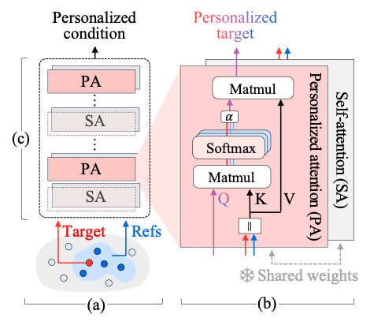
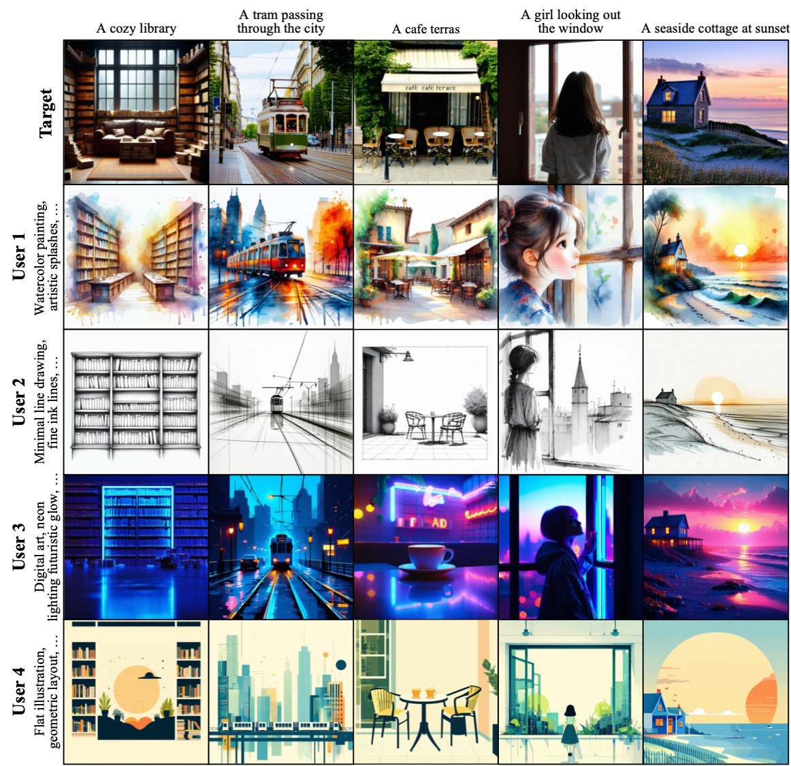
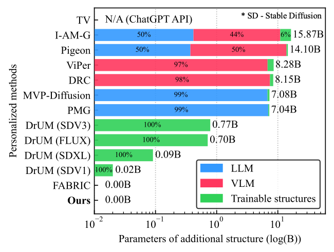
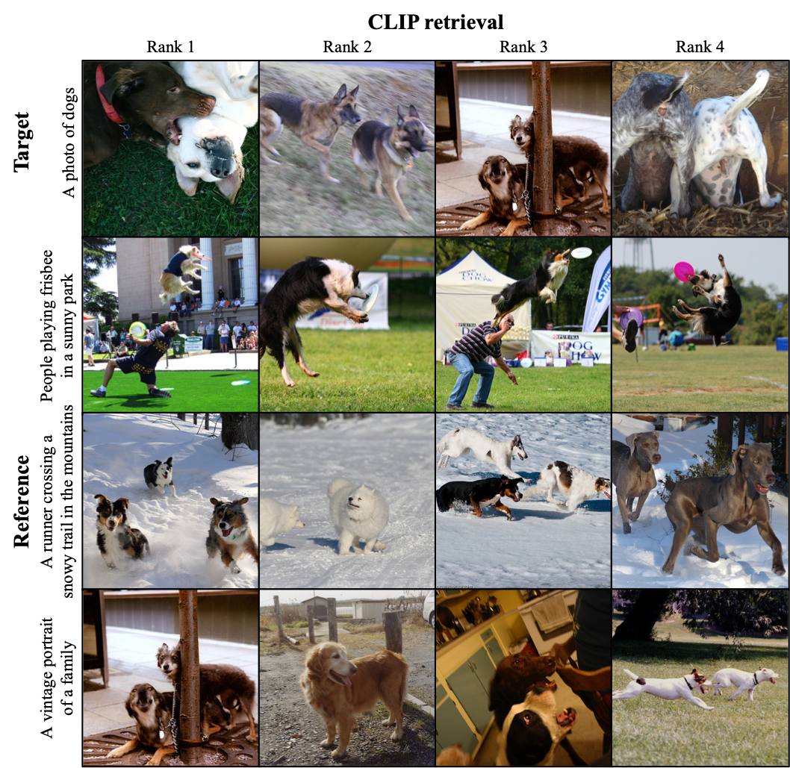
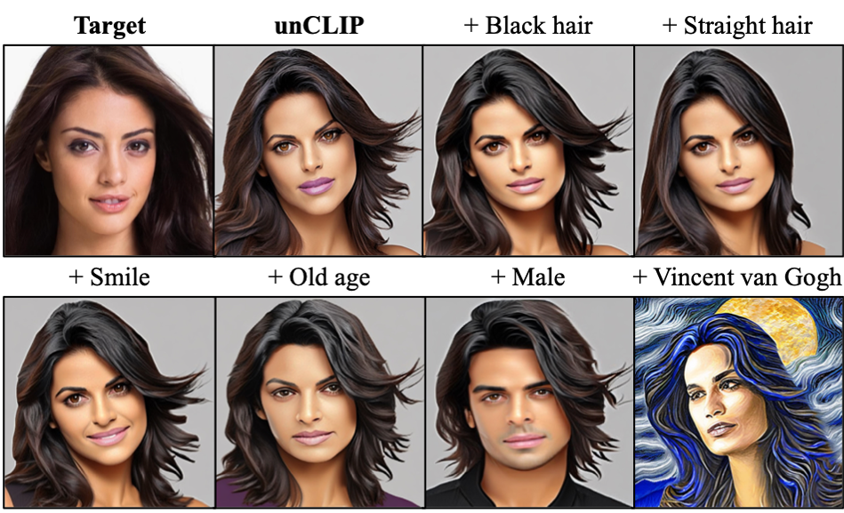
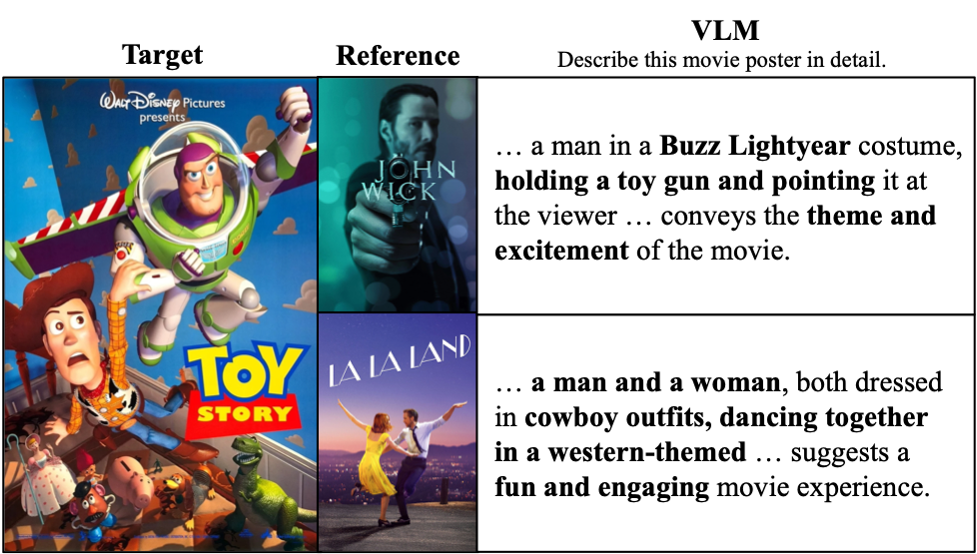
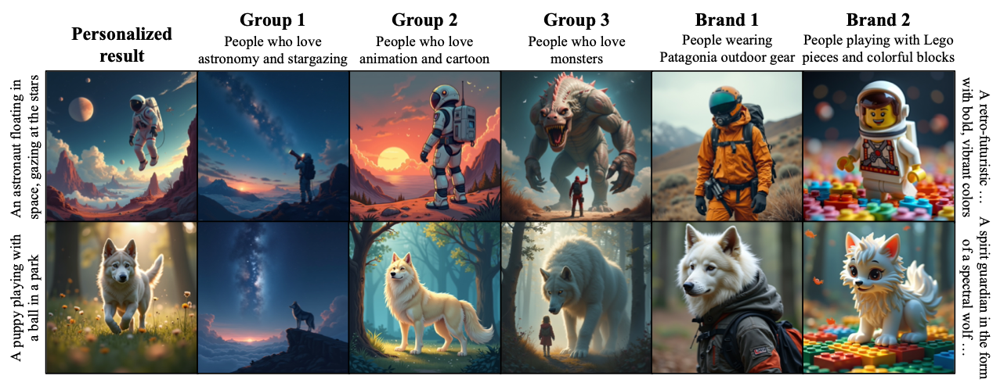
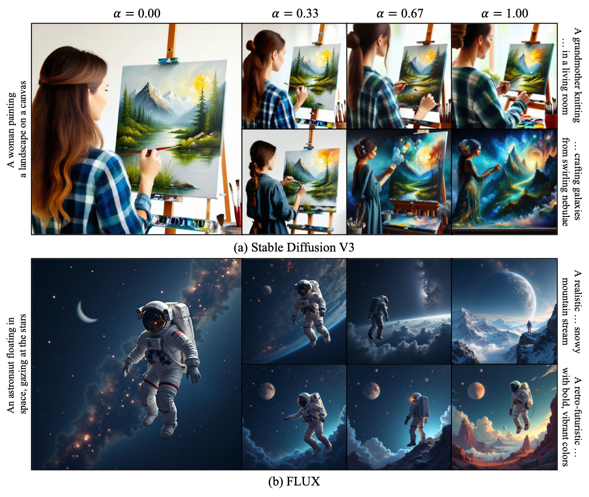

# FAN (Foundation Encoders Are All You Need for Preference-Aware Personalization)

[](https://pytorch.org/)
[](https://github.com/huggingface/diffusers)
[](https://opensource.org/licenses/MIT)

This repository hosts the official implementation of:

[Hyungjin Kim](https://scholar.google.com/citations?user=HrMSrN0AAAAJ&hl), [Seokho Ahn](https://scholar.google.com/citations?user=EputdKkAAAAJ&hl), and [Young-Duk Seo](https://mysid88.github.io/homepage/home), **Foundation Encoders Are All You Need for Preference-Aware Personalization**, CVPR 2026 [[cvpr](https://openaccess.thecvf.com/content/CVPR2026/papers/Kim_Foundation_Encoders_Are_All_You_Need_for_Preference-Aware_Personalization_CVPR_2026_paper.pdf)] [[supp](https://openaccess.thecvf.com/content/CVPR2026/supplemental/Kim_Foundation_Encoders_Are_CVPR_2026_supplemental.pdf)]


## News
- [2026.05.23]: CVPR paper and supplementary materials released
- [2026.03.20]: Repository created

## Introduction

**FAN** enables **preference-aware personalization using only foundation encoders**, without additional structures or fine-tuning. By reconstructing the self-attention mechanism of transformer-based encoders, FAN integrates user preferences while preserving target fidelity. It works seamlessly with **OpenCLIP** and **Google T5** across **Stable Diffusion V1/XL/V3** and **FLUX** in text-to-image (T2I) diffusion models, and naturally extends to **multimodal retrieval**, **image-conditioned generation**, **vision-language understanding**, and **group- and brand-level conditioning** without any modification.

<p align="center">
    
</p>

 FAN consists of three key components: (a) **Tailored profiling** to precisely identify user preferences; (b) **Personalized attention** to integrate these profiles into the conditioning process; and (c) **Conditioning optimization** to synthesize high-quality personalized results while preserving target queries.

## Performance

### Qualitative results

<p align="center">
    
</p>

### Parameter comparison

FAN achieves personalization **without any additional trainable parameters**, unlike existing methods that rely on large-scale LLMs or auxiliary adapters.

<p align="center">
    
</p>

## Quick Start

FAN is designed for easy use with the `diffusers` and `transformers` libraries.

### Setup

```bash
pip install torch torchvision diffusers transformers accelerate safetensors huggingface-hub
```

### Usage

- **T2I diffusion models**

```python
import torch

from diffusers import FluxPipeline
from fan import personalized_t2i_encoder

# Load pipeline and FAN
pipeline = FluxPipeline.from_pretrained("black-forest-labs/FLUX.1-dev", torch_dtype = torch.bfloat16).to("cuda")
fan = personalized_t2i_encoder(pipeline)

# Generate personalized images
with torch.no_grad():
    cond, pool_cond = fan(
    	"A photograph of an astronaut riding a horse",
    	["A retro-futuristic space exploration movie poster with bold, vibrant colors"],
    	weight = [1.0],
    	alpha = 0.4
    )
    images = pipeline(
    	prompt_embeds = cond.type(pipeline.dtype),
    	pooled_prompt_embeds = pool_cond.type(pipeline.dtype) if pool_cond is not None else pool_cond
    ).images

images[0].save("personalized_image.png")
```

- **unCLIP**

```python
import torch

from diffusers import StableUnCLIPImg2ImgPipeline
from diffusers.utils import load_image
from fan import FAN

face1 = "https://huggingface.co/datasets/huggingface/documentation-images/resolve/main/diffusers/ip_mask_girl1.png"
face2 = "https://huggingface.co/datasets/huggingface/documentation-images/resolve/main/diffusers/ip_mask_girl2.png"

size = (512, 512)
target = load_image(face1).resize(size)
ref = load_image(face2).resize(size)

# Load pipeline and FAN
pipeline = StableUnCLIPImg2ImgPipeline.from_pretrained("sd2-community/stable-diffusion-2-1-unclip", torch_dtype = torch.float16).to("cuda")
fan = FAN(pipeline.image_encoder, pipeline.feature_extractor)

# Generate personalized images
with torch.no_grad():
    cond = fan.get_image_feature(target, ref, weight = [1.0], alpha = 0.5)
    images = pipeline(image_embeds = cond).images

images[0].save("personalized_image.png")
```

- **OpenCLIP model**

```python
from transformers import CLIPModel, CLIPProcessor
from fan import FAN

model = CLIPModel.from_pretrained("openai/clip-vit-large-patch14")
processor = CLIPProcessor.from_pretrained("openai/clip-vit-large-patch14")
fan = FAN(model, processor, decoder = "./weight/L.pth") #The decoder uses only OpenCLIP text encoders.
```

- **More applications**: See [inference.ipynb](inference.ipynb)

### Key Parameters

| Parameter | Description | Value |
|-----------|-------------|-------|
| `prompt` | Target prompt | String |
| `ref` | Reference prompts | List of strings |
| `alpha` | Personalization degree | Float (0–1) |
| `weight` | Per-reference preference intensity | List of floats |
| `sample_size` | Sampling ratio for user profiling | Float (0–1) |

### Supported foundation T2I models

FAN works with a wide variety of foundation T2I models that uses text encoders with pretrained weights:

| Architecture | Pipeline | Text encoder | Weight |
|--------------|----------|--------------|--------|
| Stable Diffusion V1 | `runwayml/stable-diffusion-v1-5`, `prompthero/openjourney-v4`,<br>`stablediffusionapi/realistic-vision-v51`, `stablediffusionapi/deliberate-v2`,<br>`stablediffusionapi/anything-v5`, `WarriorMama777/AbyssOrangeMix2`, ... | `openai/clip-vit-large-patch14` | `L.pth` |
| Stable Diffusion XL | `stabilityai/stable-diffusion-xl-base-1.0`, ... | `openai/clip-vit-large-patch14`,<br>`laion/CLIP-ViT-bigG-14-laion2B-39B-b160k` | `L.pth`,<br>`bigG.pth` |
| Stable Diffusion V3 | `stabilityai/stable-diffusion-3.5-large`,<br>`stabilityai/stable-diffusion-3.5-medium`, ... | `openai/clip-vit-large-patch14`,<br>`laion/CLIP-ViT-bigG-14-laion2B-39B-b160k`,<br>`google/t5-v1_1-xxl` | `L.pth`,<br>`bigG.pth` |
| FLUX | `black-forest-labs/FLUX.1-dev`, ... | `openai/clip-vit-large-patch14`,<br>`google/t5-v1_1-xxl` | `L.pth` |


## Other applications

- **Multimodal retrieval (CLIP retrieval)**

<p align="center">
    
</p>

- **Image-conditioned generation (unCLIP)**

<p align="center">
    
</p>

- **Vision-language understanding**

<p align="center">
    
</p>

- **Group- and brand-level generation**

<p align="center">
    
</p>

## Degree of personalization

<p align="center">
    
</p>

## Citation

```bibtex
@InProceedings{kim2026fan,
    author    = {Kim, Hyungjin and Ahn, Seokho and Seo, Young-Duk},
    title     = {Foundation Encoders Are All You Need for Preference-Aware Personalization},
    booktitle = {Proceedings of the IEEE/CVF Conference on Computer Vision and Pattern Recognition (CVPR)},
    month     = {June},
    year      = {2026}
}
```
