# FAN 強度実験 · 設定と画像の一覧

生成日時: 2026-09-22 20:50:24 JST

1 枚のシートは 1 ケース（topic × history × seed）です。列は左から plain（個人化なし）、legacy_exhibit（現行既定）、設定表の順に並ぶ候補 policy。各タイルの下の帯に policy_id と、そのケースでの legacy_exhibit に対する Δhistory（dHist）・Δtarget（dTgt）が入っています。タイルは 1024×1280 の生成画像を 320×400 に縮小したものです。

判定と数値は [README.md](README.md) にあります。

## 共通の生成設定

| 項目 | 値 |
|---|---|
| モデル | `OnomaAIResearch/Illustrious-XL-v2.0` @ `69459c1fe6f4…` |
| checkpoint | `Illustrious-XL-v2.0.safetensors` |
| pipeline 設定 | `OnomaAIResearch/Illustrious-xl-early-release-v0` |
| VAE | `madebyollin/sdxl-vae-fp16-fix` |
| scheduler | DPMSolverMultistepScheduler {"algorithm_type": "sde-dpmsolver++", "use_karras_sigmas": true} |
| steps | 30 |
| guidance_scale | 5.0 |
| 解像度 | 1024×1280 |
| precision | fp16 |
| positive_prompt_tail | `absurdres, highres` |
| negative prompt | lowres, worst quality, bad quality, bad anatomy, bad hands, … |

### お題（topic）

| topic | generation_prompt（先頭のみ） | target_text |
|---|---|---|
| `cat` | masterpiece, best quality, amazing quality, very aesthetic, newest, sa… | A brown-haired girl with green eyes wearing a sweater, holding a cat by a window. |
| `tokyo` | masterpiece, best quality, amazing quality, very aesthetic, newest, sa… | A young man with short black hair wearing a jacket, with the Tokyo skyline at night. |
| `rain` | masterpiece, best quality, amazing quality, very aesthetic, newest, sa… | A blue-haired girl wearing a raincoat on a rainy city street. |
| `forest` | masterpiece, best quality, amazing quality, very aesthetic, newest, sa… | A silver-haired witch wearing a witch hat and a cloak in a forest. |
| `lighthouse` | masterpiece, best quality, amazing quality, very aesthetic, newest, sa… | A young blond male sailor wearing a sailor hat and a striped shirt, near a lighthouse and the ocean. |
| `cafe` | masterpiece, best quality, amazing quality, very aesthetic, newest, sa… | An auburn-haired female cafe worker wearing a white shirt and an apron in a cafe. |

### 履歴（history）と参照語句

#### `warm`

| ref_id | 重み | 参照テキスト |
|---|---|---|
| `warm-color` | 3.0 | warm color palette, amber and orange tones |
| `warm-light` | 3.0 | warm golden hour light, gentle shadows |
| `warm-texture` | 3.0 | watercolor painting, soft brushwork, painterly texture |
| `warm-mood` | 3.0 | calm atmosphere |

#### `cool`

| ref_id | 重み | 参照テキスト |
|---|---|---|
| `cool-color` | 3.0 | cool color palette, blue and teal tones |
| `cool-light` | 3.0 | soft diffused light |
| `cool-texture` | 3.0 | cel shading, clean lineart, anime coloring |
| `cool-mood` | 3.0 | calm atmosphere |

#### `mixed`

| ref_id | 重み | 参照テキスト |
|---|---|---|
| `mixed-warm-color` | 2.0 | warm color palette, amber and orange tones |
| `mixed-warm-light` | 2.0 | warm golden hour light, gentle shadows |
| `mixed-warm-texture` | 2.0 | watercolor painting, soft brushwork, painterly texture |
| `mixed-cool-color` | 1.0 | cool color palette, blue and teal tones |
| `mixed-cool-light` | 1.0 | soft diffused light |
| `mixed-cool-texture` | 1.0 | cel shading, clean lineart, anime coloring |
| `mixed-mood` | 3.0 | calm atmosphere |

#### `sparse`

| ref_id | 重み | 参照テキスト |
|---|---|---|
| `sparse-warm` | 2.0 | warm color palette, amber and orange tones |
| `sparse-cool` | 1.0 | cool color palette, blue and teal tones |

#### `warm-sentence`

| ref_id | 重み | 参照テキスト |
|---|---|---|
| `warm-sentence-color` | 3.0 | An illustration with a warm color palette of amber and orange tones. |
| `warm-sentence-light` | 3.0 | A scene lit by warm golden hour light with gentle shadows. |
| `warm-sentence-texture` | 3.0 | A watercolor painting with soft brushwork and a painterly texture. |
| `warm-sentence-mood` | 3.0 | A picture with a calm and quiet atmosphere. |

#### `cool-sentence`

| ref_id | 重み | 参照テキスト |
|---|---|---|
| `cool-sentence-color` | 3.0 | An illustration with a cool color palette of blue and teal tones. |
| `cool-sentence-light` | 3.0 | A scene lit by soft diffused light. |
| `cool-sentence-texture` | 3.0 | A cel-shaded anime illustration with clean lineart and flat anime coloring. |
| `cool-sentence-mood` | 3.0 | A picture with a calm and quiet atmosphere. |

#### `mixed-sentence`

| ref_id | 重み | 参照テキスト |
|---|---|---|
| `mixed-sentence-warm-color` | 2.0 | An illustration with a warm color palette of amber and orange tones. |
| `mixed-sentence-warm-light` | 2.0 | A scene lit by warm golden hour light with gentle shadows. |
| `mixed-sentence-warm-texture` | 2.0 | A watercolor painting with soft brushwork and a painterly texture. |
| `mixed-sentence-cool-color` | 1.0 | An illustration with a cool color palette of blue and teal tones. |
| `mixed-sentence-cool-light` | 1.0 | A scene lit by soft diffused light. |
| `mixed-sentence-cool-texture` | 1.0 | A cel-shaded anime illustration with clean lineart and flat anime coloring. |
| `mixed-sentence-mood` | 3.0 | A picture with a calm and quiet atmosphere. |

#### `sparse-sentence`

| ref_id | 重み | 参照テキスト |
|---|---|---|
| `sparse-sentence-warm` | 2.0 | An illustration with a warm color palette of amber and orange tones. |
| `sparse-sentence-cool` | 1.0 | An illustration with a cool color palette of blue and teal tones. |

#### `mixed-focus`

| ref_id | 重み | 参照テキスト |
|---|---|---|
| `mixed-focus-warm-color` | 2.0 | warm color palette, amber and orange tones |
| `mixed-focus-warm-light` | 2.0 | warm golden hour light, gentle shadows |
| `mixed-focus-warm-texture` | 2.0 | watercolor painting, soft brushwork, painterly texture |
| `mixed-focus-cool-color` | 0.5 | cool color palette, blue and teal tones |
| `mixed-focus-cool-light` | 0.5 | soft diffused light |
| `mixed-focus-cool-texture` | 0.5 | cel shading, clean lineart, anime coloring |
| `mixed-focus-mood` | 1.0 | calm atmosphere |

#### `warm-cel`

| ref_id | 重み | 参照テキスト |
|---|---|---|
| `heldout-warm` | 3.0 | warm color palette, amber tones |
| `heldout-cel` | 3.0 | anime screencap, cel shading |

#### `cool-oil`

| ref_id | 重み | 参照テキスト |
|---|---|---|
| `heldout-cool` | 3.0 | cool color palette, blue background |
| `heldout-oil` | 3.0 | oil painting, thick brushstrokes |

#### `calm-flat`

| ref_id | 重み | 参照テキスト |
|---|---|---|
| `heldout-muted` | 3.0 | muted colors, desaturated |
| `heldout-flat` | 3.0 | flat color, lineless, no lineart |

## `e1-settings`

設定のみのスイープ。skip_pa 層数 (B1)、alpha (B2/B3)、profiling 件数 (A4)、attention mask (B4)。P0 の対照として legacy を alpha 0.4 でも測る。

- plan 項目: P0, P1, B1, B2, B3, B4, A4
- experiment hash: `f333ad4e8c74c132b39d3f50fc55c359d3982816941afab37b6631cb5c685cfd`

### 条件の設定

| 条件 | alpha | skip | skip_pa | pooled_mode | profiling | use_attn_mask | embed_gain | reference_unit |
|---|---|---|---|---|---|---|---|---|
| plain（個人化なし） | — | — | — | — | — | — | — | — |
| `legacy_exhibit` | 0.50 | -2 | [0,1,2,3,4,5,6,7] | plain | all | なし | — | aspect_phrase |
| `legacy-alpha0.4` | 0.40 | -2 | [0,1,2,3,4,5,6,7] | plain | all | なし | — | aspect_phrase |
| `strong_v1` | 0.50 | -2 | [0] | plain | ratio 0.1 | なし | — | aspect_phrase |
| `b1-skip4-alpha0.5` | 0.50 | -2 | [0,1,2,3] | plain | ratio 0.1 | なし | — | aspect_phrase |
| `b2-skip1-alpha0.7` | 0.70 | -2 | [0] | plain | ratio 0.1 | なし | — | aspect_phrase |
| `b2-skip1-alpha0.85` | 0.85 | -2 | [0] | plain | ratio 0.1 | なし | — | aspect_phrase |
| `b2-skip1-alpha1.0` | 1.00 | -2 | [0] | plain | ratio 0.1 | なし | — | aspect_phrase |
| `b3-skip1-all-alpha0.7` | 0.70 | -2 | [0] | plain | all | なし | — | aspect_phrase |
| `a4-skip1-count2-alpha0.5` | 0.50 | -2 | [0] | plain | count 2 | なし | — | aspect_phrase |
| `a4-skip1-count4-alpha0.5` | 0.50 | -2 | [0] | plain | count 4 | なし | — | aspect_phrase |
| `b4-skip1-mask-alpha0.5` | 0.50 | -2 | [0] | plain | ratio 0.1 | あり | — | aspect_phrase |
| `b4-skip1-mask-alpha0.7` | 0.70 | -2 | [0] | plain | ratio 0.1 | あり | — | aspect_phrase |

### 履歴 `warm`

| ref_id | 重み | 参照テキスト |
|---|---|---|
| `warm-color` | 3.0 | warm color palette, amber and orange tones |
| `warm-light` | 3.0 | warm golden hour light, gentle shadows |
| `warm-texture` | 3.0 | watercolor painting, soft brushwork, painterly texture |
| `warm-mood` | 3.0 | calm atmosphere |

**topic=cat / history=warm / seed=230923**

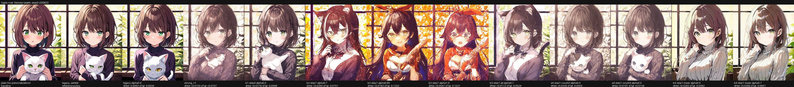

**topic=tokyo / history=warm / seed=230923**

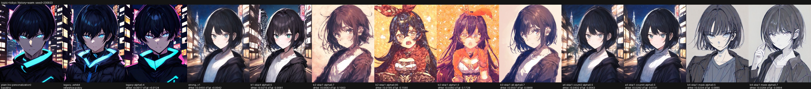

**topic=rain / history=warm / seed=230923**

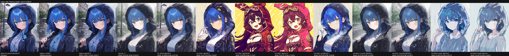

seed 230924 のシート（3 枚）

**topic=cat / history=warm / seed=230924**

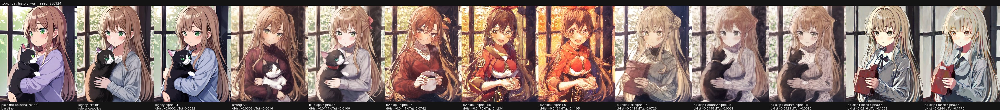

**topic=tokyo / history=warm / seed=230924**

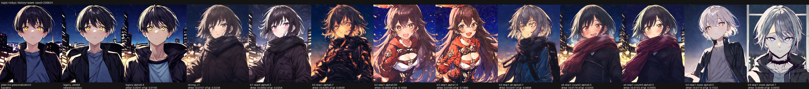

**topic=rain / history=warm / seed=230924**

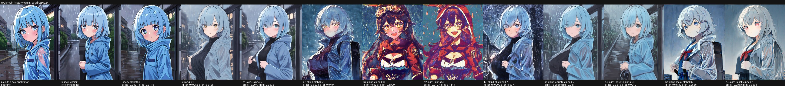

### 履歴 `cool`

| ref_id | 重み | 参照テキスト |
|---|---|---|
| `cool-color` | 3.0 | cool color palette, blue and teal tones |
| `cool-light` | 3.0 | soft diffused light |
| `cool-texture` | 3.0 | cel shading, clean lineart, anime coloring |
| `cool-mood` | 3.0 | calm atmosphere |

**topic=cat / history=cool / seed=230923**

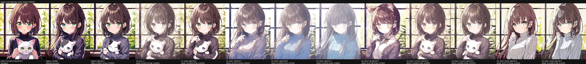

**topic=tokyo / history=cool / seed=230923**

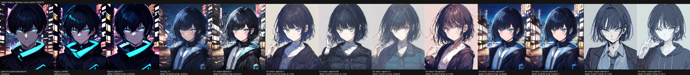

**topic=rain / history=cool / seed=230923**

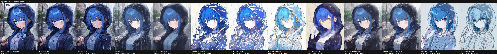

seed 230924 のシート（3 枚）

**topic=cat / history=cool / seed=230924**

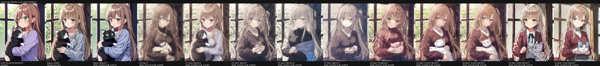

**topic=tokyo / history=cool / seed=230924**

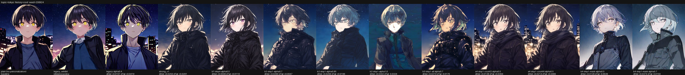

**topic=rain / history=cool / seed=230924**

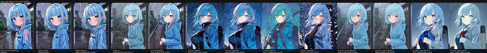

### 履歴 `mixed`

| ref_id | 重み | 参照テキスト |
|---|---|---|
| `mixed-warm-color` | 2.0 | warm color palette, amber and orange tones |
| `mixed-warm-light` | 2.0 | warm golden hour light, gentle shadows |
| `mixed-warm-texture` | 2.0 | watercolor painting, soft brushwork, painterly texture |
| `mixed-cool-color` | 1.0 | cool color palette, blue and teal tones |
| `mixed-cool-light` | 1.0 | soft diffused light |
| `mixed-cool-texture` | 1.0 | cel shading, clean lineart, anime coloring |
| `mixed-mood` | 3.0 | calm atmosphere |

**topic=cat / history=mixed / seed=230923**

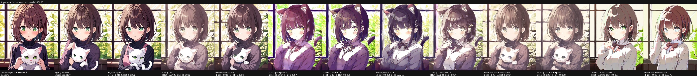

**topic=tokyo / history=mixed / seed=230923**

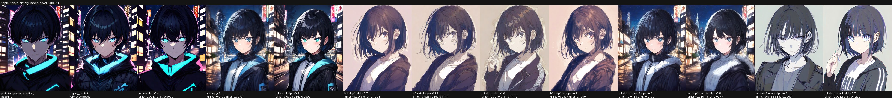

**topic=rain / history=mixed / seed=230923**

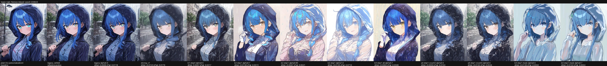

seed 230924 のシート（3 枚）

**topic=cat / history=mixed / seed=230924**

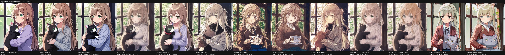

**topic=tokyo / history=mixed / seed=230924**

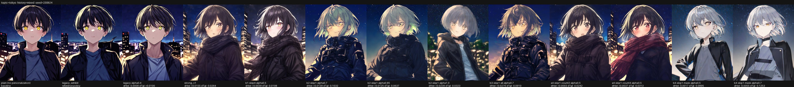

**topic=rain / history=mixed / seed=230924**

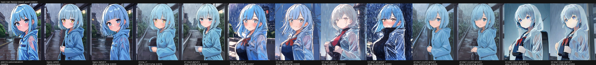

### 履歴 `sparse`

| ref_id | 重み | 参照テキスト |
|---|---|---|
| `sparse-warm` | 2.0 | warm color palette, amber and orange tones |
| `sparse-cool` | 1.0 | cool color palette, blue and teal tones |

**topic=cat / history=sparse / seed=230923**

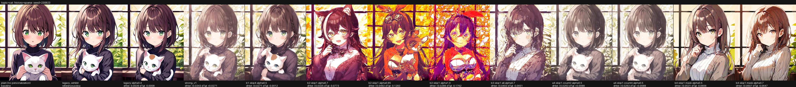

**topic=tokyo / history=sparse / seed=230923**

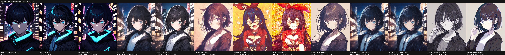

**topic=rain / history=sparse / seed=230923**

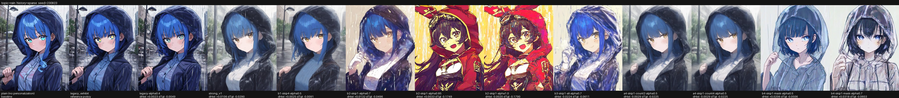

seed 230924 のシート（3 枚）

**topic=cat / history=sparse / seed=230924**

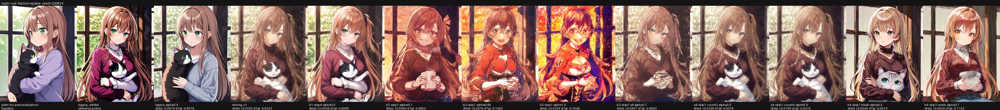

**topic=tokyo / history=sparse / seed=230924**

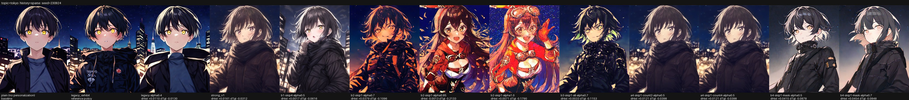

**topic=rain / history=sparse / seed=230924**

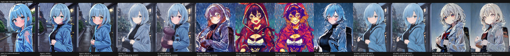

## `e2-adapter`

アダプタ側の小改修。埋め込み空間のゲイン embed_gain (C1) と EOS 位置で個人化した pooled (C2)。

- plan 項目: C1, C2
- experiment hash: `88709d3fcf87b55610fbea7726f62d4f19e9f3bed7fbf9b0440957a43b16b9b5`

### 条件の設定

| 条件 | alpha | skip | skip_pa | pooled_mode | profiling | use_attn_mask | embed_gain | reference_unit |
|---|---|---|---|---|---|---|---|---|
| plain（個人化なし） | — | — | — | — | — | — | — | — |
| `legacy_exhibit` | 0.50 | -2 | [0,1,2,3,4,5,6,7] | plain | all | なし | — | aspect_phrase |
| `c1-gain1.5-alpha0.5` | 0.50 | -2 | [0] | plain | ratio 0.1 | なし | 1.50 | aspect_phrase |
| `c1-gain2.0-alpha0.5` | 0.50 | -2 | [0] | plain | ratio 0.1 | なし | 2.00 | aspect_phrase |
| `c1-gain2.5-alpha0.5` | 0.50 | -2 | [0] | plain | ratio 0.1 | なし | 2.50 | aspect_phrase |
| `c2-faneos-alpha0.5` | 0.50 | -2 | [0] | fan_eos | ratio 0.1 | なし | — | aspect_phrase |
| `c2-faneos-alpha0.7` | 0.70 | -2 | [0] | fan_eos | ratio 0.1 | なし | — | aspect_phrase |
| `c1c2-faneos-gain1.5-alpha0.5` | 0.50 | -2 | [0] | fan_eos | ratio 0.1 | なし | 1.50 | aspect_phrase |

### 履歴 `warm`

| ref_id | 重み | 参照テキスト |
|---|---|---|
| `warm-color` | 3.0 | warm color palette, amber and orange tones |
| `warm-light` | 3.0 | warm golden hour light, gentle shadows |
| `warm-texture` | 3.0 | watercolor painting, soft brushwork, painterly texture |
| `warm-mood` | 3.0 | calm atmosphere |

**topic=cat / history=warm / seed=230923**

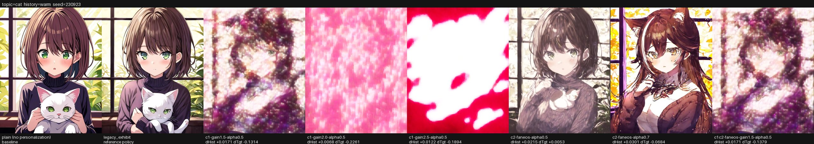

**topic=tokyo / history=warm / seed=230923**

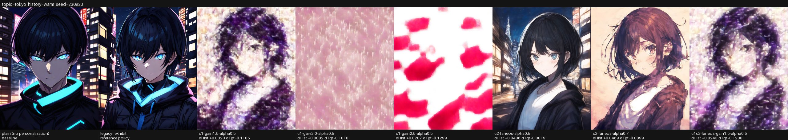

**topic=rain / history=warm / seed=230923**

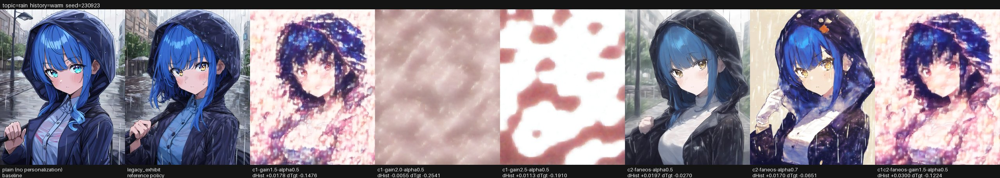

seed 230924 のシート（3 枚）

**topic=cat / history=warm / seed=230924**

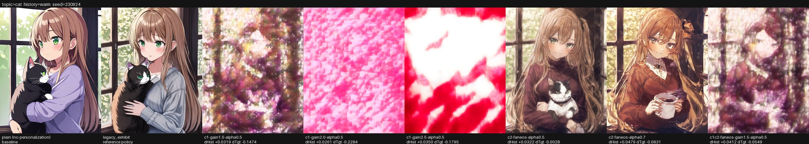

**topic=tokyo / history=warm / seed=230924**

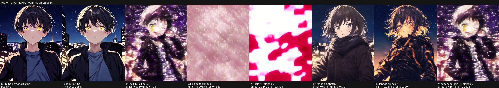

**topic=rain / history=warm / seed=230924**

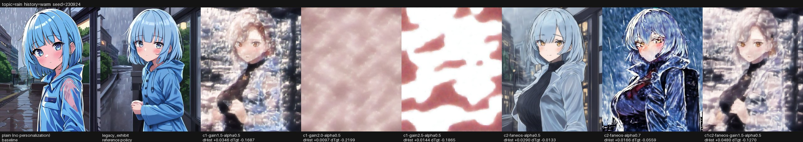

### 履歴 `cool`

| ref_id | 重み | 参照テキスト |
|---|---|---|
| `cool-color` | 3.0 | cool color palette, blue and teal tones |
| `cool-light` | 3.0 | soft diffused light |
| `cool-texture` | 3.0 | cel shading, clean lineart, anime coloring |
| `cool-mood` | 3.0 | calm atmosphere |

**topic=cat / history=cool / seed=230923**

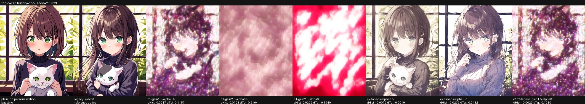

**topic=tokyo / history=cool / seed=230923**

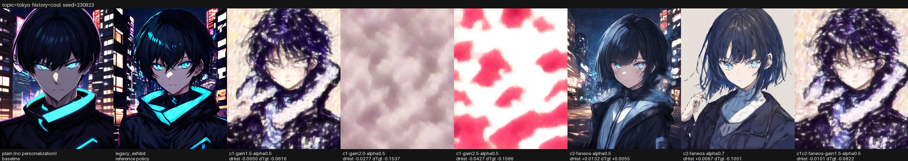

**topic=rain / history=cool / seed=230923**

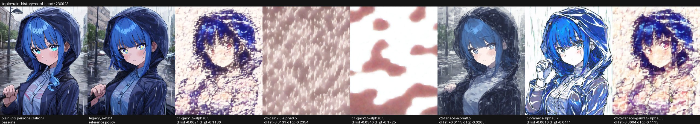

seed 230924 のシート（3 枚）

**topic=cat / history=cool / seed=230924**

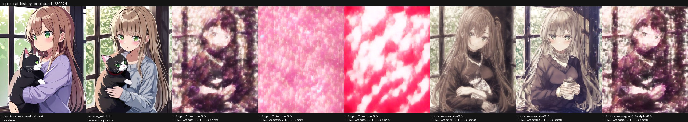

**topic=tokyo / history=cool / seed=230924**

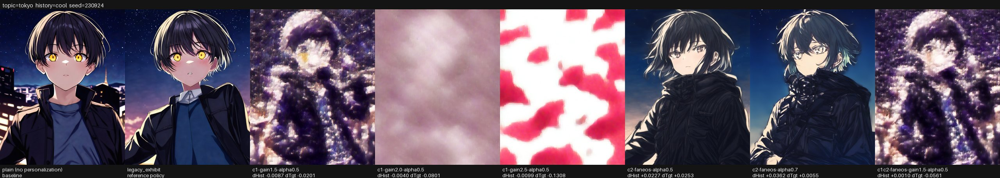

**topic=rain / history=cool / seed=230924**

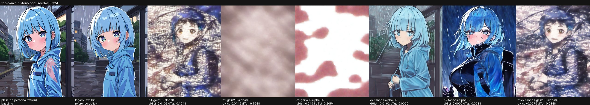

### 履歴 `mixed`

| ref_id | 重み | 参照テキスト |
|---|---|---|
| `mixed-warm-color` | 2.0 | warm color palette, amber and orange tones |
| `mixed-warm-light` | 2.0 | warm golden hour light, gentle shadows |
| `mixed-warm-texture` | 2.0 | watercolor painting, soft brushwork, painterly texture |
| `mixed-cool-color` | 1.0 | cool color palette, blue and teal tones |
| `mixed-cool-light` | 1.0 | soft diffused light |
| `mixed-cool-texture` | 1.0 | cel shading, clean lineart, anime coloring |
| `mixed-mood` | 3.0 | calm atmosphere |

**topic=cat / history=mixed / seed=230923**

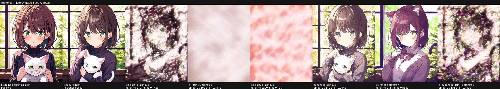

**topic=tokyo / history=mixed / seed=230923**

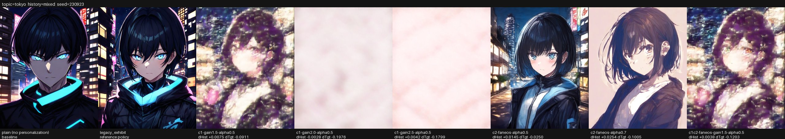

**topic=rain / history=mixed / seed=230923**

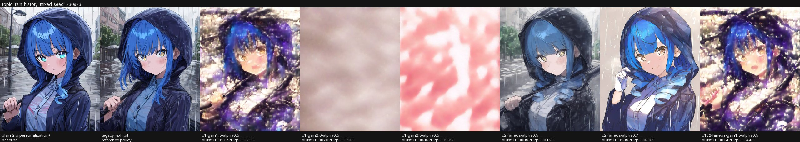

seed 230924 のシート（3 枚）

**topic=cat / history=mixed / seed=230924**

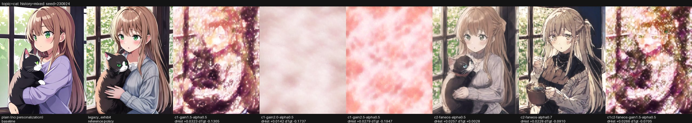

**topic=tokyo / history=mixed / seed=230924**

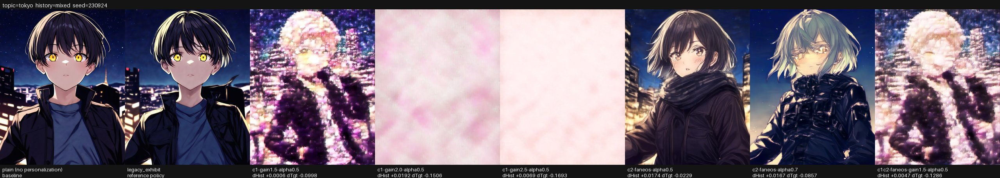

**topic=rain / history=mixed / seed=230924**

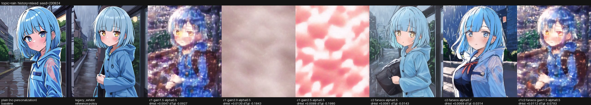

### 履歴 `sparse`

| ref_id | 重み | 参照テキスト |
|---|---|---|
| `sparse-warm` | 2.0 | warm color palette, amber and orange tones |
| `sparse-cool` | 1.0 | cool color palette, blue and teal tones |

**topic=cat / history=sparse / seed=230923**

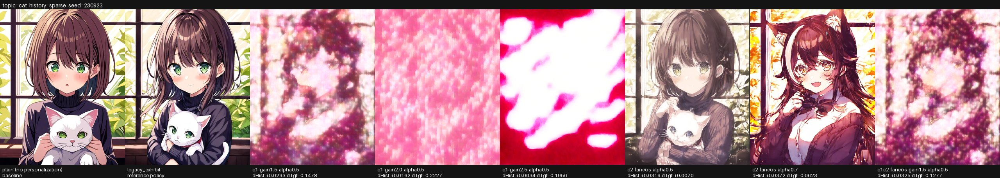

**topic=tokyo / history=sparse / seed=230923**

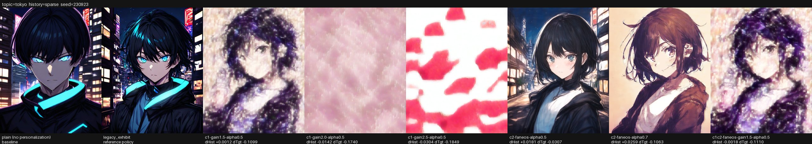

**topic=rain / history=sparse / seed=230923**

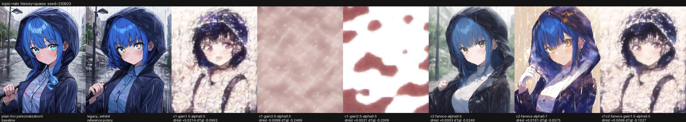

seed 230924 のシート（3 枚）

**topic=cat / history=sparse / seed=230924**

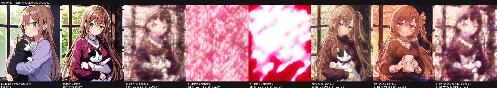

**topic=tokyo / history=sparse / seed=230924**

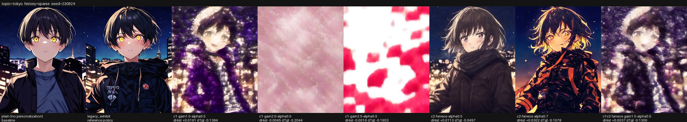

**topic=rain / history=sparse / seed=230924**

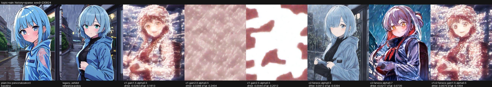

## `e3-references`

参照の設計。タグ句と自然文 (A3)、最頻レベルへの重み集中 (A5) を同じ policy で比較する。

- plan 項目: A3, A5
- experiment hash: `663fc0c361134aaf4a249ab92ab90609db589d74df46bd46eece16b40bc9da11`

### 条件の設定

| 条件 | alpha | skip | skip_pa | pooled_mode | profiling | use_attn_mask | embed_gain | reference_unit |
|---|---|---|---|---|---|---|---|---|
| plain（個人化なし） | — | — | — | — | — | — | — | — |
| `legacy_exhibit` | 0.50 | -2 | [0,1,2,3,4,5,6,7] | plain | all | なし | — | aspect_phrase |
| `strong_v1` | 0.50 | -2 | [0] | plain | ratio 0.1 | なし | — | aspect_phrase |
| `b2-skip1-alpha0.7` | 0.70 | -2 | [0] | plain | ratio 0.1 | なし | — | aspect_phrase |

### 履歴 `warm`

| ref_id | 重み | 参照テキスト |
|---|---|---|
| `warm-color` | 3.0 | warm color palette, amber and orange tones |
| `warm-light` | 3.0 | warm golden hour light, gentle shadows |
| `warm-texture` | 3.0 | watercolor painting, soft brushwork, painterly texture |
| `warm-mood` | 3.0 | calm atmosphere |

**topic=cat / history=warm / seed=230923**

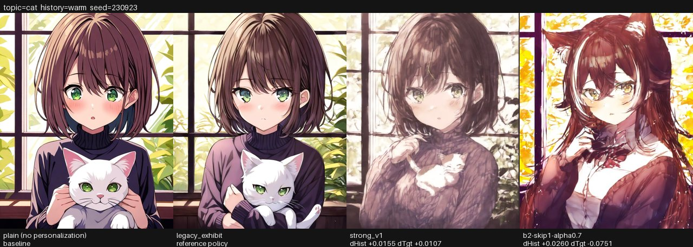

**topic=tokyo / history=warm / seed=230923**

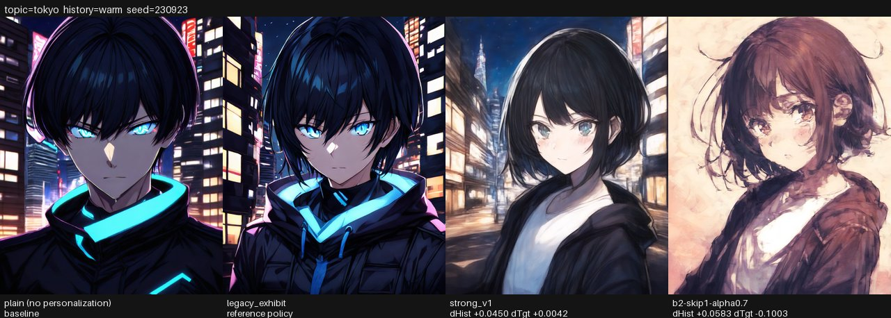

**topic=rain / history=warm / seed=230923**

seed 230924 のシート（3 枚）

**topic=cat / history=warm / seed=230924**

**topic=tokyo / history=warm / seed=230924**

**topic=rain / history=warm / seed=230924**

### 履歴 `cool`

| ref_id | 重み | 参照テキスト |
|---|---|---|
| `cool-color` | 3.0 | cool color palette, blue and teal tones |
| `cool-light` | 3.0 | soft diffused light |
| `cool-texture` | 3.0 | cel shading, clean lineart, anime coloring |
| `cool-mood` | 3.0 | calm atmosphere |

**topic=cat / history=cool / seed=230923**

**topic=tokyo / history=cool / seed=230923**

**topic=rain / history=cool / seed=230923**

seed 230924 のシート（3 枚）

**topic=cat / history=cool / seed=230924**

**topic=tokyo / history=cool / seed=230924**

**topic=rain / history=cool / seed=230924**

### 履歴 `mixed`

| ref_id | 重み | 参照テキスト |
|---|---|---|
| `mixed-warm-color` | 2.0 | warm color palette, amber and orange tones |
| `mixed-warm-light` | 2.0 | warm golden hour light, gentle shadows |
| `mixed-warm-texture` | 2.0 | watercolor painting, soft brushwork, painterly texture |
| `mixed-cool-color` | 1.0 | cool color palette, blue and teal tones |
| `mixed-cool-light` | 1.0 | soft diffused light |
| `mixed-cool-texture` | 1.0 | cel shading, clean lineart, anime coloring |
| `mixed-mood` | 3.0 | calm atmosphere |

**topic=cat / history=mixed / seed=230923**

**topic=tokyo / history=mixed / seed=230923**

**topic=rain / history=mixed / seed=230923**

seed 230924 のシート（3 枚）

**topic=cat / history=mixed / seed=230924**

**topic=tokyo / history=mixed / seed=230924**

**topic=rain / history=mixed / seed=230924**

### 履歴 `sparse`

| ref_id | 重み | 参照テキスト |
|---|---|---|
| `sparse-warm` | 2.0 | warm color palette, amber and orange tones |
| `sparse-cool` | 1.0 | cool color palette, blue and teal tones |

**topic=cat / history=sparse / seed=230923**

**topic=tokyo / history=sparse / seed=230923**

**topic=rain / history=sparse / seed=230923**

seed 230924 のシート（3 枚）

**topic=cat / history=sparse / seed=230924**

**topic=tokyo / history=sparse / seed=230924**

**topic=rain / history=sparse / seed=230924**

### 履歴 `warm-sentence`

| ref_id | 重み | 参照テキスト |
|---|---|---|
| `warm-sentence-color` | 3.0 | An illustration with a warm color palette of amber and orange tones. |
| `warm-sentence-light` | 3.0 | A scene lit by warm golden hour light with gentle shadows. |
| `warm-sentence-texture` | 3.0 | A watercolor painting with soft brushwork and a painterly texture. |
| `warm-sentence-mood` | 3.0 | A picture with a calm and quiet atmosphere. |

**topic=cat / history=warm-sentence / seed=230923**

**topic=tokyo / history=warm-sentence / seed=230923**

**topic=rain / history=warm-sentence / seed=230923**

seed 230924 のシート（3 枚）

**topic=cat / history=warm-sentence / seed=230924**

**topic=tokyo / history=warm-sentence / seed=230924**

**topic=rain / history=warm-sentence / seed=230924**

### 履歴 `cool-sentence`

| ref_id | 重み | 参照テキスト |
|---|---|---|
| `cool-sentence-color` | 3.0 | An illustration with a cool color palette of blue and teal tones. |
| `cool-sentence-light` | 3.0 | A scene lit by soft diffused light. |
| `cool-sentence-texture` | 3.0 | A cel-shaded anime illustration with clean lineart and flat anime coloring. |
| `cool-sentence-mood` | 3.0 | A picture with a calm and quiet atmosphere. |

**topic=cat / history=cool-sentence / seed=230923**

**topic=tokyo / history=cool-sentence / seed=230923**

**topic=rain / history=cool-sentence / seed=230923**

seed 230924 のシート（3 枚）

**topic=cat / history=cool-sentence / seed=230924**

**topic=tokyo / history=cool-sentence / seed=230924**

**topic=rain / history=cool-sentence / seed=230924**

### 履歴 `mixed-sentence`

| ref_id | 重み | 参照テキスト |
|---|---|---|
| `mixed-sentence-warm-color` | 2.0 | An illustration with a warm color palette of amber and orange tones. |
| `mixed-sentence-warm-light` | 2.0 | A scene lit by warm golden hour light with gentle shadows. |
| `mixed-sentence-warm-texture` | 2.0 | A watercolor painting with soft brushwork and a painterly texture. |
| `mixed-sentence-cool-color` | 1.0 | An illustration with a cool color palette of blue and teal tones. |
| `mixed-sentence-cool-light` | 1.0 | A scene lit by soft diffused light. |
| `mixed-sentence-cool-texture` | 1.0 | A cel-shaded anime illustration with clean lineart and flat anime coloring. |
| `mixed-sentence-mood` | 3.0 | A picture with a calm and quiet atmosphere. |

**topic=cat / history=mixed-sentence / seed=230923**

**topic=tokyo / history=mixed-sentence / seed=230923**

**topic=rain / history=mixed-sentence / seed=230923**

seed 230924 のシート（3 枚）

**topic=cat / history=mixed-sentence / seed=230924**

**topic=tokyo / history=mixed-sentence / seed=230924**

**topic=rain / history=mixed-sentence / seed=230924**

### 履歴 `sparse-sentence`

| ref_id | 重み | 参照テキスト |
|---|---|---|
| `sparse-sentence-warm` | 2.0 | An illustration with a warm color palette of amber and orange tones. |
| `sparse-sentence-cool` | 1.0 | An illustration with a cool color palette of blue and teal tones. |

**topic=cat / history=sparse-sentence / seed=230923**

**topic=tokyo / history=sparse-sentence / seed=230923**

**topic=rain / history=sparse-sentence / seed=230923**

seed 230924 のシート（3 枚）

**topic=cat / history=sparse-sentence / seed=230924**

**topic=tokyo / history=sparse-sentence / seed=230924**

**topic=rain / history=sparse-sentence / seed=230924**

### 履歴 `mixed-focus`

| ref_id | 重み | 参照テキスト |
|---|---|---|
| `mixed-focus-warm-color` | 2.0 | warm color palette, amber and orange tones |
| `mixed-focus-warm-light` | 2.0 | warm golden hour light, gentle shadows |
| `mixed-focus-warm-texture` | 2.0 | watercolor painting, soft brushwork, painterly texture |
| `mixed-focus-cool-color` | 0.5 | cool color palette, blue and teal tones |
| `mixed-focus-cool-light` | 0.5 | soft diffused light |
| `mixed-focus-cool-texture` | 0.5 | cel shading, clean lineart, anime coloring |
| `mixed-focus-mood` | 1.0 | calm atmosphere |

**topic=cat / history=mixed-focus / seed=230923**

**topic=tokyo / history=mixed-focus / seed=230923**

**topic=rain / history=mixed-focus / seed=230923**

seed 230924 のシート（3 枚）

**topic=cat / history=mixed-focus / seed=230924**

**topic=tokyo / history=mixed-focus / seed=230924**

**topic=rain / history=mixed-focus / seed=230924**

## `e5-official-sampler`

A6: 公式の生成設定に寄せた対照 (negative なし、非 SDE の DPM++、50 steps)。生成設定が違うため rules は拘束しない。

- plan 項目: A6
- experiment hash: `dabfba38cbc5699d39d2260a00b8f24aac906fb7986ed3830b72fa20dfdd0e65`

### 条件の設定

| 条件 | alpha | skip | skip_pa | pooled_mode | profiling | use_attn_mask | embed_gain | reference_unit |
|---|---|---|---|---|---|---|---|---|
| plain（個人化なし） | — | — | — | — | — | — | — | — |
| `legacy_exhibit` | 0.50 | -2 | [0,1,2,3,4,5,6,7] | plain | all | なし | — | aspect_phrase |
| `strong_v1` | 0.50 | -2 | [0] | plain | ratio 0.1 | なし | — | aspect_phrase |
| `b2-skip1-alpha0.7` | 0.70 | -2 | [0] | plain | ratio 0.1 | なし | — | aspect_phrase |

この実験だけ生成設定を上書きしています。

| 項目 | 値 |
|---|---|
| `negative_prompt` | （空文字列） |
| `steps` | 50 |
| `scheduler_kwargs` | {"algorithm_type": "dpmsolver++", "use_karras_sigmas": true} |

### 履歴 `warm`

| ref_id | 重み | 参照テキスト |
|---|---|---|
| `warm-color` | 3.0 | warm color palette, amber and orange tones |
| `warm-light` | 3.0 | warm golden hour light, gentle shadows |
| `warm-texture` | 3.0 | watercolor painting, soft brushwork, painterly texture |
| `warm-mood` | 3.0 | calm atmosphere |

**topic=cat / history=warm / seed=230923**

**topic=tokyo / history=warm / seed=230923**

**topic=rain / history=warm / seed=230923**

seed 230924 のシート（3 枚）

**topic=cat / history=warm / seed=230924**

**topic=tokyo / history=warm / seed=230924**

**topic=rain / history=warm / seed=230924**

### 履歴 `cool`

| ref_id | 重み | 参照テキスト |
|---|---|---|
| `cool-color` | 3.0 | cool color palette, blue and teal tones |
| `cool-light` | 3.0 | soft diffused light |
| `cool-texture` | 3.0 | cel shading, clean lineart, anime coloring |
| `cool-mood` | 3.0 | calm atmosphere |

**topic=cat / history=cool / seed=230923**

**topic=tokyo / history=cool / seed=230923**

**topic=rain / history=cool / seed=230923**

seed 230924 のシート（3 枚）

**topic=cat / history=cool / seed=230924**

**topic=tokyo / history=cool / seed=230924**

**topic=rain / history=cool / seed=230924**

### 履歴 `mixed`

| ref_id | 重み | 参照テキスト |
|---|---|---|
| `mixed-warm-color` | 2.0 | warm color palette, amber and orange tones |
| `mixed-warm-light` | 2.0 | warm golden hour light, gentle shadows |
| `mixed-warm-texture` | 2.0 | watercolor painting, soft brushwork, painterly texture |
| `mixed-cool-color` | 1.0 | cool color palette, blue and teal tones |
| `mixed-cool-light` | 1.0 | soft diffused light |
| `mixed-cool-texture` | 1.0 | cel shading, clean lineart, anime coloring |
| `mixed-mood` | 3.0 | calm atmosphere |

**topic=cat / history=mixed / seed=230923**

**topic=tokyo / history=mixed / seed=230923**

**topic=rain / history=mixed / seed=230923**

seed 230924 のシート（3 枚）

**topic=cat / history=mixed / seed=230924**

**topic=tokyo / history=mixed / seed=230924**

**topic=rain / history=mixed / seed=230924**

### 履歴 `sparse`

| ref_id | 重み | 参照テキスト |
|---|---|---|
| `sparse-warm` | 2.0 | warm color palette, amber and orange tones |
| `sparse-cool` | 1.0 | cool color palette, blue and teal tones |

**topic=cat / history=sparse / seed=230923**

**topic=tokyo / history=sparse / seed=230923**

**topic=rain / history=sparse / seed=230923**

seed 230924 のシート（3 枚）

**topic=cat / history=sparse / seed=230924**

**topic=tokyo / history=sparse / seed=230924**

**topic=rain / history=sparse / seed=230924**

## `e6-skip1-only`

legacy_exhibit から skip_pa だけ [0] に変えた設定（alpha 0.5・plain pooled・profiling all）。strong_v1 の目視結果が芳しくなかったため、profiling を legacy のまま skip_pa の効果だけを見る。

- plan 項目: B2
- experiment hash: `abca68252fcc115649eb2b44a3096f16e7a5e63d618da56e7b6b5e49985a84ab`

### 条件の設定

| 条件 | alpha | skip | skip_pa | pooled_mode | profiling | use_attn_mask | embed_gain | reference_unit |
|---|---|---|---|---|---|---|---|---|
| plain（個人化なし） | — | — | — | — | — | — | — | — |
| `legacy_exhibit` | 0.50 | -2 | [0,1,2,3,4,5,6,7] | plain | all | なし | — | aspect_phrase |
| `legacy-skip1` | 0.50 | -2 | [0] | plain | all | なし | — | aspect_phrase |
| `strong_v1` | 0.50 | -2 | [0] | plain | ratio 0.1 | なし | — | aspect_phrase |

### 履歴 `warm`

| ref_id | 重み | 参照テキスト |
|---|---|---|
| `warm-color` | 3.0 | warm color palette, amber and orange tones |
| `warm-light` | 3.0 | warm golden hour light, gentle shadows |
| `warm-texture` | 3.0 | watercolor painting, soft brushwork, painterly texture |
| `warm-mood` | 3.0 | calm atmosphere |

**topic=cat / history=warm / seed=230923**

**topic=tokyo / history=warm / seed=230923**

**topic=rain / history=warm / seed=230923**

seed 230924 のシート（3 枚）

**topic=cat / history=warm / seed=230924**

**topic=tokyo / history=warm / seed=230924**

**topic=rain / history=warm / seed=230924**

### 履歴 `cool`

| ref_id | 重み | 参照テキスト |
|---|---|---|
| `cool-color` | 3.0 | cool color palette, blue and teal tones |
| `cool-light` | 3.0 | soft diffused light |
| `cool-texture` | 3.0 | cel shading, clean lineart, anime coloring |
| `cool-mood` | 3.0 | calm atmosphere |

**topic=cat / history=cool / seed=230923**

**topic=tokyo / history=cool / seed=230923**

**topic=rain / history=cool / seed=230923**

seed 230924 のシート（3 枚）

**topic=cat / history=cool / seed=230924**

**topic=tokyo / history=cool / seed=230924**

**topic=rain / history=cool / seed=230924**

### 履歴 `mixed`

| ref_id | 重み | 参照テキスト |
|---|---|---|
| `mixed-warm-color` | 2.0 | warm color palette, amber and orange tones |
| `mixed-warm-light` | 2.0 | warm golden hour light, gentle shadows |
| `mixed-warm-texture` | 2.0 | watercolor painting, soft brushwork, painterly texture |
| `mixed-cool-color` | 1.0 | cool color palette, blue and teal tones |
| `mixed-cool-light` | 1.0 | soft diffused light |
| `mixed-cool-texture` | 1.0 | cel shading, clean lineart, anime coloring |
| `mixed-mood` | 3.0 | calm atmosphere |

**topic=cat / history=mixed / seed=230923**

**topic=tokyo / history=mixed / seed=230923**

**topic=rain / history=mixed / seed=230923**

seed 230924 のシート（3 枚）

**topic=cat / history=mixed / seed=230924**

**topic=tokyo / history=mixed / seed=230924**

**topic=rain / history=mixed / seed=230924**

### 履歴 `sparse`

| ref_id | 重み | 参照テキスト |
|---|---|---|
| `sparse-warm` | 2.0 | warm color palette, amber and orange tones |
| `sparse-cool` | 1.0 | cool color palette, blue and teal tones |

**topic=cat / history=sparse / seed=230923**

**topic=tokyo / history=sparse / seed=230923**

**topic=rain / history=sparse / seed=230923**

seed 230924 のシート（3 枚）

**topic=cat / history=sparse / seed=230924**

**topic=tokyo / history=sparse / seed=230924**

**topic=rain / history=sparse / seed=230924**

## `e7-skip-ladder`

skip_pa の階段。legacy_exhibit（alpha 0.5・plain・profiling all）から skip_pa を [0] → [0..7] まで 1 層ずつ増やし、霞が消えて効きが残る境目を探す。 [0..7] は legacy_exhibit そのもの（暗黙の比較列）。

- plan 項目: B1
- experiment hash: `c255fdc72c8f4d95729225da7d5327d00b1ff4fbcc6257504dd00c8163f45930`

### 条件の設定

| 条件 | alpha | skip | skip_pa | pooled_mode | profiling | use_attn_mask | embed_gain | reference_unit |
|---|---|---|---|---|---|---|---|---|
| plain（個人化なし） | — | — | — | — | — | — | — | — |
| `legacy_exhibit` | 0.50 | -2 | [0,1,2,3,4,5,6,7] | plain | all | なし | — | aspect_phrase |
| `ladder-skip0to0` | 0.50 | -2 | [0] | plain | all | なし | — | aspect_phrase |
| `ladder-skip0to1` | 0.50 | -2 | [0,1] | plain | all | なし | — | aspect_phrase |
| `ladder-skip0to2` | 0.50 | -2 | [0,1,2] | plain | all | なし | — | aspect_phrase |
| `ladder-skip0to3` | 0.50 | -2 | [0,1,2,3] | plain | all | なし | — | aspect_phrase |
| `ladder-skip0to4` | 0.50 | -2 | [0,1,2,3,4] | plain | all | なし | — | aspect_phrase |
| `ladder-skip0to5` | 0.50 | -2 | [0,1,2,3,4,5] | plain | all | なし | — | aspect_phrase |
| `ladder-skip0to6` | 0.50 | -2 | [0,1,2,3,4,5,6] | plain | all | なし | — | aspect_phrase |

### 履歴 `warm`

| ref_id | 重み | 参照テキスト |
|---|---|---|
| `warm-color` | 3.0 | warm color palette, amber and orange tones |
| `warm-light` | 3.0 | warm golden hour light, gentle shadows |
| `warm-texture` | 3.0 | watercolor painting, soft brushwork, painterly texture |
| `warm-mood` | 3.0 | calm atmosphere |

**topic=cat / history=warm / seed=230923**

**topic=tokyo / history=warm / seed=230923**

**topic=rain / history=warm / seed=230923**

seed 230924 のシート（3 枚）

**topic=cat / history=warm / seed=230924**

**topic=tokyo / history=warm / seed=230924**

**topic=rain / history=warm / seed=230924**

### 履歴 `cool`

| ref_id | 重み | 参照テキスト |
|---|---|---|
| `cool-color` | 3.0 | cool color palette, blue and teal tones |
| `cool-light` | 3.0 | soft diffused light |
| `cool-texture` | 3.0 | cel shading, clean lineart, anime coloring |
| `cool-mood` | 3.0 | calm atmosphere |

**topic=cat / history=cool / seed=230923**

**topic=tokyo / history=cool / seed=230923**

**topic=rain / history=cool / seed=230923**

seed 230924 のシート（3 枚）

**topic=cat / history=cool / seed=230924**

**topic=tokyo / history=cool / seed=230924**

**topic=rain / history=cool / seed=230924**

### 履歴 `mixed`

| ref_id | 重み | 参照テキスト |
|---|---|---|
| `mixed-warm-color` | 2.0 | warm color palette, amber and orange tones |
| `mixed-warm-light` | 2.0 | warm golden hour light, gentle shadows |
| `mixed-warm-texture` | 2.0 | watercolor painting, soft brushwork, painterly texture |
| `mixed-cool-color` | 1.0 | cool color palette, blue and teal tones |
| `mixed-cool-light` | 1.0 | soft diffused light |
| `mixed-cool-texture` | 1.0 | cel shading, clean lineart, anime coloring |
| `mixed-mood` | 3.0 | calm atmosphere |

**topic=cat / history=mixed / seed=230923**

**topic=tokyo / history=mixed / seed=230923**

**topic=rain / history=mixed / seed=230923**

seed 230924 のシート（3 枚）

**topic=cat / history=mixed / seed=230924**

**topic=tokyo / history=mixed / seed=230924**

**topic=rain / history=mixed / seed=230924**

### 履歴 `sparse`

| ref_id | 重み | 参照テキスト |
|---|---|---|
| `sparse-warm` | 2.0 | warm color palette, amber and orange tones |
| `sparse-cool` | 1.0 | cool color palette, blue and teal tones |

**topic=cat / history=sparse / seed=230923**

**topic=tokyo / history=sparse / seed=230923**

**topic=rain / history=sparse / seed=230923**

seed 230924 のシート（3 枚）

**topic=cat / history=sparse / seed=230924**

**topic=tokyo / history=sparse / seed=230924**

**topic=rain / history=sparse / seed=230924**

## `e8-skip1-alpha`

skip_pa [0]（全層で個人化）のまま alpha を 0.3 / 0.4 に下げ、霞が alpha に比例して薄まるかを見る。e7 の階段と対になる実験。

- plan 項目: B2
- experiment hash: `654e07cc2ce5d1559b97b02415494b528aec416a620b60291b0c2cf85ce782c5`

### 条件の設定

| 条件 | alpha | skip | skip_pa | pooled_mode | profiling | use_attn_mask | embed_gain | reference_unit |
|---|---|---|---|---|---|---|---|---|
| plain（個人化なし） | — | — | — | — | — | — | — | — |
| `legacy_exhibit` | 0.50 | -2 | [0,1,2,3,4,5,6,7] | plain | all | なし | — | aspect_phrase |
| `skip1-alpha0.3` | 0.30 | -2 | [0] | plain | all | なし | — | aspect_phrase |
| `skip1-alpha0.4` | 0.40 | -2 | [0] | plain | all | なし | — | aspect_phrase |

### 履歴 `warm`

| ref_id | 重み | 参照テキスト |
|---|---|---|
| `warm-color` | 3.0 | warm color palette, amber and orange tones |
| `warm-light` | 3.0 | warm golden hour light, gentle shadows |
| `warm-texture` | 3.0 | watercolor painting, soft brushwork, painterly texture |
| `warm-mood` | 3.0 | calm atmosphere |

**topic=cat / history=warm / seed=230923**

**topic=tokyo / history=warm / seed=230923**

**topic=rain / history=warm / seed=230923**

seed 230924 のシート（3 枚）

**topic=cat / history=warm / seed=230924**

**topic=tokyo / history=warm / seed=230924**

**topic=rain / history=warm / seed=230924**

### 履歴 `cool`

| ref_id | 重み | 参照テキスト |
|---|---|---|
| `cool-color` | 3.0 | cool color palette, blue and teal tones |
| `cool-light` | 3.0 | soft diffused light |
| `cool-texture` | 3.0 | cel shading, clean lineart, anime coloring |
| `cool-mood` | 3.0 | calm atmosphere |

**topic=cat / history=cool / seed=230923**

**topic=tokyo / history=cool / seed=230923**

**topic=rain / history=cool / seed=230923**

seed 230924 のシート（3 枚）

**topic=cat / history=cool / seed=230924**

**topic=tokyo / history=cool / seed=230924**

**topic=rain / history=cool / seed=230924**

### 履歴 `mixed`

| ref_id | 重み | 参照テキスト |
|---|---|---|
| `mixed-warm-color` | 2.0 | warm color palette, amber and orange tones |
| `mixed-warm-light` | 2.0 | warm golden hour light, gentle shadows |
| `mixed-warm-texture` | 2.0 | watercolor painting, soft brushwork, painterly texture |
| `mixed-cool-color` | 1.0 | cool color palette, blue and teal tones |
| `mixed-cool-light` | 1.0 | soft diffused light |
| `mixed-cool-texture` | 1.0 | cel shading, clean lineart, anime coloring |
| `mixed-mood` | 3.0 | calm atmosphere |

**topic=cat / history=mixed / seed=230923**

**topic=tokyo / history=mixed / seed=230923**

**topic=rain / history=mixed / seed=230923**

seed 230924 のシート（3 枚）

**topic=cat / history=mixed / seed=230924**

**topic=tokyo / history=mixed / seed=230924**

**topic=rain / history=mixed / seed=230924**

### 履歴 `sparse`

| ref_id | 重み | 参照テキスト |
|---|---|---|
| `sparse-warm` | 2.0 | warm color palette, amber and orange tones |
| `sparse-cool` | 1.0 | cool color palette, blue and teal tones |

**topic=cat / history=sparse / seed=230923**

**topic=tokyo / history=sparse / seed=230923**

**topic=rain / history=sparse / seed=230923**

seed 230924 のシート（3 枚）

**topic=cat / history=sparse / seed=230924**

**topic=tokyo / history=sparse / seed=230924**

**topic=rain / history=sparse / seed=230924**

## `heldout-3bb8cd97`（heldout）

正式チェーンの run。目視 (P3) 用。

- experiment hash: `3bb8cd97a9c11518ce5b31b26c1a9ac61beabc70fc605d1e8ae8210f3b7ff3df`

### 条件の設定

| 条件 | alpha | skip | skip_pa | pooled_mode | profiling | use_attn_mask | embed_gain | reference_unit |
|---|---|---|---|---|---|---|---|---|
| plain（個人化なし） | — | — | — | — | — | — | — | — |
| `legacy_exhibit` | 0.50 | -2 | [0,1,2,3,4,5,6,7] | plain | all | なし | — | aspect_phrase |
| `screen-skip1-plain-ratio01-alpha-0.5` | 0.50 | -2 | [0] | plain | ratio 0.1 | なし | — | aspect_phrase |
| `screen-skip1-plain-all` | 0.40 | -2 | [0] | plain | all | なし | — | aspect_phrase |

### 履歴 `warm-cel`

| ref_id | 重み | 参照テキスト |
|---|---|---|
| `heldout-warm` | 3.0 | warm color palette, amber tones |
| `heldout-cel` | 3.0 | anime screencap, cel shading |

**topic=cat / history=warm-cel / seed=230927**

**topic=tokyo / history=warm-cel / seed=230927**

**topic=forest / history=warm-cel / seed=230927**

**topic=lighthouse / history=warm-cel / seed=230927**

**topic=rain / history=warm-cel / seed=230927**

**topic=cafe / history=warm-cel / seed=230927**

seed 230928 のシート（6 枚）

**topic=cat / history=warm-cel / seed=230928**

**topic=tokyo / history=warm-cel / seed=230928**

**topic=forest / history=warm-cel / seed=230928**

**topic=lighthouse / history=warm-cel / seed=230928**

**topic=rain / history=warm-cel / seed=230928**

**topic=cafe / history=warm-cel / seed=230928**

### 履歴 `cool-oil`

| ref_id | 重み | 参照テキスト |
|---|---|---|
| `heldout-cool` | 3.0 | cool color palette, blue background |
| `heldout-oil` | 3.0 | oil painting, thick brushstrokes |

**topic=cat / history=cool-oil / seed=230927**

**topic=tokyo / history=cool-oil / seed=230927**

**topic=forest / history=cool-oil / seed=230927**

**topic=lighthouse / history=cool-oil / seed=230927**

**topic=rain / history=cool-oil / seed=230927**

**topic=cafe / history=cool-oil / seed=230927**

seed 230928 のシート（6 枚）

**topic=cat / history=cool-oil / seed=230928**

**topic=tokyo / history=cool-oil / seed=230928**

**topic=forest / history=cool-oil / seed=230928**

**topic=lighthouse / history=cool-oil / seed=230928**

**topic=rain / history=cool-oil / seed=230928**

**topic=cafe / history=cool-oil / seed=230928**

### 履歴 `calm-flat`

| ref_id | 重み | 参照テキスト |
|---|---|---|
| `heldout-muted` | 3.0 | muted colors, desaturated |
| `heldout-flat` | 3.0 | flat color, lineless, no lineart |

**topic=cat / history=calm-flat / seed=230927**

**topic=tokyo / history=calm-flat / seed=230927**

**topic=forest / history=calm-flat / seed=230927**

**topic=lighthouse / history=calm-flat / seed=230927**

**topic=rain / history=calm-flat / seed=230927**

**topic=cafe / history=calm-flat / seed=230927**

seed 230928 のシート（6 枚）

**topic=cat / history=calm-flat / seed=230928**

**topic=tokyo / history=calm-flat / seed=230928**

**topic=forest / history=calm-flat / seed=230928**

**topic=lighthouse / history=calm-flat / seed=230928**

**topic=rain / history=calm-flat / seed=230928**

**topic=cafe / history=calm-flat / seed=230928**

### 履歴 `mixed`

| ref_id | 重み | 参照テキスト |
|---|---|---|
| `heldout-mixed-warm` | 1.0 | warm color palette, amber tones |
| `heldout-mixed-cel` | 1.0 | anime screencap, cel shading |
| `heldout-mixed-cool` | 1.0 | cool color palette, blue background |
| `heldout-mixed-oil` | 1.0 | oil painting, thick brushstrokes |
| `heldout-mixed-muted` | 1.0 | muted colors, desaturated |
| `heldout-mixed-flat` | 1.0 | flat color, lineless, no lineart |

**topic=cat / history=mixed / seed=230927**

**topic=tokyo / history=mixed / seed=230927**

**topic=forest / history=mixed / seed=230927**

**topic=lighthouse / history=mixed / seed=230927**

**topic=rain / history=mixed / seed=230927**

**topic=cafe / history=mixed / seed=230927**

seed 230928 のシート（6 枚）

**topic=cat / history=mixed / seed=230928**

**topic=tokyo / history=mixed / seed=230928**

**topic=forest / history=mixed / seed=230928**

**topic=lighthouse / history=mixed / seed=230928**

**topic=rain / history=mixed / seed=230928**

**topic=cafe / history=mixed / seed=230928**

## A2: 論文レジーム（base SDXL 1.0）

FAN 本来の土俵（base SDXL 1.0、自然文プロンプト、自然文参照）での上限確認です。生成設定が違うので exhibit の rules は当てはめません。

| 項目 | 値 |
|---|---|
| `model` | stabilityai/stable-diffusion-xl-base-1.0 |
| `size` | 1024 |
| `steps` | 50 |
| `guidance_scale` | 5.0 |
| `skip` | -2 |
| `skip_pa` | [0] |
| `use_attn_mask` | なし |
| `sample_size` | 0.0 |
| `negative_prompt` | — |
| alpha | [0.0,0.4,0.7] |
| seeds | [42] |

| topic | プロンプト |
|---|---|
| `cat` | A brown-haired girl with green eyes wearing a sweater, holding a cat by a window. |
| `tokyo` | A young man with short black hair wearing a jacket, with the Tokyo skyline at night. |

#### `warm-sentence`

| ref_id | 重み | 参照テキスト |
|---|---|---|
| `warm-sentence-color` | 3.0 | An illustration with a warm color palette of amber and orange tones. |
| `warm-sentence-light` | 3.0 | A scene lit by warm golden hour light with gentle shadows. |
| `warm-sentence-texture` | 3.0 | A watercolor painting with soft brushwork and a painterly texture. |
| `warm-sentence-mood` | 3.0 | A picture with a calm and quiet atmosphere. |

#### `cool-sentence`

| ref_id | 重み | 参照テキスト |
|---|---|---|
| `cool-sentence-color` | 3.0 | An illustration with a cool color palette of blue and teal tones. |
| `cool-sentence-light` | 3.0 | A scene lit by soft diffused light. |
| `cool-sentence-texture` | 3.0 | A cel-shaded anime illustration with clean lineart and flat anime coloring. |
| `cool-sentence-mood` | 3.0 | A picture with a calm and quiet atmosphere. |

| 画像 | topic | history | alpha | pixel MAE (vs alpha 0) | cos hidden | cos pooled |
|---|---|---|---|---|---|---|
| `cat-plain-alpha0.0-seed42.png` | cat | — | 0.00 | 0.0000 | 1.0000 | 1.0000 |
| `cat-warm-sentence-alpha0.4-seed42.png` | cat | warm-sentence | 0.40 | 20.8745 | 0.9467 | 0.9476 |
| `cat-warm-sentence-alpha0.7-seed42.png` | cat | warm-sentence | 0.70 | 28.5801 | 0.8248 | 0.6300 |
| `cat-cool-sentence-alpha0.4-seed42.png` | cat | cool-sentence | 0.40 | 35.3179 | 0.9472 | 0.9399 |
| `cat-cool-sentence-alpha0.7-seed42.png` | cat | cool-sentence | 0.70 | 40.1413 | 0.8282 | 0.6544 |
| `tokyo-plain-alpha0.0-seed42.png` | tokyo | — | 0.00 | 0.0000 | 1.0000 | 1.0000 |
| `tokyo-warm-sentence-alpha0.4-seed42.png` | tokyo | warm-sentence | 0.40 | 18.5981 | 0.9467 | 0.9393 |
| `tokyo-warm-sentence-alpha0.7-seed42.png` | tokyo | warm-sentence | 0.70 | 28.3145 | 0.8194 | 0.5762 |
| `tokyo-cool-sentence-alpha0.4-seed42.png` | tokyo | cool-sentence | 0.40 | 19.6717 | 0.9465 | 0.9280 |
| `tokyo-cool-sentence-alpha0.7-seed42.png` | tokyo | cool-sentence | 0.70 | 30.9648 | 0.8202 | 0.6170 |
