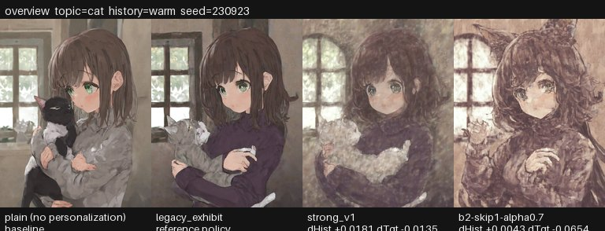
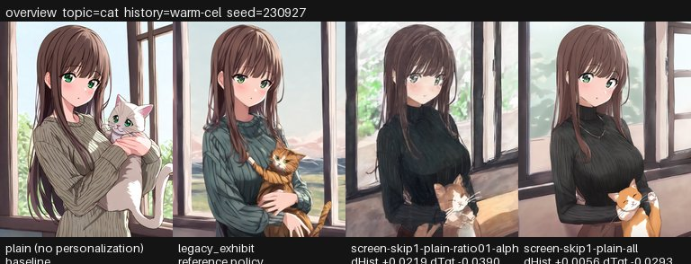

# FAN 強度実験 · 結果レポート

生成日時: 2026-09-22 15:44:19 JST

`build_strength_report.py` がディスク上の成果物だけから作ります。
実行されていない実験は **未実施** であり、成功でも失敗でもありません。

条件ごとの設定と生成画像の一覧は [GALLERY.md](GALLERY.md) にあります。

## 指標の読み方

- `target_score`: 生成画像とお題文（target_text）の CLIP コサイン類似度。主題を保っているか。
- `history_score`: 生成画像と参照語句の CLIP コサイン類似度を、参照の重みで加重平均したもの。好みに寄ったか。
- `Δ` は既定 policy `legacy_exhibit` との差。`vs plain` は個人化なしの画像との差。
- 合否は既存 rules: target の床 `Δtarget ≥ -0.01`、history の改善 `Δhistory ≥ +0.005`。
- `rules.binding` が false の実験（生成設定を変えたもの）は参考値で、policy の採否には使いません。
- 数値は小数第 4 位まで。角括弧は履歴クラスタのブートストラップ 95% 区間。

## 判定・評価の回答形式

AI 判定も人による評価も、同じ形の JSON を `--judge-answers` に渡します。`kind` が `human` のファイルは「人による評価」に、それ以外は「AI 判定」に集計されます（`review.html` の書き出しは自動で `human` になります）。

```json
{
  "judge": "judge-a",
  "kind": "ai",
  "answers": {
    "<pair_id>": {
      "preference": "A",
      "target_kept": {"A": "yes", "B": "partly"},
      "note": ""
    }
  }
}
```

`preference` は `A` / `B` / `tie`、`target_kept` は `yes` / `partly` / `no`。`pair_id` は各実験の `judge/tasks.json` にあります。どちらが個人化した画像かは `judge/key.json` にだけ書いてあり、回答する側には見えません。

## 実験一覧

| 実験 | 状態 | 種別 | rules 拘束 | 内訳 |
|---|---|---|---|---|
| `e1-settings` | 完了 | policy | あり | 計測 294 / 失敗 0 / 未計測 0（レコード 294 件） |
| `e2-adapter` | 完了 | policy | あり | 計測 174 / 失敗 0 / 未計測 0（レコード 174 件） |
| `e3-references` | 完了 | policy | あり | 計測 168 / 失敗 0 / 未計測 0（レコード 168 件） |
| `e5-official-sampler` | 完了 | generation | なし | 計測 78 / 失敗 0 / 未計測 0（レコード 78 件） |

## `e1-settings`

設定のみのスイープ。skip_pa 層数 (B1)、alpha (B2/B3)、profiling 件数 (A4)、attention mask (B4)。P0 の対照として legacy を alpha 0.4 でも測る。

- plan 項目: P0, P1, B1, B2, B3, B4, A4
- 種別: policy（rules 拘束: あり）
- 状態: **完了** — 計測 294 / 失敗 0 / 未計測 0（レコード 294 件）
- experiment hash: `f333ad4e8c74c132b39d3f50fc55c359d3982816941afab37b6631cb5c685cfd`
- 出力: `exhibit/outputs/fan-evaluation/strength/f333ad4e8c74c132b39d3f50fc55c359d3982816941afab37b6631cb5c685cfd`
- 画像: [e1-settings/index.md](e1-settings/index.md)（シート 24 枚）


### policy 別

| policy_id | alpha | skip_pa | pooled | profiling | mask | embed_gain | Δhistory vs legacy | Δtarget vs legacy | Δhistory vs plain | Δtarget vs plain | 判定 |
|---|---|---|---|---|---|---|---|---|---|---|---|
| `b2-skip1-alpha0.7` | 0.70 | [0] | plain | ratio 0.1 | なし | — | +0.0239 [+0.0148, +0.0329] | -0.0729 [-0.0816, -0.0619] | +0.0290 | -0.0787 | 不合格（target_non_degradation） |
| `b4-skip1-mask-alpha0.7` | 0.70 | [0] | plain | ratio 0.1 | あり | — | +0.0224 [+0.0133, +0.0362] | -0.0681 [-0.0831, -0.0461] | +0.0276 | -0.0739 | 不合格（numerical_failure） |
| `b3-skip1-all-alpha0.7` | 0.70 | [0] | plain | all | なし | — | +0.0205 [+0.0131, +0.0279] | -0.0658 [-0.0764, -0.0530] | +0.0257 | -0.0715 | 不合格（target_non_degradation） |
| `b4-skip1-mask-alpha0.5` | 0.50 | [0] | plain | ratio 0.1 | あり | — | +0.0176 [+0.0115, +0.0258] | -0.0660 [-0.0751, -0.0555] | +0.0227 | -0.0717 | 不合格（numerical_failure） |
| `strong_v1` | 0.50 | [0] | plain | ratio 0.1 | なし | — | +0.0170 [+0.0129, +0.0223] | -0.0096 [-0.0176, -0.0015] | +0.0222 | -0.0154 | 合格 |
| `a4-skip1-count4-alpha0.5` | 0.50 | [0] | plain | count 4 | なし | — | +0.0147 [+0.0085, +0.0210] | -0.0152 [-0.0239, -0.0044] | +0.0199 | -0.0209 | 不合格（target_non_degradation） |
| `a4-skip1-count2-alpha0.5` | 0.50 | [0] | plain | count 2 | なし | — | +0.0140 [+0.0076, +0.0215] | -0.0154 [-0.0226, -0.0054] | +0.0192 | -0.0211 | 不合格（target_non_degradation） |
| `b2-skip1-alpha1.0` | 1.00 | [0] | plain | ratio 0.1 | なし | — | +0.0135 [+0.0108, +0.0161] | -0.1160 [-0.1627, -0.0693] | +0.0186 | -0.1218 | 不合格（target_non_degradation） |
| `b2-skip1-alpha0.85` | 0.85 | [0] | plain | ratio 0.1 | なし | — | +0.0121 [+0.0063, +0.0168] | -0.1052 [-0.1549, -0.0556] | +0.0173 | -0.1110 | 不合格（target_non_degradation） |
| `b1-skip4-alpha0.5` | 0.50 | [0,1,2,3] | plain | ratio 0.1 | なし | — | +0.0044 [+0.0011, +0.0085] | -0.0090 [-0.0172, -0.0016] | +0.0096 | -0.0147 | 不合格（history_improvement） |
| `legacy-alpha0.4` | 0.40 | [0,1,2,3,4,5,6,7] | plain | all | なし | — | -0.0002 [-0.0020, +0.0020] | +0.0004 [-0.0047, +0.0070] | +0.0050 | -0.0054 | 不合格（history_improvement） |

### 履歴別 Δhistory vs legacy

| policy_id | warm | cool | mixed | sparse |
|---|---|---|---|---|
| `b2-skip1-alpha0.7` | +0.0338 | +0.0144 | +0.0152 | +0.0320 |
| `b4-skip1-mask-alpha0.7` | +0.0193 | +0.0144 | +0.0123 | +0.0435 |
| `b3-skip1-all-alpha0.7` | +0.0294 | +0.0086 | +0.0265 | +0.0176 |
| `b4-skip1-mask-alpha0.5` | +0.0166 | +0.0113 | +0.0117 | +0.0306 |
| `strong_v1` | +0.0252 | +0.0122 | +0.0136 | +0.0170 |
| `a4-skip1-count4-alpha0.5` | +0.0237 | +0.0083 | +0.0183 | +0.0087 |
| `a4-skip1-count2-alpha0.5` | +0.0258 | +0.0065 | +0.0150 | +0.0087 |
| `b2-skip1-alpha1.0` | +0.0114 | +0.0160 | +0.0163 | +0.0102 |
| `b2-skip1-alpha0.85` | +0.0184 | +0.0146 | +0.0120 | +0.0035 |
| `b1-skip4-alpha0.5` | +0.0103 | +0.0032 | +0.0042 | +0.0001 |
| `legacy-alpha0.4` | -0.0022 | +0.0033 | -0.0019 | +0.0001 |

### AI 判定（plain との 2 枚比較）

判定素材: `e1-settings/judge/tasks.json`（264 ペア）、画像は `e1-settings/judge/pairs/`。正解は `e1-settings/judge/key.json` にあり、tasks.json には入っていません。

回答者: claude-opus, claude-sonnet（回答済み 264 / 264 ペア）

| policy_id | plain に対する勝率 | n（引き分け除く） | 引き分け | target 維持率（はい） | n |
|---|---|---|---|---|---|
| `a4-skip1-count2-alpha0.5` | 0.7826 | 23 | 5 | 0.5714 | 28 |
| `a4-skip1-count4-alpha0.5` | 0.6957 | 23 | 5 | 0.7143 | 28 |
| `b1-skip4-alpha0.5` | 0.6800 | 25 | 3 | 0.6071 | 28 |
| `b2-skip1-alpha0.7` | 0.6800 | 25 | 3 | 0.1786 | 28 |
| `b2-skip1-alpha0.85` | 0.6429 | 28 | 0 | 0.0357 | 28 |
| `b2-skip1-alpha1.0` | 0.6786 | 28 | 0 | 0.0000 | 28 |
| `b3-skip1-all-alpha0.7` | 0.6154 | 26 | 2 | 0.1429 | 28 |
| `b4-skip1-mask-alpha0.5` | 0.6087 | 23 | 5 | 0.2143 | 28 |
| `b4-skip1-mask-alpha0.7` | 0.7200 | 25 | 3 | 0.1071 | 28 |
| `legacy-alpha0.4` | 0.5000 | 12 | 16 | 0.8929 | 28 |
| `strong_v1` | 0.7200 | 25 | 3 | 0.6429 | 28 |

判定者間の一致率: 0.3636（複数人が答えたペア 44 件のうち 16 件で全員一致）

### 人による評価

未実施。人の回答を代わりに作ることはしません。

1. `review.html` をブラウザで開く（ファイルを直接開けます）。
2. 氏名を入れると、ペアの並びがその氏名から決まる順に入れ替わります。
3. 各ペアで「参照の好みに近いのはどちら？」と「お題(target)を保っているか」に答える。
4. 「回答を書き出す」で JSON を保存し、`build_strength_report.py --judge-answers <保存した JSON>` に渡す。

## `e2-adapter`

アダプタ側の小改修。埋め込み空間のゲイン embed_gain (C1) と EOS 位置で個人化した pooled (C2)。

- plan 項目: C1, C2
- 種別: policy（rules 拘束: あり）
- 状態: **完了** — 計測 174 / 失敗 0 / 未計測 0（レコード 174 件）
- experiment hash: `88709d3fcf87b55610fbea7726f62d4f19e9f3bed7fbf9b0440957a43b16b9b5`
- 出力: `exhibit/outputs/fan-evaluation/strength/88709d3fcf87b55610fbea7726f62d4f19e9f3bed7fbf9b0440957a43b16b9b5`
- 画像: [e2-adapter/index.md](e2-adapter/index.md)（シート 24 枚）


### policy 別

| policy_id | alpha | skip_pa | pooled | profiling | mask | embed_gain | Δhistory vs legacy | Δtarget vs legacy | Δhistory vs plain | Δtarget vs plain | 判定 |
|---|---|---|---|---|---|---|---|---|---|---|---|
| `c2-faneos-alpha0.7` | 0.70 | [0] | fan_eos | ratio 0.1 | なし | — | +0.0234 [+0.0162, +0.0305] | -0.0675 [-0.0797, -0.0525] | +0.0286 | -0.0733 | 不合格（target_non_degradation） |
| `c2-faneos-alpha0.5` | 0.50 | [0] | fan_eos | ratio 0.1 | なし | — | +0.0170 [+0.0137, +0.0231] | -0.0124 [-0.0218, -0.0040] | +0.0222 | -0.0182 | 不合格（target_non_degradation） |
| `c1c2-faneos-gain1.5-alpha0.5` | 0.50 | [0] | fan_eos | ratio 0.1 | なし | 1.50 | +0.0129 [+0.0031, +0.0246] | -0.1082 [-0.1213, -0.0940] | +0.0181 | -0.1140 | 不合格（target_non_degradation） |
| `c1-gain1.5-alpha0.5` | 0.50 | [0] | plain | ratio 0.1 | なし | 1.50 | +0.0091 [-0.0002, +0.0177] | -0.1172 [-0.1340, -0.0980] | +0.0143 | -0.1230 | 不合格（target_non_degradation） |
| `c1-gain2.5-alpha0.5` | 0.50 | [0] | plain | ratio 0.1 | なし | 2.50 | +0.0004 [-0.0161, +0.0160] | -0.1844 [-0.1931, -0.1757] | +0.0056 | -0.1901 | 不合格（numerical_failure） |
| `c1-gain2.0-alpha0.5` | 0.50 | [0] | plain | ratio 0.1 | なし | 2.00 | -0.0001 [-0.0101, +0.0100] | -0.1964 [-0.2159, -0.1769] | +0.0051 | -0.2022 | 不合格（target_non_degradation, history_improvement） |

### 履歴別 Δhistory vs legacy

| policy_id | warm | cool | mixed | sparse |
|---|---|---|---|---|
| `c2-faneos-alpha0.7` | +0.0301 | +0.0155 | +0.0170 | +0.0309 |
| `c2-faneos-alpha0.5` | +0.0260 | +0.0141 | +0.0146 | +0.0134 |
| `c1c2-faneos-gain1.5-alpha0.5` | +0.0294 | +0.0001 | +0.0102 | +0.0119 |
| `c1-gain1.5-alpha0.5` | +0.0212 | -0.0044 | +0.0125 | +0.0070 |
| `c1-gain2.5-alpha0.5` | +0.0198 | -0.0255 | +0.0122 | -0.0047 |
| `c1-gain2.0-alpha0.5` | +0.0084 | -0.0138 | +0.0115 | -0.0064 |

### AI 判定（plain との 2 枚比較）

判定素材: `e2-adapter/judge/tasks.json`（144 ペア）、画像は `e2-adapter/judge/pairs/`。正解は `e2-adapter/judge/key.json` にあり、tasks.json には入っていません。

回答者: claude-sonnet（回答済み 144 / 144 ペア）

| policy_id | plain に対する勝率 | n（引き分け除く） | 引き分け | target 維持率（はい） | n |
|---|---|---|---|---|---|
| `c1-gain1.5-alpha0.5` | 0.4348 | 23 | 1 | 0.0417 | 24 |
| `c1-gain2.0-alpha0.5` | 0.4348 | 23 | 1 | 0.0417 | 24 |
| `c1-gain2.5-alpha0.5` | 0.4783 | 23 | 1 | 0.1250 | 24 |
| `c1c2-faneos-gain1.5-alpha0.5` | 0.5217 | 23 | 1 | 0.0000 | 24 |
| `c2-faneos-alpha0.5` | 0.5909 | 22 | 2 | 0.4167 | 24 |
| `c2-faneos-alpha0.7` | 0.7391 | 23 | 1 | 0.1250 | 24 |

判定者間の一致率: —（複数人が答えたペア 0 件のうち 0 件で全員一致）

### 人による評価

未実施。人の回答を代わりに作ることはしません。

1. `review.html` をブラウザで開く（ファイルを直接開けます）。
2. 氏名を入れると、ペアの並びがその氏名から決まる順に入れ替わります。
3. 各ペアで「参照の好みに近いのはどちら？」と「お題(target)を保っているか」に答える。
4. 「回答を書き出す」で JSON を保存し、`build_strength_report.py --judge-answers <保存した JSON>` に渡す。

## `e3-references`

参照の設計。タグ句と自然文 (A3)、最頻レベルへの重み集中 (A5) を同じ policy で比較する。

- plan 項目: A3, A5
- 種別: policy（rules 拘束: あり）
- 状態: **完了** — 計測 168 / 失敗 0 / 未計測 0（レコード 168 件）
- experiment hash: `663fc0c361134aaf4a249ab92ab90609db589d74df46bd46eece16b40bc9da11`
- 出力: `exhibit/outputs/fan-evaluation/strength/663fc0c361134aaf4a249ab92ab90609db589d74df46bd46eece16b40bc9da11`
- 画像: [e3-references/index.md](e3-references/index.md)（シート 54 枚）


### policy 別

| policy_id | alpha | skip_pa | pooled | profiling | mask | embed_gain | Δhistory vs legacy | Δtarget vs legacy | Δhistory vs plain | Δtarget vs plain | 判定 |
|---|---|---|---|---|---|---|---|---|---|---|---|
| `b2-skip1-alpha0.7` | 0.70 | [0] | plain | ratio 0.1 | なし | — | +0.0219 [+0.0159, +0.0276] | -0.0693 [-0.0759, -0.0621] | +0.0283 | -0.0741 | 不合格（target_non_degradation） |
| `strong_v1` | 0.50 | [0] | plain | ratio 0.1 | なし | — | +0.0164 [+0.0136, +0.0193] | -0.0157 [-0.0221, -0.0085] | +0.0228 | -0.0206 | 不合格（target_non_degradation） |

### 履歴別 Δhistory vs legacy

| policy_id | warm | cool | mixed | sparse | warm-sentence | cool-sentence | mixed-sentence | sparse-sentence | mixed-focus |
|---|---|---|---|---|---|---|---|---|---|
| `b2-skip1-alpha0.7` | +0.0338 | +0.0144 | +0.0152 | +0.0320 | +0.0196 | +0.0076 | +0.0154 | +0.0249 | +0.0341 |
| `strong_v1` | +0.0252 | +0.0122 | +0.0136 | +0.0171 | +0.0153 | +0.0103 | +0.0138 | +0.0179 | +0.0222 |

### AI 判定（plain との 2 枚比較）

判定素材: `e3-references/judge/tasks.json`（108 ペア）、画像は `e3-references/judge/pairs/`。正解は `e3-references/judge/key.json` にあり、tasks.json には入っていません。

回答者: claude-sonnet（回答済み 108 / 108 ペア）

| policy_id | plain に対する勝率 | n（引き分け除く） | 引き分け | target 維持率（はい） | n |
|---|---|---|---|---|---|
| `b2-skip1-alpha0.7` | 0.8148 | 54 | 0 | 0.0741 | 54 |
| `strong_v1` | 0.7959 | 49 | 5 | 0.4259 | 54 |

判定者間の一致率: —（複数人が答えたペア 0 件のうち 0 件で全員一致）

### 人による評価

未実施。人の回答を代わりに作ることはしません。

1. `review.html` をブラウザで開く（ファイルを直接開けます）。
2. 氏名を入れると、ペアの並びがその氏名から決まる順に入れ替わります。
3. 各ペアで「参照の好みに近いのはどちら？」と「お題(target)を保っているか」に答える。
4. 「回答を書き出す」で JSON を保存し、`build_strength_report.py --judge-answers <保存した JSON>` に渡す。

## `e5-official-sampler`

A6: 公式の生成設定に寄せた対照 (negative なし、非 SDE の DPM++、50 steps)。生成設定が違うため rules は拘束しない。

- plan 項目: A6
- 種別: generation（rules 拘束: なし）
- 状態: **完了** — 計測 78 / 失敗 0 / 未計測 0（レコード 78 件）
- experiment hash: `dabfba38cbc5699d39d2260a00b8f24aac906fb7986ed3830b72fa20dfdd0e65`
- 出力: `exhibit/outputs/fan-evaluation/strength/dabfba38cbc5699d39d2260a00b8f24aac906fb7986ed3830b72fa20dfdd0e65`
- 生成設定の上書き: `{"negative_prompt": "", "steps": 50, "scheduler_kwargs": {"algorithm_type": "dpmsolver++", "use_karras_sigmas": true}}`
- 画像: [e5-official-sampler/index.md](e5-official-sampler/index.md)（シート 24 枚）



### policy 別

| policy_id | alpha | skip_pa | pooled | profiling | mask | embed_gain | Δhistory vs legacy | Δtarget vs legacy | Δhistory vs plain | Δtarget vs plain | 判定 |
|---|---|---|---|---|---|---|---|---|---|---|---|
| `b2-skip1-alpha0.7` | 0.70 | [0] | plain | ratio 0.1 | なし | — | +0.0096 [+0.0019, +0.0173] | -0.0613 [-0.0741, -0.0528] | +0.0122 | -0.0713 | 不合格（target_non_degradation） |
| `strong_v1` | 0.50 | [0] | plain | ratio 0.1 | なし | — | +0.0055 [-0.0019, +0.0136] | -0.0191 [-0.0251, -0.0142] | +0.0080 | -0.0291 | 不合格（target_non_degradation） |

### 履歴別 Δhistory vs legacy

| policy_id | warm | cool | mixed | sparse |
|---|---|---|---|---|
| `b2-skip1-alpha0.7` | +0.0203 | -0.0011 | +0.0082 | +0.0109 |
| `strong_v1` | +0.0184 | -0.0030 | +0.0073 | -0.0008 |

### AI 判定（plain との 2 枚比較）

判定素材: `e5-official-sampler/judge/tasks.json`（48 ペア）、画像は `e5-official-sampler/judge/pairs/`。正解は `e5-official-sampler/judge/key.json` にあり、tasks.json には入っていません。

回答者: claude-sonnet（回答済み 48 / 48 ペア）

| policy_id | plain に対する勝率 | n（引き分け除く） | 引き分け | target 維持率（はい） | n |
|---|---|---|---|---|---|
| `b2-skip1-alpha0.7` | 0.7826 | 23 | 1 | 0.2083 | 24 |
| `strong_v1` | 0.6818 | 22 | 2 | 0.3750 | 24 |

判定者間の一致率: —（複数人が答えたペア 0 件のうち 0 件で全員一致）

### 人による評価

未実施。人の回答を代わりに作ることはしません。

1. `review.html` をブラウザで開く（ファイルを直接開けます）。
2. 氏名を入れると、ペアの並びがその氏名から決まる順に入れ替わります。
3. 各ペアで「参照の好みに近いのはどちら？」と「お題(target)を保っているか」に答える。
4. 「回答を書き出す」で JSON を保存し、`build_strength_report.py --judge-answers <保存した JSON>` に渡す。

## 参考: 正式チェーンの run

`fan-strength.json` の実験ではなく、screen / refine / heldout の正式チェーンの run です。目視 (P3) のためにシートだけを作ります。判定ペアと `review.html` には入りません。

### `heldout-3bb8cd97`

- 段階: heldout
- 状態: **完了** — 計測 156 / 失敗 0 / 未計測 0（レコード 156 件）
- experiment hash: `3bb8cd97a9c11518ce5b31b26c1a9ac61beabc70fc605d1e8ae8210f3b7ff3df`
- 判定: selected（不合格 1, 合格 1）
- 出力: `exhibit/outputs/fan-evaluation/3bb8cd97a9c11518ce5b31b26c1a9ac61beabc70fc605d1e8ae8210f3b7ff3df`
- 画像: [heldout-3bb8cd97/index.md](heldout-3bb8cd97/index.md)（シート 48 枚）



| policy_id | alpha | skip_pa | pooled | profiling | mask | embed_gain | Δhistory vs legacy | Δtarget vs legacy | Δhistory vs plain | Δtarget vs plain | 判定 |
|---|---|---|---|---|---|---|---|---|---|---|---|
| `screen-skip1-plain-ratio01-alpha-0.5` | 0.50 | [0] | plain | ratio 0.1 | なし | — | +0.0131 [+0.0073, +0.0184] | -0.0076 [-0.0107, -0.0038] | +0.0209 | -0.0125 | 合格 |
| `screen-skip1-plain-all` | 0.40 | [0] | plain | all | なし | — | +0.0032 [-0.0000, +0.0064] | -0.0017 [-0.0057, +0.0024] | +0.0111 | -0.0065 | 不合格（history_improvement） |

## 見方

- シート画像は 1 ケース（topic × history × seed）を 1 枚にまとめたものです。左から plain（個人化なし）、legacy_exhibit（現行既定）、宣言順の候補 policy が並びます。
- 各タイルの下の帯に policy_id と、そのケースでの legacy_exhibit に対する Δhistory（dHist）・Δtarget（dTgt）が入っています。帯は ASCII のみです。
- 同じ行の画像は seed も生成設定も同じで、encoder の policy だけが違います。違いが見えない場合、その policy はそのケースで効いていません。
- 各実験の `index.md` に参照語句の全文があります。どの好みを再現しようとしたのかはそこで確認してください。
- `judge/pairs/` の画像は plain と候補の 2 枚で、左右はペアごとに入れ替えてあります。どちらが候補かは `judge/key.json` にだけ書いてあります。

## 再実行

```bash
PYTHONPATH=exhibit/src exhibit/.venv/bin/python exhibit/scripts/evaluate_fan.py strength --config exhibit/configs/fan-strength.json --experiment e1-settings --resume
PYTHONPATH=exhibit/src exhibit/.venv/bin/python exhibit/scripts/evaluate_fan.py strength --config exhibit/configs/fan-strength.json --experiment e2-adapter --resume
PYTHONPATH=exhibit/src exhibit/.venv/bin/python exhibit/scripts/evaluate_fan.py strength --config exhibit/configs/fan-strength.json --experiment e3-references --resume
PYTHONPATH=exhibit/src exhibit/.venv/bin/python exhibit/scripts/evaluate_fan.py strength --config exhibit/configs/fan-strength.json --experiment e5-official-sampler --resume
PYTHONPATH=exhibit/src exhibit/.venv/bin/python exhibit/scripts/build_strength_report.py
PYTHONPATH=exhibit/src exhibit/.venv/bin/python exhibit/scripts/build_strength_report.py \
  --judge-answers <回答1>.json <回答2>.json
```
