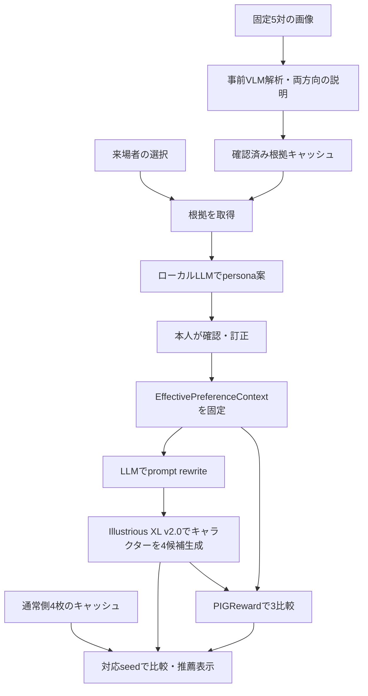

# ZIPP-style persona × PIGReward：9月23日展示デモ設計

作成日: 2026-09-19 / 更新日: 2026-09-20 / 展示日: 2026-09-23 / 状態: 実装済みデモをIllustrious XL v2.0のキャラクターイラストへ変更

添付提案を起点に、ZIPP・PIGRewardの論文と公開モデルを確認して作成した設計書。[FAN中心の旧展示案](2026-09-19-personalized-t2i-exhibition-demo-design.md)を更新する。初稿作成時にはモデルの取得・推論・速度測定を行っていない。以下の性能予算は設計目標であり、実装と実測は `exhibit/README.md` とレポートを参照する。9/20の変更で、展示の生成器と固定画像をIllustrious XL v2.0によるキャラクターイラストに統一する。

## 1. 展示の目的と採用方針

**5回の画像選択から好みを言葉にし、本人が修正した好みで画像を生成し、その中からPIGRewardが1枚を推薦する。**

採用案は **ZIPPのpersona-conditioned prompt rewritingを応用した独自実装 + 公開PIGRewardによる候補選択**。来場者ごとの追加学習は行わない。FAN、Premier、Tailored Visionsのライブ比較は展示後の拡張とする。

### 前提と実環境

- 添付提案から引き継ぐ要件: 9/23展示、約5回の二択、読める・修正できるpersona、4候補、通常生成との比較、推薦理由。
- 既存設計から引き継ぐ前提: 1台の展示端末、ローカル主体、ネットワーク障害時にも展示を継続。
- 9/19確認の実機: RTX 4090、VRAM 24,564 MiB、ホストRAM約62 GiB。
- 外部APIの利用条件は未指定のため、必須依存にしない。代案として残す。
- リポジトリ構成の移行はmainへ取り込まれている。現在の `fan-repro/` 等の配置を基準にする。

## 2. 論文を読んで確認したこと

### 2.1 ZIPP

対象: *ZIPP: Zero-shot Image Personalization from Personas*, arXiv:2606.08841v1。本文§3–5、Appendix B・D・G・Hを中心に確認した。

原手法は、Reddit行動グラフからGATv2でユーザー表現を学び、自然言語personaへ変換し、そのpersonaでLLMにプロンプトを書き換えさせる。画像生成器は凍結する。書き換えでは元の被写体と意図を保持する。既定の生成器はSDXLである。[論文§3、Appendix B・D](https://arxiv.org/html/2606.08841v1)

原論文のfew-shotは過去のプロンプトを例示する設定で、今回の5回の画像選択とは異なる。報告された79%は、属性・職業・趣味の質問からpersonaを作った実験の、personaなし書き換えとの250比較の結果。展示の成功率には使用しない。[Appendix D・G.1](https://arxiv.org/html/2606.08841v1)

公式ページはECCV 2026と表示し、コード・データは確認時点でComing Soon。公開実装の到着を前提に日程を組まない。[公式ページ](https://behavior-in-the-wild.github.io/zipp.html)

### 2.2 PIGReward

対象: *Personalized Reward Modeling for Text-to-Image Generation*, arXiv:2511.19458v1、および著者公開PDF。本文の手法・実験と公開モデルを確認した。

原手法は二段階。Preference reasonerは、履歴の「お題・選ばれた画像・選ばれなかった画像」を選択理由の文章へ変換する。Evaluatorは、その文章群と新しいお題・候補2枚から評価軸、比較理由、点数、選択結果を生成する。両者はQwen2-VL-7Bベースの、事前に学習された別モデルである。[論文§3.1](https://arxiv.org/html/2511.19458v1)

公開checkpointは evaluator の `jeongeunnn/pigreward` と reasoner の `jeongeunnn/pigreward-bootstrap` に分かれ、それぞれ約16.6 GB。ファイル容量は推論時VRAM量ではない。[Evaluatorカード](https://huggingface.co/jeongeunnn/pigreward)、[Evaluatorファイル](https://huggingface.co/jeongeunnn/pigreward/tree/main)、[Bootstrapファイル](https://huggingface.co/jeongeunnn/pigreward-bootstrap/tree/main)

公開物にはロード例・出力例・汎用chat templateがあるが、専用タスク指示を含む完全な推論スクリプトは確認できなかった。**重みの公開と、今回の入力で推論が成立することは別の検証項目**とする。[モデルカード](https://huggingface.co/jeongeunnn/pigreward)、[公式プロジェクト](https://jeongeunnn-e.github.io/projects/PIGReward/)

著者公開PDFのPIGBench評価は、人間による4枚のランキングから1位と4位を取り出した二者比較。報告された84.91%等を「4枚から本人の1位を当てる確率」として利用しない。[公式PDF §4.1・Table 2](https://jeongeunnn-e.github.io/projects/PIGReward/static/PIGReward.pdf)

### 2.3 添付提案からの修正点

| 論点 | 展示設計での扱い |
|---|---|
| 「ZIPPを再現」 | 「ZIPP-style」と表記。画像選択からのpersona推定は独自実装 |
| 「zero-shot / 5-shot」 | 「5回の選択・個人別の追加学習なし」と説明 |
| PIGRewardの組み込み | ZIPP論文では評価指標。生成後の候補選択への組み込みは本展示の設計 |
| 4枚を3回比較してランキング | 得られるのはトーナメントの勝者。2～4位は表示しない |
| 色・構図などの9/10表示 | 公式出力に数値例はあるが、全比較共通の1～10尺度は保証されない。MVPは短い理由を表示 |
| 「選ばれなかった＝嫌い」 | その相手との比較では選ばれなかった、という相対情報として保持 |
| FLUXが必要 | 必須ではない。SDXL互換のIllustrious XLで二次元イラストを生成 |
| 論文の勝率・精度 | 原実験と展示の実測を分離し、期待成功率には転用しない |

ZIPPの評価指標については[§4.1](https://arxiv.org/html/2606.08841v1)、点数の出力例は[PIGRewardカード](https://huggingface.co/jeongeunnn/pigreward)を参照。

## 3. 構成案の比較と選択

| 案 | 体験と負荷 | 判断 |
|---|---|---|
| A. 固定画像のVLM解析を事前計算し、当日はpersona・生成・推薦をローカル実行 | 画像選択の意味を保ち、当日の大きなVLM呼び出しを減らせる | **採用案** |
| B. 毎回VLM/APIへ画像履歴を送り、オンラインで処理 | 自由度は高い。通信・API・モデル切替の影響が増える | 持ち込み画像等の将来拡張 |
| C. 代表的な体験をすべて事前生成 | 安定する。本人の選択をその場で反映した結果とは区別が必要 | 障害時のサンプル展示 |

案Aでは固定5対の「左を選んだ場合」「右を選んだ場合」のVLM説明を計10件、事前計算する。来場者には「画像の特徴は事前にAIが解析し、あなたの選択から好みを組み立てています」と説明する。

Bootstrapの推論形式や利用条件を確定できない場合は、別VLMで事前解析する。その場合は `context_source=generic_vlm` と記録し、「PIGRewardの履歴推定まで再現」とは表示しない。どちらも実機確認できない場合はライブ推薦を成立済みと扱わない。

## 4. MVPの範囲

必須機能:

- 固定5対・10枚からの二択と「決められない」。左右はランダム化する。
- 根拠付きの美的persona。各項目のOFFと、用意した候補への訂正。
- 固定6お題、通常側4枚と個人化側4枚、対応seedでの比較。
- PIGRewardによる3回の比較と、おすすめ1枚・短い理由の表示。
- 来場者自身による最終選択。「おすすめが合わない」ことも表現できる。
- 単一GPUの排他制御、途中結果表示、タイムアウト、セッションリセット。
- オフライン起動、実際の生成結果／事前生成サンプルを区別する表示。

9/23の必須範囲に含めないもの:

- Redditデータ取得、GATv2学習、個人別LoRA・DPO、PIGRewardの再学習。
- 持ち込み画像、ログイン、プロフィールの長期保存。
- 日本語自由入力、自由記述でのpersona訂正、複数人の同時生成。
- FLUXへの移行、FANライブ比較、4枚の完全順位付け、固定尺度のレーダーチャート。

添付提案の自由入力例は、まず「東京の夜景と青年」等を固定お題として実現する。自由入力は品質と待ち時間の検証後に追加する。

## 5. 来場者体験

### 5.1 選ぶ

1画面1対、全5問。両画像に共通する短いお題を表示する。「どちらがより好きですか」「決められない」で回答する。負けた画像に×印や「嫌い」のラベルを付けない。

各対は同じ被写体・場面を保ち、配色、光、構図、描画表現、雰囲気のうち1～2軸を主に変える。被写体の好みを画風の好みと誤認しにくくするためであり、完全に独立した心理測定とは主張しない。5問は複数の題材に分散する。

3問以上の有効選択でpersonaへ進める。2問以下なら未回答の対を再表示し、選べなければ通常生成またはサンプル体験を案内する。skipを勝敗データに変換しない。

### 5.2 好みを確かめる

表示例:

> AIは「柔らかな光」「余白の多い構図」が好きそうだと考えました。違っていたら直してください。

色・光・構図・質感／描画表現・雰囲気を最大5項目で表示する。描画表現は二次元イラスト内の「柔らかな絵筆のタッチ／くっきりしたアニメ塗り」とし、写真風への切替は設けない。根拠のない項目は「まだ分かりません」とする。性格・年齢・職業を推定しない。

各項目から根拠になった選択画像を確認できる。「今回は反映しない」と少数の訂正候補を用意する。確かさは「複数の選択で見られた傾向／1回だけの仮説」と根拠数で示し、校正されていない確率は出さない。

### 5.3 お題を選び、描く

初期お題は「窓辺で猫と過ごす少女」「東京の夜景と青年」「森を旅する魔法使い」「海辺の灯台と船乗り」「雨の街角の少女」「カフェで迎える店員」の6件。日本語表示と検証済み英語の基本プロンプトを対応付ける。選択対と6お題の基本プロンプトは人物数・外見・衣装・場面と、イラストの描画指定・品質タグを含み、通常・個人化の両方で保持する。人物抑制の指定は外す。色・光・構図・塗り・雰囲気を個人化し、髪型・顔立ち・服装自体の嗜好推定は今回の範囲に含めない。画像間で厳密に同じ顔を維持する保証は設けない。

「好みを使わず補足した描き方」と「あなた向けの描き方」を短く表示し、実際の英語プロンプトは詳細欄で読めるようにする。生成開始後はこの実行のpersonaを固定する。編集する場合は実行を中止し、改めて生成する。

### 5.4 比較し、選ぶ

通常側4枚はキャッシュから表示し、個人化側は1枚ずつ完成した時点で表示する。両側は同じseedの画像を同じ位置へ置く。

4枚生成後に「この4枚からおすすめを選んでいます」と表示する。推薦完了後、勝者にマークを付け、最終比較に基づく理由を1～2文で表示する。「柔らかな光と余白が、選択から推定した好みに合うと評価しました」のように、モデルの判断として表現する。

来場者は推薦結果に関係なく好きな1枚を選べる。「もう一度」「終了」を用意し、90秒の無操作でリセットする。実行中は無操作リセットを止め、処理タイムアウトを適用する。

## 6. データと好みの扱い

| データ | 必須項目と契約 |
|---|---|
| `PairAsset` | pair ID、版、共通basic prompt、画像ID・hash、生成条件、出典 |
| `PreferenceChoice` | pair ID、chosen ID、other ID、skip、左右表示順。左右番号を画像識別子にしない |
| `EvidenceFragment` | VLM説明の短い節、対応choice、dimensionタグ、source model/revision、template hash、確認状態 |
| `PersonaDraft` | 各軸の推定値、evidence IDs、根拠数、矛盾・不明の状態 |
| `EffectivePreferenceContext` | 有効な好み・根拠節・本人の訂正、choice IDs、version/hash。生成と推薦の共通入力 |
| `GenerationRun` | session/job ID、context hash、basic/generic/personalized prompt、モデルrevision、全生成設定、4 seeds、画像hash、所要時間 |
| `PairwiseJudgment` | candidate IDsと入力順、context hash、評価軸、理由、任意の生スコア、winner/tie/invalid、model/template/parser版 |
| `ExhibitResult` | live/exact-cache/sample/manualの区別、画像、比較記録、おすすめIDまたは推薦なし、障害理由 |

### 根拠の事前計算

固定5対の両方向、計10件をbootstrapまたは代替VLMへ入力する。各入力は共通お題、2枚の画像、選ばれた側を含む。逆向きの説明を単純な否定文で代用しない。

説明は文・節単位で軸タグを付け、画像にない特徴、相対選択からの過剰な一般化、意味不明な説明を準備段階で除く。元の出力と、展示で使う確認済み断片を分けて保持する。この文脈整形は独自仕様であり、PIGRewardの完全再現ではない。

### 本人の訂正を両経路へ反映する

生成ボタンで `EffectivePreferenceContext` を確定し、以後そのhashを固定する。

- OFFにした軸を含む根拠節は、生成用・推薦用の両方から除く。複数軸を含む節は節全体を除く。
- 訂正した軸は推定値と矛盾する根拠節を除き、「本人が指定した好み」として値を入れる。
- 未編集の軸は、選択に紐づく自然言語根拠を保つ。personaの短い箇条書きだけで履歴を置き換えない。
- raw bootstrap出力や元の全personaを下流へ別経路で渡さない。OFFにした嗜好の再混入を防ぐ。
- すべてOFFなら通常側のキャッシュ4枚を表示し、個人化生成・個人化推薦を実行しない。
- リセット／訂正後に古いjobが完了しても、session・job・context hashが一致しない結果を表示しない。

準備時には同じ選択の未加工contextと整形contextを比較し、極端な判断変化や根拠消失を確認する。

## 7. プロンプト書き換えと画像生成

### 7.1 書き換え契約

基本プロンプトの被写体、数、動作、場所、時間帯、明示的な色指定を守る。「茶髪のキャラクター」を寒色嗜好だけで青髪へ変えない。好みは元のお題と矛盾しない配色・光・質感・構図へ適用する。

personaなし／ありの両経路で同じ書き換えモデルと同等の長さ制約を使う。通常側も自然な詳細を補い、単に長いプロンプトになった効果とpersonaの効果を混同しにくくする。通常側は固定お題ごとに事前計算し、モデル・テンプレートの版を固定する。

英語プロンプトは使用するIllustrious XLの両tokenizerで切り詰めが発生しない長さへ収める。語数だけで判定しない。persona欄や解説文をそのまま生成器へ流し込まない。長過ぎる／意味保持に失敗した出力は1回だけ修正し、再失敗時は通常側のキャッシュを表示し、「今回は好みを反映できませんでした」と案内する。この実行では個人化生成・PIGReward推薦を省略する。

固定6お題の不変条件は設定ファイルに記載し、初日の実例とリハーサルで被写体・数・場所が保たれるか確認する。

### 7.2 生成器

採用モデルは `OnomaAIResearch/Illustrious-XL-v2.0`、固定revisionは `69459c1fe6f46db41ab31e6114f05acc0e06bcaa`。SDXL互換パイプラインにイラスト向けのIllustrious XLの重みを読み込み、個人別の追加学習は行わない。[公式モデルカード](https://huggingface.co/OnomaAIResearch/Illustrious-XL-v2.0)

設定は1024×1024、28 steps、guidance 6.5、Euler ancestral、fp16、batch size 1。配布された単一safetensorsを `from_single_file` で読み込む。構成とtokenizerは初期Illustriousの固定revisionから取得してキャッシュし、推論時の外部取得を禁止する。UNet・VAE・text encoderの重みはv2.0を使う。negative promptは `exhibit/configs/demo.json` に固定し、低品質・手指破綻・複数画面・文字・写真・3Dなどを抑制する。通常・個人化・選択対で同じ設定にする。[プロンプト出典と設計根拠](../../reports/zipp-demo/characters/prompt-notes.md)を参照。

選択10枚・通常24枚・代表履歴のサンプル24枚をIllustrious XLで再生成し、画像hash、生成条件、出典、VLMの両方向解析と確認済み根拠、静的HTMLを更新する。SDXLで作った旧画像・根拠・測定値を新モデルの結果として流用しない。4枚同時batchは使わず、必要なら768×768も測定し、品質を確認して切り替える。その際は通常側キャッシュも再生成する。

### 7.3 比較の公平性

各お題のseed列を `s0, s1, s2, s3` とし、通常側 `G_i` と個人化側 `P_i` に同じseedを使う。モデル、scheduler、steps、解像度、precision、negative promptを一致させる。

- 生成の変化: 4組の `G_i ↔ P_i` を表示する。
- 推薦の働き: 個人化4枚から選んだ1枚を示す。
- 勝者を大きく見せる場合: 同じseedの通常画像も隣に出す。ただし勝者を選んだ後の対比だけを性能評価に使わない。
- 展示後の評価: personaなし補足・personaあり・personaあり＋推薦を分ける。PIGRewardで選んだ画像をPIGRewardで採点しただけの改善を、人間の満足度と扱わない。

## 8. PIGRewardの候補選択

### 8.1 入力と呼び出し回数

Evaluatorには `basic_prompt_en`、`EffectivePreferenceContext` の自然言語根拠と本人指定、候補画像2枚を渡す。書き換え後プロンプトは監査用に保存するが、評価のお題は元のお題に固定する。追加した好みの語句への追従だけが評価になることを避けるためである。

履歴画像10枚は毎回送らない。画像2枚と文章contextに限定する。初期前処理はアスペクト比を保った長辺512px以下を候補とし、文字数・画像token数・出力token数の上限を計測で確定する。学習時の設定や理論上のcontext長を、展示の安全な上限と見なさない。

候補の組み合わせをsessionの乱数で決め、左右順も記録する。

```text
A vs B → W1
C vs D → W2
W1 vs W2 → おすすめ1枚
```

最大3比較。通常時に往復比較や総当たりを追加しない。勝者はこの組み合わせで選ばれた推薦であり、全相手に勝つことは保証しない。

### 8.2 出力検証と理由表示

専用adapterで画像IDへの対応、明示的winner、軸ごとの比較、出力終了を検証する。モデルに存在しないJSON仕様を公式契約と仮定しない。生出力もsession中は保持する。

数値がある場合は比較内の整合性を確認する。数値欠損やwinnerとの矛盾を作った点数で埋めない。別試合で異なる軸・尺度の点数を合算して4枚の順位に変換しない。

同点、途中で切れた出力、解析不能、明確な矛盾は `inconclusive` とし、トーナメントを中止して手動選択へ移る。seed順で「PIGRewardのおすすめ」を捏造しない。左右入替の事前検証で著しい位置依存が出た場合も、ライブ推薦を見送る。

一般画面には最終比較の有効な軸名と短い理由を表示する。日本語表示は事前確認済みの軸名・説明テンプレートを優先し、自由文翻訳が必要なら追加時間へ計上する。翻訳できなければ原文を詳細欄へ出し、未確認の日本語理由を作らない。

## 9. システム構成とGPU管理



現行UIはローカルHTML/JavaScript＋FastAPI、調停はPythonの単一orchestratorとする。ワーカーは別プロセスにし、UIが重いモデルを直接importしない。ローカルのJSON入出力でモデル依存を分け、外部公開サービスの構成はMVPに持ち込まない。

| 段階 | GPU上のモデル | 終了条件 |
|---|---|---|
| 展示準備 | bootstrapまたは代替VLM | 10方向分の根拠が検査済みになったら終了 |
| 選択後・persona確認 | ローカルLLM候補 `Qwen/Qwen3.5-4B` | personaとrewriteを同じワーカーで処理。確認中は保持し、rewrite完了または無操作リセットで解放 |
| 画像生成 | Illustrious XLのみ | 4枚とmetadataをCPU側へ保存し、プロセス終了 |
| 候補比較 | PIGReward evaluatorのみ | 3比較またはエラーで終了 |

Qwen3.5-4Bは既存の `tailored-visions-repro/scripts/serve_local_llm.py` を参考にする候補で、ZIPP原設定と同一とは扱わない。小さなローカルLLMによるpersona統合の品質は初日に確認する。

**1回に1sessionだけ受け付ける。** persona確認中のLLM保持もこの前提で許容する。二重送信はjob IDで抑止し、別端末の並行GPU要求は受け付けない。

GPU leaseの移譲は子プロセス終了とメモリ解放を確認してから行う。`empty_cache()` だけで重みが解放されたと判断しない。GPU同時常駐も、CPU側への全モデル常駐も初期仕様にせず、ロード時間を含めて測定する。

### 配置案

```text
exhibit/
├── pyproject.toml / uv.lock
├── src/exhibit/           # UI、状態、context編集、ジョブ調停
├── configs/              # 選択対、お題、表示文、生成設定
├── assets/               # 配布可能な選択画像と出典manifest
├── scripts/              # prepare、preflight、rehearsal
├── tests/                # 状態・文脈・cache・異常系
└── outputs/              # cache、session一時物、統計（Git対象外）

pigreward-repro/
├── README.md / pyproject.toml / uv.lock
├── src/pigreward_repro/   # 独自bootstrap/evaluator adapterとCLI
├── configs/              # revision、前処理、template、parser版
├── docs/DEVIATIONS.md    # 公開物との差・未検証部分
├── tests/
├── artifacts/            # 公開重み（Git対象外）
└── outputs/              # 準備時解析とfixture実行結果（Git対象外）
```

これは配置設計であり、本書作成時にアプリを実装した意味ではない。実在する公式sourceを取得できた場合のみ、既存方針どおり `upstream/` submoduleと `patches/` を追加する。checkpointを公式Git実装の代わりに見せない。ZIPP-styleの書き換え処理は `exhibit/` に置き、空の再現プロジェクトは作らない。

## 10. 待ち時間、キャッシュ、障害時の動作

### 10.1 性能予算

初日計測で可否を判定する目標。旧FAN案の「生成20秒・全体60秒」は引き継がない。

| 区間 | 初期目標 |
|---|---:|
| 選択完了からpersona案 | 15秒以内を目標、30秒で打切り・簡易表示へ |
| 通常側のcache表示 | 1秒以内 |
| 生成押下後のrewrite | 5秒以内 |
| Illustrious XLロード・4枚生成・解放 | 45秒以内 |
| PIGRewardロード・3比較・解放 | 40秒以内 |
| 生成押下から推薦完了 | p95 90秒以内を目標、120秒でライブ処理打切り |

ロード・IPC・保存を含むwall timeを測る。段階別の最大VRAM、RAM、モデル切替時間を記録する。選択・確認込みの体験全体は約2～3分を想定し、20秒で全工程が済むとは案内しない。

### 10.2 キャッシュのキー

- 根拠: pair版、画像hash、共通お題、chosen ID、VLM revision、template・前処理版。
- 通常画像: generic prompt、生成モデルrevision、scheduler、steps、CFG、negative prompt、解像度、precision、seed。
- 個人化結果: 生成条件にcontext hash、rewriter revision/template、実際のrewriteを加える。
- 比較結果: 候補画像hashと入力順、basic prompt、context hash、evaluator revision、template・前処理・parser版。

通常画像は6お題×4 seeds＝24枚。事前サンプルは最初に3つの代表的な選択履歴×2お題＝6体験分を用意する。PIGReward採用モードでは各体験に4候補と実際の3比較記録を含める。ZIPP-styleのみの縮小モードでは4候補と書き換え記録を保存し、PIGReward推薦は表示しない。余力があれば増やすが、5問の全回答パターンの事前生成はMVPの条件にしない。

### 10.3 失敗時の扱い

| 失敗 | 来場者に返すもの |
|---|---|
| persona生成の不正出力・30秒超過 | ワーカー終了を要求し、確認済み根拠から簡単な好み項目を表示。簡易表示であることを明示し、次のGPU処理は終了確認後に受け付ける |
| rewriteの再試行失敗 | 通常側キャッシュを表示。個人化生成・推薦を省略し、好みを反映できなかったと表示する |
| 画像生成の途中失敗 | 完成画像を保持し「一部のみ生成」と表示。4枚未満の自動推薦は省略 |
| PIGRewardのOOM・timeout・同点・解析不能 | 実際の4枚を維持し「おすすめの自動選択は利用できません。好きな1枚を選んでください」 |
| 全体120秒超過 | UIで即時打切り表示し、ワーカー終了を指示。終了確認まで次のGPU処理を始めない |
| GPU復旧不可 | 明示的な「事前生成サンプル」モードへ。他の履歴の結果を本人向け結果と表示しない |
| UI停止 | ローカル静的HTMLで事前生成体験と手法説明を展示 |

OOMを同じ設定で繰り返し再試行しない。復旧テストはスタッフ操作で行う。復帰までサンプル表示を継続し、ネット接続を復旧条件にしない。

## 11. 検証と採用判定

### G0: 最初に潰す不確実性（9/19～9/20午前）

1. checkpointの固定revision、必要ファイル、配布情報を記録する。evaluatorカードはApache-2.0表示だがbootstrapはカードがないため、同条件と推定せず確認する。資料・画像の出典も記録する。[Evaluator](https://huggingface.co/jeongeunnn/pigreward)、[Bootstrap](https://huggingface.co/jeongeunnn/pigreward-bootstrap)
2. 展示用1対で採用したreasoner（bootstrapまたは代替VLM）から両方向の説明を得る。専用templateがなければ独自adapterであることを明記する。代替VLMを採用した場合、bootstrapの動作成功は必須にしない。
3. お題・根拠文・候補2枚でevaluatorを実行し、画像対応と解析が成立することを確認する。
4. 有効な20入力で18件以上が解析可能か確認する。失敗はすべてmanualへ落ちることも確認する。同じ20組の左右反転で18組未満しか判断が一致しないならライブ推薦を採用しない。
5. 4090単体で採用reasoner（準備時のみ）、LLM、Illustrious XL、evaluatorを順次起動し、残留VRAMが次の処理を妨げないことを確認する。外部VLMを準備時だけ使う場合は、現地でreasonerを起動する必要がないことも確認する。

G0不成立ならPIGReward統合を約束しない。9/20正午を判断期限とし、実モデルによるサンプル展示が成立するか、ZIPP-styleのみへ縮小するかを結果から決める。PIGReward未動作のまま名称を実動作の説明に使わない。

### G1: 意味と比較の検証

- 左右入替後もchosen画像IDが正しく保存され、skipがcontextに混入しない。
- personaの主張に選択根拠があり、弱い情報は不明・仮説とする。
- 項目OFF・訂正後、生成と推薦が同じcontext hashを使い、除いた軸の旧根拠を渡さない。
- 訂正・リセット後に古い結果を表示しない。
- 6お題×3代表personaで、被写体・数・場所等の不変条件と切り詰めを確認する。
- 通常側と個人化側の対応seedと生成条件が一致する。
- 3比較から勝者だけが出て、同点・矛盾・中断では推薦なしになる。
- cache hit、ライブ結果、事前サンプルを画面とmetadataで区別する。

### G2: 体験と安定性の検証（9/21～9/22）

- スタッフ以外の5人程度に操作してもらい、少なくとも4人が「好みの解釈を直せる」「おすすめを自分で選び直せる」と理解できるか確認する。
- 推薦マークを出す前に本人の選択を聞く試行を設け、一致・不一致を記録する。少人数の結果を論文相当の性能と扱わない。
- warm状態から20sessionでwall timeとp95を測定。別途、冷起動・オフライン起動・2時間連続稼働を確認する。
- worker停止、出力不正、OOM相当、timeout、二重送信、リセットを試し、実画像が失われず誤った推薦を表示しないことを確認する。
- 90秒目標を超える場合は解像度変更を測定し、120秒内に安定完了しなければライブ推薦を主経路にしない。量子化・新モデル導入を直前の必須作業にしない。

## 12. 9月23日までの制作順序

| 日付 | 作るもの | 完了条件 |
|---|---|---|
| 9/19 | PIGReward入出力、1対の根拠、1比較、生成器4枚の計測 | 不確かなモデル接続を試し、失敗内容も残す |
| 9/20午前 | GPU切替とG0、固定画像・お題の確定 | モデル、template、revision、生成設定を固定 |
| 9/20午後 | 根拠cache、persona、編集、rewrite | 選択と訂正が同じcontextへ反映される |
| 9/21 | 比較UI、4枚生成、3比較、manual切替 | 1人が最初から最後まで操作できる |
| 9/22 | 通常24枚・サンプル6体験、性能・障害・第三者リハーサル | ライブ採用／縮小を決め、構成を凍結 |
| 9/23開場前 | preflight、オフライン起動、1体験、リセット | ライブとサンプルの両方を操作できる |

削る順序は自由入力、表示の装飾、追加お題、FAN等の比較機能。好みの訂正、通常との比較、失敗時の正しい表示を優先する。

## 13. 記録と当日運用

選択・persona・入力文・実画像はsession別の一時領域に保存し、終了／無操作リセットで破棄する。処理中リセットはキャンセルを要求し、ワーカー終了後に回収する。固定カードの解析と事前サンプルは別の永続assetとする。

長期保存はモデル・設定版、段階別所要時間、エラー種別等の運用情報だけを既定とする。リハーサルの生成例や本人の最終選択を研究用に残す場合は、項目を本人へ説明した別の収集として扱う。

起動前に採用モードで必要な重み、hash、通常24枚、サンプル6体験、空きメモリ、不要な常駐ワーカー、revisionを点検する。PIGReward採用モードでは比較記録を必須とし、ZIPP-styleのみの縮小モードでは推薦機能を無効化して書き換え記録を点検する。当日のモデルdownloadをなくす。推論が止まっていてもサンプルと説明を開けるようにする。

パネルには「ZIPPのpersonaによるプロンプト個人化と、PIGRewardの画像比較を応用」「画像特徴の解析は事前実行」「本人向け生成は追加学習なし」と記す。実装したモードに応じて文言を切り替える。

## 14. 既存資産と一次資料

既存資産:

- [リポジトリREADME](../../../README.md): データ・重み・独自コードの配置。
- [構成統一の設計](2026-09-19-repository-layout-and-submodules-design.md): upstreamとpatchの管理。
- [Tailored Visionsローカル実行](../../../tailored-visions-repro/docs/OFFICIAL_SETUP.md): ローカルLLMの起動とVRAM保持。
- [SDXL生成の検証](../../../tailored-visions-repro/tests/test_generation.py)、[公式adapterの検証](../../../tailored-visions-repro/tests/test_official_sdxl.py): 生成設定・loaderの参考。GPU速度の根拠にはしない。
- [FAN README](../../../fan-repro/README.md): 展示後の比較候補。

一次資料（確認日: 2026-09-19）:

- [ZIPP本文・付録](https://arxiv.org/html/2606.08841v1)、[公式プロジェクト](https://behavior-in-the-wild.github.io/zipp.html)。
- [PIGReward本文](https://arxiv.org/html/2511.19458v1)、[著者公開PDF](https://jeongeunnn-e.github.io/projects/PIGReward/static/PIGReward.pdf)、[公式プロジェクト](https://jeongeunnn-e.github.io/projects/PIGReward/)。
- [Evaluatorカード](https://huggingface.co/jeongeunnn/pigreward)、[Bootstrap配布先](https://huggingface.co/jeongeunnn/pigreward-bootstrap)。
- [SDXL baseモデルカード](https://huggingface.co/stabilityai/stable-diffusion-xl-base-1.0)。
- [Illustrious XLモデルカード](https://huggingface.co/OnomaAIResearch/Illustrious-XL-v2.0)（9/20の生成器変更時に確認）。

本書は展示の実装範囲と判定条件を定める。実装済みの機能、採用モードと最新の実機検証結果は `exhibit/README.md` を参照する。
