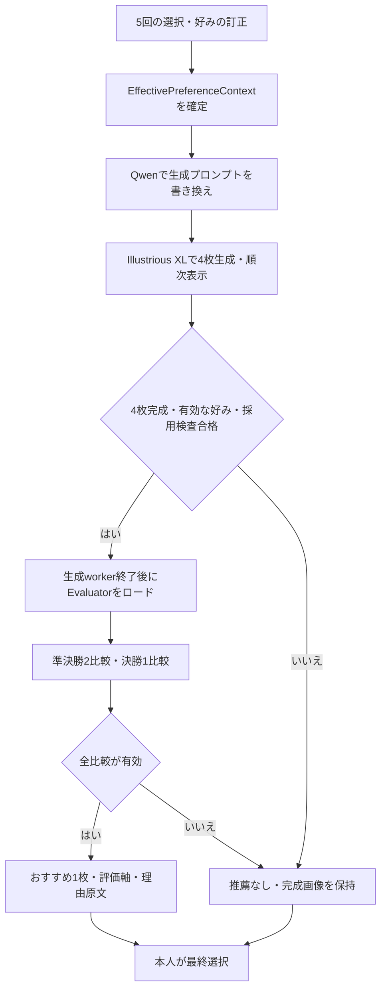

# exhibit: PIGReward 2nd-stage 導入設計

作成日: 2026-09-20 / 状態: 設計案（実装・新規GPU検証は未実施）

関連: [展示全体の設計](2026-09-19-zipp-pigreward-exhibition-demo-design.md)、[現状のREADME](../../../exhibit/README.md)、[既存G0結果](../../reports/zipp-demo/pigreward-g0.json)。本書は既存の手動選択モードに追加する推薦処理を定める。既存設計書の編集中の内容は変更しない。

## 1. 目的と範囲

来場者が5回の画像選択から確認・訂正した好みに基づき、その場で生成したIllustrious XLの4枚からPIGRewardが1枚を推薦する。本人は推薦と異なる画像や「しっくりこない」を選べる。

ユーザーの要求は「PIGRewardの2nd-stageも導入したい。設計する」。本書では2nd-stageを **Context-to-Reward evaluator** と扱う。追加確認で「その場で生成した4枚を比較・推薦する」を優先する方針が選択された。RTX 4090 24GB、ローカル主体、追加学習なし、ジョブ全体120秒の既存条件を引き継ぐ。事前サンプルへの推薦追加は必須範囲に含めない。

対象外: bootstrap reasonerへの置換、DPOによるprompt modelの学習、生成の反復最適化、通常4枚を含む8枚の順位付け、外部API、来場者データの長期保存。既存のQwenによる事前解析と本人の訂正を入力contextとして使う。展示表記は「ZIPP-style生成 + PIGReward evaluatorによる推薦」とする。

成功は、画像対応と好みの訂正を守った推薦が実機で安定して完了し、理由と本人の選択を区別して示せること。parser通過率や左右反転一致率は、人間の満足度・推薦精度とは別に扱う。

## 2. 確認した現状

- `pigreward-repro/src/pigreward_repro/worker.py` は公開checkpointを一度ロードし、候補を2枚ずつ比較する。`adapter.py` に3比較のトーナメントと保守的なparserがある。
- `exhibit/src/exhibit/service.py` に生成後のEvaluator起動経路、UIに推薦マークと理由原文の表示がある。現在は `recommendation_enabled=false`、`live_approved=false`。
- 旧SDXL画像によるG0は20入力の正順・逆順40出力で、有効な正順0/20、一致0/20。40出力中26件には勝者らしい文言があるが、形式違い、点数反復、合計の矛盾等を含む。勝者文字列の存在だけでは成功にできない。
- 既存G0のEvaluatorピークallocated VRAMは約15,980 MiB。これは過去の画像・解像度・token条件の実測であり、新設定や生成器との同時常駐の保証ではない。
- ローカルcheckpointの `generation_config.json` はTransformers 4.57.6を記録。現在のGPU環境はREADME上5.16.1。現workerは独自template、448px縮小、512出力token、greedy decodingを指定する。これらの差が原因とはまだ確定していない。
- 現在のpreflightはmanual固定の結果を返し、Evaluator重み・採用記録を検査しない。生成結果cache keyにもEvaluatorの版が含まれない。推薦イベントは生成画像イベントほどcontextの検証が強くないため、導入時に補う。

公開モデルカードは入力・出力例とロード方法を示すが、完全なタスク入力例は示していない。論文では理由contextと候補2枚を入力し、軸別比較から選好を判定する。独自adapterの適合性を実測する必要がある。参照は末尾。

## 3. 方式の比較

| 方式 | 長所 | コスト・制約 | 判断 |
|---|---|---|---|
| 4枚を3比較のトーナメントで推薦 | 既存経路を活用でき、Evaluatorの推論回数が少ない | 組合せ依存。完全順位・全候補に勝った保証はない | 採用案 |
| 全6組を比較し集計 | 候補間の関係を広く確認できる | 推論回数が倍。循環・同率への別ルールが必要 | 展示後の検討 |
| 事前サンプルだけ推薦 | 時間・GPU障害に強い | 今回の来場者の生成結果を評価したことにはならない | ライブが不成立の場合の明示的な縮小案 |

採用案では当日の比較は3回。左右反転は事前検証で行い、ライブで6回に増やさない。同点や不正出力の対をランダムな勝者で埋めない。自動再試行も初版には入れない。

## 4. データフローとGPU実行

Qwen → Illustrious → PIGRewardを既存のGPU lease下で順次実行する。各workerのプロセス終了を確認してから次を起動する。Evaluatorは1ジョブにつき1ロード、3比較を逐次実行し、その後終了する。量子化・常駐化は初版の必須条件にしない。

入力は元のお題、訂正後のcontext、候補4枚のID・ファイルhash・パス。個人化した生成プロンプトは採点指示に使用しない。通常4枚は対照表示として維持する。全OFF、生成失敗、4枚未満、採用記録不適合ではEvaluatorを起動しない。

準決勝の組合せはセッション生成時に決めたseedから再現可能にする。同じ4枚・contextのcache再利用では同じ組合せを保つ。推薦はトーナメントの勝者のみで、2〜4位や「4枚中の絶対的最良」は表示しない。

## 5. モデル入出力を確立する検証

有効化より先に、固定した開発用画像対で次の順に検証する。この作業の結果が不成立ならライブ採用条件を満たすまで無効を維持する。

1. **観測の追加**: 画像IDと順番、前処理後サイズ、image token数、入力長、生成token数、終了token、finish reason、raw全文、template/processor/runtimeの版、所要時間を記録する。EOS停止と上限打切りを区別する。
2. **入力整合**: checkpointのchat templateを使い、Image 1/2と画像を明示的に対応させる。画像placeholder数と画像tensor数・順序を検査する。元のお題とcontextを区切り、OFFの根拠を混入させない。
3. **template比較**: 現行独自指示をbaselineとし、短いタスク指示＋明確な入力区切り、必要なら公開出力例を付けた指示を順に比較する。出力例には例であることを明記し、例の点数がコピーされていないか確認する。複数要因を同時変更しない。
4. **長さ・runtimeの切り分け**: 打切りが主因の場合だけ512→1024出力tokenを比較する。入力の画像・contextを含む実token長を記録する。現環境とcheckpoint記録版の比較が必要なら独立venvを作り、既存環境を変更しない。記録版が正解とは仮定しない。
5. **parser契約を固定**: 開発用データで観測した完全な出力構造だけを受理する。空白等の表記正規化は許すが、別LLMに点数・勝者・理由を補完させない。JSON強制は学習時出力との適合を検証するまで採用しない。

出力上限や画像サイズを変えたら速度・VRAM・採用判定をやり直す。max_length=3072という学習引数の記録だけを、モデルの正式な入力上限とは解釈しない。

### 判定の受理条件

- EOSに到達し、候補2枚の一意なIDに対応している。
- 重複しない評価軸・比較理由・両候補の有限数値・合計・明示的勝者を抽出できる。
- 各候補の軸別合計と出力合計が許容誤差0.01以内で一致し、勝者の合計が相手を上回る。
- 合計同点、矛盾した勝者、途中出力、不明な構造、数値異常は棄却する。明示的同点は `inconclusive/tie` として記録する。
- 監査でOFF・訂正前の好みの再利用や根拠のない比較が見つかれば、構文が正しくても採用検証を失敗とする。数値の整合性だけでは意味の妥当性を保証しない。

好みが1軸しか残らないケースでも、軸数を満たすために好みを作らせない。論文の学習データの軸数条件と展示の訂正可能性の違いは検証項目として残す。安定しないcontextでは推薦を見送る。

## 6. 契約とサービス境界

既存 `run.status` と画像の `mode` は維持し、推薦状態を別フィールドにする。画像cacheの有無と推薦の有無を混同しない。

| 契約 | 必須情報 |
|---|---|
| EvaluationRequest | session_id、job_id、contextとhash、original_prompt、4候補のID/hash/path、bracket_seed、contract_hash |
| Judgment | match_id、round、ordered_candidate_ids/hash、status、failure_code、winner_id/null、axis_comparisons、reason、raw、finish_reason、context_hash、contract_hash |
| Recommendation | status、source、winner_id/null、final_match_id、3比較の参照、reason_en、context_hash、contract_hash、timings |

`Recommendation.status` は `disabled / pending / evaluating / recommended / inconclusive / failed / skipped`。`source` は `live / exact-cache / sample / none`。失敗コードは `invalid_output / tie / truncated / context_mismatch / candidate_mismatch / timeout / worker_exit / cancelled / insufficient_candidates / no_preferences / adoption_mismatch` 等の固定enumにする。

Coordinatorはイベントごとにsession/job/context/contract、候補ID・hash・画像順を照合する。準決勝・決勝の候補関係も検査し、誤ったwinnerを受け付けない。途中比較を内部に保持しても、全3比較とworker正常終了の確認前にはおすすめを公開しない。決勝イベント後にworkerが異常終了した場合も推薦なしにする。

失敗時はwinnerだけでなく推薦理由・マークもクリアする。完成画像・生成プロンプト・手動選択は残す。終了・編集・resetでは既存のsession/job無効化を使い、古い推薦イベントを公開しない。

## 7. 待ち時間・画面・キャンセル

設計目標は生成開始から結果確定までp95 90秒以内、ジョブ全体の推論deadlineは120秒。これは未検証の目標で、Illustrious単独20.87秒に旧Evaluatorの時間を足して達成としない。モデル読込・3比較・後処理を含む通し実測で判定する。

- 4枚は生成完了次第表示し、推薦中は「おすすめを比較中（1/3）」などの進捗を示す。
- 初版は推薦終了まで最終選択を無効にする既存契約を維持する。ただし「おすすめを待たずに自分で選ぶ」を追加する。
- このボタンは `POST /api/sessions/{sid}/runs/{job_id}/skip-recommendation` を呼ぶ。evaluating中のみ有効で、同一jobへの再送は冪等。古いjobは拒否する。生成中の中止・編集とは別に扱う。
- Coordinatorのlock下でskipを確定し、推薦イベントの公開を止める。Evaluatorの停止・プロセス回収・lease解放後に `done + skipped` とし、4枚を選択可能にする。スキップと完了の競合は先に確定した状態を採用し、スキップ確定後にマークを出さない。
- 120秒は全stage共通deadlineで、推薦開始時に時計をリセットしない。期限到達後は停止処理へ移る。SIGTERMの猶予と回収にかかる時間は別計測し、120秒ちょうどにGPUが解放済みと主張しない。
- 推薦成功時は対象に「PIGRewardのおすすめ」。比較軸は既知の軸だけ確認済み日本語名へ変換し、未知軸は原文で表示する。比較理由原文を詳細欄で読めるようにする。初版では自由文の日本語翻訳workerを追加しない。
- 理由は「決勝での比較理由」と明示する。他の3枚すべてに勝る根拠に拡張せず、モデルが出していない画像特徴を日本語定型文で補わない。点数は内部記録のみとし、満足度や確信度として見せない。
- 推薦不能時は「今回はおすすめを決められませんでした。好きな1枚を選んでください」。機能OFF時の文言と分ける。最終選択は通常側・個人化側・該当なしを維持する。

## 8. Cache、採用設定、preflight

生成cacheと推薦cacheを分ける。推薦cache keyは元のお題、context hash、4候補のID/hashと組合せ、Evaluator revision、template/parser/processor/decoding設定、runtime版、推薦algorithm版を含む。上記をまとめた `contract_hash` を採用記録にも使う。

生成画像だけのcache hitでは、新契約で推薦を計算できる。成功した同一契約の推薦だけを再利用し、timeout等を恒久的な推薦不能としてcacheしない。既存の生成結果cacheに入ったwinnerを新モードへ無条件に引き継がない。来場者cacheはsession終了時に削除する。

単純な `live_approved=true` だけで有効化しない。運用設定は `recommendation.mode = off | live` と採用記録のパスを持ち、旧booleanは移行時に一つの判定へ統合する。採用記録はcontract_hash、Illustrious生成設定hash、固定根拠bundle hash、評価dataset hash、G0・リハーサル結果を参照する。条件不一致ならliveを起動不可にし、offへ明示的に切替可能にする。

preflightは採用モードを正しく返し、liveではEvaluatorの固定revision由来の全shard・index・processor/tokenizer/configの存在と準備時manifest hash、採用記録の一致を検査する。重みの存在だけでモデル動作成功としない。通常画像とサンプルの既存検査は維持する。起動時の自動downloadは行わない。

事前サンプルに推薦を付ける場合は、現在のIllustrious画像hash・その代表履歴context・同じ採用契約で別途実推論する。6体験それぞれに実結果を記録し、不成立の体験には推薦を付けない。UIと単独HTMLに「事前計算した推薦」と表示し、来場者のlive失敗をサンプル推薦で置換しない。

## 9. 採用判定と検証

### A. 接続と入出力

開発用セットは6お題・複数contextを含み、parser/templateの調整に使う。採用用20組は開発用と画像を分離し、6お題・3代表履歴をカバーする。代表履歴ごとの2お題しかない既存6サンプルだけでは不足するため、残りのお題の評価用画像を準備する。組合せと採用閾値は評価前に固定する。

採用用20組を正順・逆順の40比較で実行し、正順18/20以上を有効とし、両方向が有効で実画像IDの勝者が一致する組を18/20以上要求する。反転側が欠けた組・timeout・同点は成功に含めない。分母20は実行前manifestで固定する。

現probeの「出力配列の隣同士が正逆」という集計は、明示的 `case_id + direction` に置き換える。欠落・重複・別sample混入を検出し、途中失敗で分母を小さくしない。各出力の理由と画像対応を目視監査する。調整後は採用データへの過適合を避けるため、新しい保留データで再判定する。

### B. 好みの意味と訂正

別の意味確認セットで、OFF・逆方向への訂正・1軸のみ・不明/矛盾・全OFFを確認する。入力payloadと理由を検査し、除外した好みを復活させない。色など違いが明白な対では画像と理由の対応を確認する。訂正したら必ずwinnerが変わる、という機械的条件は置かない。

### C. 展示の通し実行

- Illustrious生成から3比較まで20session、6お題を含めて実行。全20件で4枚を保持し操作可能に復帰、18/20以上で推薦成立、p95全体90秒以内をlive採用条件とする。120秒deadlineによる打切りを別集計する。
- 冷起動・通信遮断・2時間連続稼働で、残留workerやVRAM増加、画像消失、停止不能がないことを確認する。
- 第三者5人程度で、4人以上が「好みを直せる」「おすすめと別の画像を選べる」を理解できるか確認する。推薦との一致確認は、スタッフによるマーク提示前の選択と提示後の最終選択を分けたリハーサルとして行い、少人数の一致を精度保証にしない。

### D. 回帰・障害

parser: 形式差、打切り、反復、NaN/Inf、重複軸、合計違い、同点、矛盾したwinner。サービス: 不正candidate/context/job、最終イベント後のworker異常終了、timeout、OOM相当、skip/resetの競合、二重送信。cache: モデル・parser・画像・context変更による無効化。ブラウザー: 進捗、理由表示、待ち時間スキップ、再読込、手動選択、旧poll応答の破棄。既存manual modeの試験も維持する。

## 10. 実装単位と導入順

| 順序 | 主な対象 | 完了条件 |
|---|---|---|
| 1 | `pigreward-repro` worker、template、parser、probe | 原因候補を切り分け、実出力で固定契約を確立。G0の集計を再現可能にする |
| 2 | `exhibit` service、app、cache | 判定イベント検証、独立した推薦状態、失敗時の画像保持、skip API、cache契約をテストする |
| 3 | `exhibit` UI | 3比較の進捗、推薦と理由、手動選択への切替、全状態の文言と再読込を確認する |
| 4 | preflight、設定、採用記録 | 現モデル・全重み・根拠・contractに一致した記録がなければliveにならない |
| 5 | 実機評価、README、HTML report | G0・20session・障害・受入結果を保存し、成立したモードだけを展示設定へ反映する |

G0が不成立なら、サンプルに使える実比較があるかを別に確認する。それもなければ現在の手動選択モードを維持し、「2nd-stage導入完了」とは扱わない。未成立を理由にparserの矛盾検査や採用閾値を後から緩めない。

設計作成時点ではGPU推論・試験を再実行していない。過去の0/20は旧条件の失敗を示し、本設計による改善やIllustrious上の性能を示すものではない。

## 11. 一次資料

2026-09-20確認。

- [PIGRewardモデルカード](https://huggingface.co/jeongeunnn/pigreward): Context-to-Reward evaluator、入力・出力例・ロード方法。
- [論文 §3.1](https://arxiv.org/html/2511.19458v1): reasonerとevaluatorの分離、contextを用いた候補2枚の比較。
- [公式プロジェクト](https://jeongeunnn-e.github.io/projects/PIGReward/): 二段構成と個人化評価の位置付け。
- [既存adapterの相違点](../../../pigreward-repro/docs/DEVIATIONS.md): 独自template・入力縮小・保守的parser。
- [Illustrious版の検証記録](../../reports/zipp-demo/illustrious/index.html): 生成側の現状。PIGReward込みの通し検証ではない。
