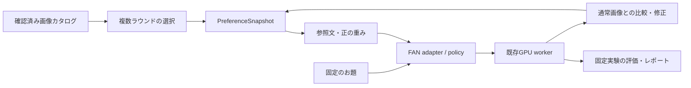

# FAN 個人化改善設計書

- 作成日: 2026-09-21
- 対象: `exhibit/` と `fan-repro/`
- 調査時の HEAD: `31d7918`（`feat/exhibit-ember-redesign`）
- 状態: coding agent に渡す実装仕様。記載した新機能・新コマンドは未実装。

## 0. Coding agent への依頼

この設計書と [実装計画](../plans/2026-09-21-fan-personalization-improvement.md)を読み、計画の Task 1 から順に実装する。目的は、FAN の公式処理を比較可能な形で復元し、その評価結果と、より情報量のある画像選択を使って個人化を改善することである。

- 通常の実装判断は本書の既定値で進める。本書の数値は、明記した論文設定以外は検証するための設計値であり、確認済みの最適値ではない。
- 最初に作業ツリーと適用される `AGENTS.md` を確認する。IDE に残る `.worktrees/fan-exhibit/` は調査時には存在しなかったため、パスを決め打ちしない。
- 既存のローカル変更・未追跡データを保護する。調査時には `premier-repro/data/prefbench/`、`premier-repro/official/`、`tailored-visions-repro/official/` が未追跡だった。
- 実装、ローカルの準備・検証、実測レポート作成までを作業範囲とする。外部への公開・メッセージ送信は含めない。
- GPU や重みが利用できない場合も CPU テスト、疑似ワーカーでの統合、評価用画面・集計器まで完成させる。未実施の実測を成功扱いしない。
- 人の回答が必要な評価は agent が代答しない。回答収集を除く作業を完了し、実施手順と未取得の評価を残す。
- プロダクトの実装完了、公式経路の整合性確認、本人の好みへの精度改善の実証は、別々の完了状態として報告する。

## 1. 目的とスコープ

### 1.1 目的

1. 現行設定から FAN 公式実装への変更を、一要因ずつ比較できるようにする。
2. 小規模な目視調整で固定された `skip_pa` と pooled の扱いを、現行の生成モデル・VAE・サンプラーで再検証する。
3. 画像 pool を拡張し、色・光・描画・雰囲気を分離してユーザーの好みを収集する。
4. 選択履歴から target ごとに参照を選別する Tailored profiling を利用可能にする。
5. target 忠実度、好みへの整合性、本人の選好を評価し、改善を判断できるようにする。

### 1.2 実装対象

- 公式 FAN と現行設定を共存させる encoding policy。
- GPU を使う数値検証・比較生成と、固定画像を使うオフライン評価。
- 64 枚の画像カタログ、最大 3 ラウンドの選択、好きな側面・強さの入力。
- 選択変更、側面の強弱変更、同一 seed での再生成。
- 結果に紐づく任意の選好回答、および展示とは独立したブラインド評価。
- キャッシュ、生成イベント、preflight、サンプル、fallback、レポートの整合性更新。

### 1.3 今回含めないもの

拡散モデルの追加学習、ユーザー別 LoRA、他手法への乗り換え、公開サーバー運用、オンライン VLM/LLM 推論、永続的な個人アカウントは対象外。構図や人物そのものの個人化も今回の評価対象に含めない。

### 1.4 採る進め方

| 案 | 評価 |
|---|---|
| 公式設定へ一括置換 | 複数要因が同時に変わり、pooled の既知の不整合も混入するため採用しない |
| 現行 encoder のまま pool だけ拡大 | 入力は改善できるが、公式設定との差分が未解決のまま残る |
| 比較基盤 → 参照収集改善 → 評価による設定選定 | **採用**。各変更の効果を記録し、結果が悪い要因だけ戻せる |

## 2. 現状と一次資料

### 2.1 確認済みの現状

| 対象 | 状態・根拠 |
|---|---|
| 公式 FAN | `9d0b76843f6437718195accac9cf3f050a25d26b`。`upstream/fan/model.py` と `.work/upstream/fan/model.py`、wrapper もそれぞれ一致 |
| 生成 | Illustrious XL v2.0、fp16-fix VAE、1024×1280、30 steps、DPM++ 2M SDE Karras、CFG 5.0 |
| 個人化 | `alpha=0.5`、`skip=-2`、`sample_size=0`、`skip_pa=[0,1,2,3,4,5,6,7]`、`use_attn_mask=false`、plain pooled |
| 参照 | 4 被写体×4 表現の 16 枚から 3〜5 枚。画像に紐づく固定説明句を使用。15 種類の句へ集約される |
| 重み | 同じ句をまとめ、カードごとの寄与を加算。公式 PA 内で正規化されるため、全重みの共通倍率は実質的に相殺される |
| 選択後 | 結果画面は通常・個人化を明示。好みの投票なし。run がある間の選択変更は拒否 |
| 既存テスト | 調査時に Python 67 件、Node 8 件が通過。GPU による精度評価の代替にはならない |
| トークン制限 | `girl-warm_soft` は79、`student-warm_soft` と `barista-warm_soft` は82。77トークンで末尾の品質タグが切れる |

主要コード:

- [domain.py](../../../exhibit/src/exhibit/domain.py): 参照生成、重み、hash。
- [workers.py](../../../exhibit/src/exhibit/workers.py): FAN wrapper、生成時の pooled 差し替え。
- [service.py](../../../exhibit/src/exhibit/service.py): run、cache、GPU 実行、選択の固定。
- [app.py](../../../exhibit/src/exhibit/app.py): API。
- [app.js](../../../exhibit/src/exhibit/static/app.js): カード選択・比較画面。
- [既存設計](2026-09-21-fan-exhibition-demo-design.md): 本書と矛盾する改善対象については本書を優先する。旧設計を一括復元しない。

### 2.2 なぜ変更されていたか

- profiling は「参照が3〜5件なので全部使う。増えた将来に有効化」という設計判断。精度比較で不要と確認されたものではない。
- 8 層除外は初期の画像のもや・構図崩れへの目視中心の対処。その後 `4ff0d01` で VAE、サンプラー、解像度が変更されている。
- pooled は参照あり・α=0でも通常出力との cosine が約0.820、hidden は約0.99998だったため plain へ差し替えた。padding位置を検出したことだけで誤検出と断定しない。
- `e1d3517` は体験時間短縮を理由にブラインド投票・答え合わせ・強度調整を削除した。研究評価を実施できないという技術的制約ではない。
- 既存 `outputs/fan-probe/` と `docs/reports/fan-demo/evidence.json` には旧設定の結果が混在する。現行設定での再検証の代わりに使わない。

### 2.3 論文・公式実装で確認する事項

1. [論文](https://openaccess.thecvf.com/content/CVPR2026/papers/Kim_Foundation_Encoders_Are_All_You_Need_for_Preference-Aware_Personalization_CVPR_2026_paper.pdf): PDF p.4 §4.1–4.2、p.5 §4.3–5。
2. [補足資料](https://openaccess.thecvf.com/content/CVPR2026/supplemental/Kim_Foundation_Encoders_Are_CVPR_2026_supplemental.pdf): PDF p.2 §13、p.5 §19。
3. [固定公式実装](https://github.com/Burf/FAN/tree/9d0b76843f6437718195accac9cf3f050a25d26b): `fan/model.py`、`fan/wrapper.py`、`inference.py`。

Tailored profiling は target との類似性で候補を絞り、多様性を考慮して選別する。実験では履歴の10%を使用する。PA は条件ごとに独立した softmax を使い、参照側の総量を α に正規化する。論文実験の PA 除外は最初の1層のみ。公式 SDXL は両 CLIP の `skip=-2` hidden を結合し、bigG の最終層から検出・正規化・projection した個人化 pooled を使う。

論文の PIP/ML 評価はこの展示とは入力分布・モデル条件が異なる。Illustrious と選択カードで公式 encoder 処理を再現しても「論文の定量結果を再現した」と記載しない。

## 3. 共通制約

- 公式 pin は `9d0b76843f6437718195accac9cf3f050a25d26b` を維持する。
- `fan-repro/upstream/` と `.work/upstream/` を直接編集しない。
- Web は `exhibit/.venv`、GPU/FAN は `fan-repro/.venv` を使用し、`transformers>=4.57,<5` を維持する。
- GPU は RTX 4090 24 GB ×1。生成・準備・評価は既存 GPU lease を共有し、並列実行しない。
- 通常と個人化で target prompt、negative prompt、モデル、VAE、サンプラー、steps、CFG、解像度、seed をそろえる。
- 本書の比較中は `generation` を現行の値で固定する。変更した場合は別 experiment とし、過去結果に追記しない。
- サーバー起動・通常の推論・ブラウザー利用中にモデルをダウンロードしない。追加重みは明示的な準備コマンドで取得する。
- 通常セッションの入力と生成画像は終了時に削除する。研究用評価の保存先とは分離する。
- 評価が揃うまで展示の既定 encoder policy は `legacy_exhibit` とする。

## 4. 構成と責務



| モジュール | 責務 |
|---|---|
| 新規 `exhibit/src/exhibit/fan_adapter.py` | policy の解決、公式 wrapper 呼び出し、pooled の選択、実効設定・profiling trace |
| 新規 `exhibit/src/exhibit/catalog.py` | v1/v2 カタログのロード、確認済みカードの選択、軸・prompt の検証 |
| 新規 `exhibit/src/exhibit/elicitation.py` | 軽量な候補選択とラウンド状態。GPU・画像認識モデルを使わない |
| 既存 `domain.py` | PreferenceSnapshot から参照を生成し、policy と合わせた内容 hash を計算 |
| 既存 `workers.py` / `gpu.py` | 生成・診断・評価を子プロセスで実行。lease、cancel、deadline を維持 |
| 新規 `exhibit/src/exhibit/evaluation.py` | 固定画像・評価スコア・人の回答の検証と集計。生成ロジックを重複させない |
| 新規 `exhibit/src/exhibit/evaluation_worker.py` | GPU 診断、CLIP の画像/テキスト encoding、比較実験を実行 |
| 既存 `service.py` / `app.py` / static | revision を持つ選択、再生成、任意のフィードバックを扱う |

`gpu.py` に共通の lease context を抽出し、既存 `run_stage` と評価 worker の両方が同じロックを取得する。評価のために `run_process` を lease なしで直接使わない。

## 5. FAN policy と参照表現

### 5.1 設定

新規 `exhibit/configs/fan-policies.json` に保存する。論文の α=0.4 は PIP 実験値であり、すべてのユーザーに最適とは扱わない。

```json
{
  "schema_version": 1,
  "default_policy_id": "legacy_exhibit",
  "policies": {
    "legacy_exhibit": {
      "alpha": 0.5,
      "skip": -2,
      "skip_pa": [0, 1, 2, 3, 4, 5, 6, 7],
      "use_attn_mask": false,
      "pooled_mode": "plain",
      "profiling": {"mode": "all"},
      "reference_unit": "aspect_phrase"
    },
    "official_encoder": {
      "alpha": 0.4,
      "skip": -2,
      "skip_pa": [0],
      "use_attn_mask": false,
      "pooled_mode": "fan",
      "profiling": {"mode": "ratio", "value": 0.1},
      "reference_unit": "aspect_phrase"
    }
  }
}
```

`official_encoder` は、現行と同じ参照表現を渡して encoder 設定の差だけを調べる比較基準。「完全な論文再現」という表示にはしない。評価用に `reference_unit=card_description` も生成できるようにする。

通常 API はユーザーが任意の encoder 設定やファイルパスを渡す仕様にしない。サーバーが設定から policy を解決する。評価 CLI は登録済み policy と検証済みの実験 matrix を使用する。

移行後の`demo.json`では`fan`にPython/upstreamのパス、commit、decoder hashだけを残し、alpha/skip/sample_size/skip_pa/use_attn_maskはpolicyへ集約する。rootのalphaも削除し、APIの表示値は解決済みpolicyから返す。旧値を別々の箇所で上書きする構造にしない。移行の途中は互換helperを使って既存経路を保ってよいが、最終状態では設定の正を一箇所にする。

### 5.2 profiling の意味を明示する

| 指定 | FAN に渡す値 |
|---|---|
| `mode=all` | 整数 `0`。選別しない |
| `mode=ratio,value=0.1` | float `0.1`。公式 `sample_reference` が件数へ変換 |
| `mode=count,value=4` | 整数 `4`。最大4参照を使用 |

`count` は1以上の整数、`ratio` は0より大きく1以下の数とする。bool を数値として受け入れない。`1` と `1.0` の挙動を混同しない。公式 CLI は非ゼロ値を一律0.1へ変換するため、その CLI 経由で新しい policy を実行しない。

- 選別はユーザーが好んだ参照だけを対象にする。未選択の pool 全体を FAN へ渡さない。
- 公式 SDXL の L と bigG はそれぞれ選別する。共通の参照集合を独自に選んで「公式そのまま」と説明しない。
- 公式 `sample_reference` を呼ぶ際の入力順・重み・選択 index を記録する。少数参照で ratio=0.1 が1件になっても隠さない。
- `sample_reference` を計測用に wrap する場合は worker 内の逐次区間に限定し、`finally` で必ず復元する。FAN 自体の attention patch も例外後に戻ることを検証する。
- trace は `clip_l_hidden`、`clip_g_hidden`、`clip_g_pool` を区別する。plain pooled policy では最後の呼び出しを省略してもよいが、その場合は `not_used` と記録する。
- profiling の選別処理を手書きで再実装しない。別方式を追加するときは別名にする。

### 5.3 参照の構成と重み

`PreferenceSnapshot` の選択カードごとに、ユーザーが指定した側面だけを使う。

- `aspect_phrase`: 有効な各句の寄与を `strength * aspect_gain` とし、完全一致する句を重複排除して加算する。`strength` は1または2、`aspect_gain` は0.5、1、2のいずれか。
- `card_description`: 有効側面の句を色→光→描画→雰囲気の順に結合し、`strength` を重みにする。評価上は全 `aspect_gain=1` のケースに限定する。側面別 gain が異なる入力は422相当の明示的エラーにし、黙って平均しない。
- 同一 card_description は重みを合算する。被写体 prompt は参照に含めない。
- `ref_id` は正規化済み text の sha256 で安定化する。text と refs の順序を決定的にする。
- weight は有限・正値のみ。不要な句は参照リストから除去する。嫌い・スキップを負の weight に変換しない。
- 参照なしは通常生成として扱う。個人化を要求して有効参照が0件になった場合はエラーとする。

aspect_phrase は既存表示の表現単位、card_description は選んだ画像を表す短文という実験上の単位である。参照単位の比較時は入力を固定し、得られた最良値を別の単位へ一般化しない。

### 5.4 pooled 診断

1. 参照なしの FAN と `pipe.encode_prompt` の hidden / pooled を比較する。
2. 参照あり・α=0で、両者の差を測定する。
3. target の長さ、入力 EOS index、detector が選んだ index、未正規化/正規化 hidden での detector 出力を記録する。正規化位置を変えるのは診断だけとし、公式経路を黙って変更しない。
4. α=0.4でも同じ診断を行い、plain pooled と公式 pooled の画像・整合性を比較する。
5. 公式経路が α=0の基準を満たさない場合は、tokenizer、encoder の由来、decoder 重み、dtype、最終 norm/projection を確認する。
6. 必要なら、別の `target_eos` 実験 policy を追加する。これは「個人化 hidden の元 target EOS位置を最終 norm/projection する」処理であり、通常の plain pooled とも公式 detector とも異なる。成功しても公式と同一とは記載しない。

本体の修正が必要な場合は、外側の adapter で分離するか、`fan-repro/patches/` に最小 patch を追加する。固定公式処理を比較できる経路を残し、patch hash・理由・回帰テストを記録する。α=0だけ通常経路へ逃がして診断を通すことは禁止する。

### 5.5 hash と生成契約

`personalization_hash` は少なくとも次を含む。表示用 policy_id だけで同一性を判定しない。

- catalog の内容 hash、選択カード・側面・強さ、aspect_gain、参照 text と weight。
- reference_unit、profiling の mode/value、alpha、skip、skip_pa、use_attn_mask、pooled_mode。
- FAN pin、実行ソース/patch/adapter の hash、decoder と tokenizer の hash。
- target/negative の実際の文、generation 設定、seed 列。

session の revision 自体は結果内容の hash に入れない。同じ内容へ戻したら同じ cache を使える。一方、publish・feedback の stale 判定には revision を必ず使う。

画像イベントには `policy_id`、`effective_policy`、`policy_hash`、`personalization_hash`、profiling trace の参照先を含める。新フィールドがない旧個人化 cache は再利用しない。通常画像の cache は、通常 encoding・generation・prompt・seed・画像hash の一致を別途確認する。

## 6. 64枚の画像 pool

### 6.1 軸を組み替える

> 2026-09-21 追記: 光の軸の再定義、色c1・雰囲気m3の文言、profile の明示列挙、カード専用 negative prompt、被写体文の短縮は、[文言パイロット](../../reports/fan-personalization/catalog-v2-phrase-pilot/README.md)の結果を受けて所有者が承認した。
>
> 2026-09-22 追記: 以下の表と禁止対・16組は **「2026-09-22 改訂」の項が現行**である。この項は 2026-09-21 時点の記録として残す。

`exhibit/configs/catalog-v2.json` に以下の4軸・4水準を定義する。既存の4被写体を使い、各被写体で16表現を生成する。

| index | color | lighting | texture | mood |
|---|---|---|---|---|
| 0 | `warm color palette, amber tones` | `overcast, diffused light, soft shadows` | `watercolor (medium), soft wash` | `calm, closed eyes, gentle smile` |
| 1 | `cool color palette, blue background` | `night, dim lighting, lamplight, dark background` | `anime screencap, cel shading, crisp lineart` | `cheerful, open mouth smile, happy` |
| 2 | `muted colors, desaturated` | `backlighting, rim light, sun glare` | `flat color, minimal shading` | `serious, stern expression` |
| 3 | `vivid saturated colors` | `harsh sunlight, cast shadow, high contrast` | `oil painting (medium), thick brushstrokes` | `dreamy, half-closed eyes, looking away` |

lighting は明るさや時間帯ではなく **光の向きと硬さ** の軸である。時間帯で分けた案（曇天／夜／夕景／日中）は、`sunset, orange sky` などが color 軸へ色を持ち込み背景も変えてしまうため採らない（[文言パイロット](../../reports/fan-personalization/catalog-v2-phrase-pilot/lighting-rounds/README.md)）。

16組は XOR で導出せず、`profiles` に明示列挙する。`build_catalog` は次を検証し、満たさなければ失敗する。

- 16組の `(color, lighting, texture, mood)` が重複しないこと。
- 各軸の各水準がちょうど4回ずつ現れること。水準は0..3。
- `forbidden_level_pairs` の水準対を1組も使っていないこと。

`forbidden_level_pairs` は、同じ絵への指示として矛盾する水準対を理由付きで定義に置く。硬い直射光×水彩／平塗り、逆光のグレア×油彩の厚塗り、暖色×夜、鮮やか×曇天の5対で、いずれもパイロットで被写体か軸の破綻として観測されたものである。

16組は「6つの軸ペア×16通り=96対のうち到達可能な範囲で最大の被覆」を目的に決定的探索で選ぶ。禁止5対のため上限は91対で、実際に到達できるのは **90対（最大重複2）** である。`color×texture`・`color×mood`・`lighting×mood`・`texture×mood` は16対すべてを1回ずつ、`color×lighting` は許される14対すべて、`lighting×texture` は許される13対のうち12対を含む（`backlighting × cel shading` だけが出現しない）。`profile_id="c{color}-l{lighting}-t{texture}-m{mood}"`。4被写体で同じ16組を使い64枚にする。

- 同じ被写体の16枚は同じ seed・構図指定を使う。
- 全画像は現行 generation 条件の参照なし経路で生成する。
- カードの生成文は両 tokenizer で special token 込み77以下。長さ超過は生成前に失敗させる。
- 長さ調整では重複する品質語から削り、4側面の句は残す。tokenizer の切り捨てに任せない。
- カード生成専用の negative prompt を定義の `card_negative_prompt` に置く。被写体が後ろ向き・風景主体になるのを防ぐ語を足したもので、`demo.json` の negative prompt は変えない。カードの実効設定は「展示の generation ＋ この1項目の上書き」だけであり、manifest・画像イベントの `settings`・token 検査レポートのすべてがこの実効設定に束縛される。negative prompt も両 tokenizer で77以下を検査する。
- caption は生成要求の文を無条件に真実と見なさず、実画像と照合する。
- `reviewed` だけでなく4側面それぞれの確認結果と、対象の画像sha256・説明文hashを保存する。画像や説明を変更したら確認を無効化する。
- 64枚のうち適合しないものは修正・再生成する。未確認画像を埋め合わせのために表示しない。

#### 2026-09-22 改訂（現行）

所有者承認 2026-09-22: 色3をパステル、描画0をラフスケッチに変更。64枚を厳密に揃えず、確認できたカードで運用する。
根拠は [candidate-6 パイロット](../../reports/fan-personalization/catalog-v2-phrase-pilot/candidate-6/README.md)。

| index | color | lighting | texture | mood |
|---|---|---|---|---|
| 0 | `warm color palette, amber tones` | `overcast, diffused light, soft shadows` | `sketch, visible pencil lines, rough drawing` | `calm, closed eyes, gentle smile` |
| 1 | `cool color palette, blue background` | `night, dim lighting, lamplight, dark background` | `anime screencap, cel shading` | `cheerful, open mouth smile, happy` |
| 2 | `muted colors, desaturated` | `backlighting, rim light, sun glare` | `flat color, lineless, no lineart` | `serious, stern expression` |
| 3 | `pastel colors, soft pink and mint` | `harsh sunlight, hard cast shadow, high contrast` | `oil painting, thick brushstrokes` | `dreamy, half-closed eyes, looking away` |

**意味が変わった水準**（所有者承認）。

- 色3「鮮やかな高彩度色」→「淡いパステルの色」。鮮やかはどの文言でも平均彩度が暖色・寒色を上回らなかった。
- 描画0「水彩の柔らかな筆致」→「鉛筆のラフスケッチ」。水彩・色鉛筆・パステル画・墨絵・ハーフトーンはいずれも絵に出ない。

**文言だけの変更**（意味は同じ）: 描画1から `crisp lineart` を外す（寒色×強い日差しで未彩色の線画になるため）、
描画2を `flat color, lineless, no lineart`（`axes_ja` は「線のない平塗り」）、描画3から `(medium)` を外す、
光3を `hard cast shadow`（`on the wall` は草原を壁に置き換えるため使わない）。光1は短縮せず全文のまま使う。

**禁止対は8対**。理由は定義の `forbidden_level_pairs` に1行ずつ書く。

| 対 | 内容 | 理由 |
|---|---|---|
| c0×l1 | 暖色×夜 | 夜の暗さが暖色のパレットを打ち消す |
| c3×l3 | パステル×強い日差し | 淡いパステルに硬い落ち影が乗らない |
| c1×t0 | 寒色×スケッチ | 寒色の地色が紙面を染め、肌が青緑になる |
| c3×t3 | パステル×油彩 | 淡いパステルでは厚い筆致が出ない |
| l2×t0 | 逆光×スケッチ | ラフスケッチは平坦でグレアの出る面がない |
| l2×t3 | 逆光×油彩 | グレアが厚い筆致に埋もれる |
| l3×t0 | 強い日差し×スケッチ | 陰影を持たないので硬い落ち影が乗らない |
| l3×t2 | 強い日差し×平塗り | 硬い落ち影と線のない平塗りが同じ絵で両立しない |

`c0×l0`（暖色×曇天）と `l2×t2`（逆光×平塗り）は禁止しない。これらまで禁止すると l2 は t1 としか、l3 は t3 としか
組めなくなり、光と描画が事実上1本の軸になってしまう。探索ではこの2対の枚数を最小化するだけにする。到達値は `c0×l0` 1枚・`l2×t2` 2枚の計3枚で、
最大重複2のもとではこれが最小（`l2×t2` は2枚が強制される）。
`c3×l0`（パステル×曇天）も禁止しない（パステルは曇天で最もよく出る）。

16組は次の順の目的で決定的に探索する。**水準対の最大重複の最小化 → 被覆対数の最大化 → `c0×l0`・`l2×t2` の枚数の最小化 → 辞書順最小**。
トークン超過は探索の制約として扱う。すなわち4被写体・両 tokenizer のいずれかで77を超える組は候補から外す（256組中15組が該当）。
到達値は **85/96対・最大重複2**（禁止8対を除く上限は88対）。最大重複2のもとで88は不可能で、85が最大である
（88には `lighting×texture` が12対すべてを含む必要があるが、最大重複2では l2 は t1/t2、l3 は t1/t3 としか組めず t1 を使い切るため10対が上限。
上限を満たす骨格4通りはいずれも雰囲気を割り当てられない）。

採用した16組（`profile_id`）。

```
c0-l0-t0-m2  c0-l2-t2-m0  c0-l3-t1-m1  c0-l3-t3-m3
c1-l0-t2-m3  c1-l1-t3-m1  c1-l2-t1-m2  c1-l3-t1-m0
c2-l0-t3-m0  c2-l1-t0-m3  c2-l2-t2-m1  c2-l3-t3-m2
c3-l0-t0-m1  c3-l1-t0-m0  c3-l1-t2-m2  c3-l2-t1-m3
```

| 軸ペア | 被覆 | 重複2の対 | 出現しない対（*=禁止） |
|---|---|---|---|
| color×lighting | 14/14 | c0l3, c3l1 | c0l1\*, c3l3\* |
| color×texture | 13/14 | c1t1, c2t3, c3t0 | c1t0\*, c3t3\*, c2t1 |
| color×mood | 16/16 | なし | なし |
| lighting×texture | 10/12 | l0t0, l1t0, l2t1, l2t2, l3t1, l3t3 | l2t0\*, l2t3\*, l3t0\*, l3t2\*, l0t1, l1t1 |
| lighting×mood | 16/16 | なし | なし |
| texture×mood | 16/16 | なし | なし |

交絡は `lighting×texture` に集中する。光は l0/l1 が {スケッチ, 平塗り, 油彩}、l2 が {セル塗り, 平塗り}、l3 が {セル塗り, 油彩} としか同席しない。
色は c0 が全描画、c1 が {セル塗り, 平塗り, 油彩}、c2 が {スケッチ, 平塗り, 油彩}、c3 が {スケッチ, セル塗り, 平塗り}。
`color×mood`・`lighting×mood`・`texture×mood` は16対を1回ずつで交絡がない。
16組のプロンプト最大長は77（`c1-l0-t2-m3`・`c2-l1-t0-m3`・`c3-l1-t0-m0` の student/barista）。

**`seed_overrides`**。定義に `seed_overrides: {card_id: int}` を置く（既定は空）。被写体の seed と異なる整数だけを許し、
未知の card_id は失敗させる。指定されたカードだけ `card["seed"]` が変わるので、manifest・seed 照合・確認の無効化もその1枚だけに効く。
`prepare.py cards --catalog v2 --only <card_id> ...` は指定カードだけを生成し、残りの manifest 項目をそのまま保って書き直す。
1枚差し替えるのに64枚を作り直さない。

**64枚を揃える条件は外す**。確認できたカードだけで展示・heldout を回す（§9.2）。

### 6.2 ファイル配置

- 定義: `exhibit/configs/catalog-v2.json`
- 画像: `exhibit/assets/cards-v2/<subject_id>-<profile_id>.png`
- 生成後カタログ: `exhibit/assets/catalog-v2.json`
- 確認記録: `exhibit/configs/cards-v2-review.json`
- 生成ログ: `exhibit/outputs/preparation/catalog-v2/`

新catalogの生成条件とtokenizer hashを独立して保存する。preflight はcatalogの各画像・説明・確認記録を照合する。

**所有者判断 2026-09-22: 展示を catalog-v2 に切り替え、catalog-v1 は互換を残さず削除。heldout と本人評価の完了を待たない。**
これは本節と §9.5 の「確認後に切り替える」「本人評価の後に設定を1回変更する」というゲートのうち、**catalog に関する部分を上書きする**。
`demo.json` の `catalog_id` と `sample_manifest` は削除した。catalog は1つしかないので、`catalog-v2` は
コード上の定数（`exhibit.catalog.CATALOG_ID`）としてだけ残り、manifest・review・評価の同一性のために id 文字列は変えない。
v1 の資産（`assets/cards/`、`configs/cards-review.json`、`assets/manifest.json` のカード項目、
`configs/legacy-card-token-overflow.json`、旧6サンプル）と、v1 pool を必要とした `elicitation` study（§9.7）は削除した。
既定 encoder policy は `legacy_exhibit` のままで、この判断は policy には及ばない。
selection設定は`min=3,max=10,round_size=12,max_rounds=3`。schema/versionの更新によって古いブラウザー状態と新APIを混在させない。

## 7. 好みの収集

### 7.1 画面フロー

1. ラウンド1: 12枚から選択。カード内の subject を揃えた比較を行いやすい並びにする。
2. 選択カードに対し、好きな側面を1つ以上指定する。「全部好き」ボタンは明示的な操作として設ける。未回答を全側面好きへ変換しない。
3. ラウンド2: 未提示画像から12枚を追加。3枚以上の有効な選択があれば、この時点より前でも終了可能。
4. 任意のラウンド3: さらに12枚。合計6〜10枚を目安とするが、下限3、上限10、最大3ラウンドとする。
5. お題選択 → 通常/個人化4枚 → 任意の修正・再生成。

好みがない画像は選択しなくてよい。未選択を「嫌い」とは扱わない。全ラウンドで提示済み画像は重複させない。候補不足なら残りを出し、足りない理由を表示する。3枚に達しない場合は個人化生成せず、選択継続またはサンプル閲覧へ案内する。

### 7.2 ラウンド候補の選び方

大きな学習器は導入せず、catalog の4軸カテゴリを使う。これは展示の候補選択であり、FAN の Tailored profiling とは別処理である。

- 初回は12枚を貪欲に選ぶ。これまでの軸水準・軸ペアの提示回数が少ないカードを優先し、各被写体は最大3枚にする。tie は session seed と card_id による決定的順序で解消する。
- 2回目以降は、8枚を「好みに近いが新しい組み合わせ」、4枚を探索に割り当てる。
- 類似性: 確認済みの好きな側面について、カードの水準が一致する比率を `strength` で重み付けして平均する。未回答側面は計算しない。
- 8枚の選択は `similarity - 0.25 * max_similarity_to_already_chosen` の貪欲法とし、候補同士の類似性は4軸の一致率を使う。初期の最大類似性は0。
- 探索4枚は軸水準・ペアの提示回数が少ない順で選ぶ。選択が0件なら全12枚を初回と同じ探索にする。
- 各roundで被写体最大3枚を維持する。候補不足時のみ最大4枚へ緩和し、それでも不足なら少ない枚数で返す。
- 選択順、提示画像、seed、アルゴリズムversion、round_id を保存して再現できるようにする。

初回のカバレッジ費用は「そのカードの4水準の累積提示回数の和＋6軸ペアの累積提示回数の和」とする。少ない方を優先する。多様性の評価は見た目が同じになっていないかという実画像の確認も必要。

### 7.3 PreferenceSnapshot

```json
{
  "revision": 2,
  "catalog_id": "catalog-v2",
  "selection": [
    {
      "card_id": "girl-c0-l1-t1-m2",
      "strength": 2,
      "aspects": ["color", "texture"]
    }
  ],
  "aspect_gains": {"color": 1, "lighting": 1, "texture": 1, "mood": 1}
}
```

この JSON は1件のデータ形を示す。個人化生成には3〜10件が必要。draft は0〜10件を許容するが、commit 時は3〜10件・全カードで1側面以上が必要。この入力例に省略した`catalog_hash`は、サーバーが検証済みcatalogから計算してsnapshotへ付加し、クライアントの値を信頼しない。

## 8. API・セッション・再生成

### 8.1 API 契約

既存 session API の構造を拡張する。新フロントと同時更新し、古い payload を誤解釈して受け付けない。schema_version を `/api/config` に含め、不一致なら再読み込みを案内する。

| API | 入力と動作 |
|---|---|
| `POST /api/sessions` | 空の draft、revision=0、round1を返す |
| `PUT /api/sessions/{sid}/selection` | `expected_revision, cards, aspect_gains, commit`。cards は `card_id,strength,aspects`。内容変更時にrevisionを1増やす |
| `POST /api/sessions/{sid}/rounds` | `request_id, expected_revision`。未提示の次roundを返す。3round超過は409 |
| `POST /api/sessions/{sid}/runs` | `topic_id, request_id, expected_revision`。commit済みの選択からサーバー側でpolicyを解決して開始 |
| `PUT /api/sessions/{sid}/runs/{rid}/feedback` | `expected_revision, preference`。preferenceは`plain/personal/tie`。完了済みの当該runだけに回答可能 |
| cancel / DELETE session | 既存の子プロセス終了待ち、lease解放、後処理を維持 |

すべての変更 API で session を検証する。unknown card/aspect、未確認card、不正なstrength/gain、重複card、未知フィールドは422。古いrevision、生成中の変更、request_idの異なるpayloadへの再使用は409。

- selection PUT は全置換。正規化後の内容が同一ならrevisionは増やさない。同一内容の再送も冪等。
- round/run の request_id は session 内の payload hash と結びつける。同じrequestの再送は同じ結果、新内容への再使用は409。
- run開始時に選択とpolicyのimmutable snapshotを保存する。
- 生成中は選択・round変更を拒否する。cancel直後でもworker終了前は拒否する。
- 完了後の選択変更は許可する。active run を外し、poller を止め、旧画像はsession cacheとして保持する。次の生成は新runにする。
- publish条件は `session_id + run_id + preference_revision + personalization_hash`。古いイベントを新runへ反映しない。
- 完了前・sample・異なるrevisionのrunへのfeedbackは409。feedback PUTは同じ値の再送で件数を増やさず、別の値で回答を置き換える。
- フィードバックのplain/personal/tieだけから属性の原因を推定して重みを変えない。属性の「弱める/そのまま/強める」はselection PUTでgainを0.5/1/2へ置き換える。

### 8.2 展示の画面

現在の通常/個人化を明示する比較画面を基本とする。結果の下に「好みを調整する」を置き、選択側面、strength、aspect_gainを変更して同じお題・seedで描き直せるようにする。任意の好み回答は集計用の補助情報であり、ブラインド評価の勝率に混ぜない。

初期選択・round・進行位置は再読み込み後もsession snapshotから復元する。クライアントだけに次roundの決定権を持たせない。説明文やpolicy詳細は折りたたみとし、操作画面の主文に実装パラメータを並べない。

## 9. 評価設計

### 9.1 3種類の評価を分ける

| 評価 | 分かること | 分からないこと |
|---|---|---|
| encoding整合性 | 公式呼び出し、α=0、patch復元、dtype・poolingの整合 | 本人が画像を好きか |
| オフライン画像評価 | targetと参照へのCLIP整合、設定変更の傾向 | 本人の主観的な好みの優劣 |
| ブラインド選好評価 | 本人がどちらを好むか、他人のprofileとの差 | 全ユーザー・全モデルへの一般化 |

彩度、平均RGB、Laplacian、画素MAEは診断補助として残す。精度の主要指標・候補採用の単独根拠にしない。

### 9.2 固定ケースと実験 manifest

新規 `exhibit/configs/fan-evaluation.json` にケース、policy、seed、評価モデル、上限枚数を定義する。

- encoder検査: 現行6お題、短文/長文の2診断prompt、単一参照/同一参照の重複/全weight共通倍率/相反参照/4側面の短句の5履歴fixture。
- 画像screen: お題`cat,tokyo,rain`、履歴`warm,cool,mixed,sparse`、seed`230923,230924`。
- 履歴fixtureはcard_idだけでなく解決済みtext・weightをJSON保存する。warm/coolは旧カタログの該当表現3枚、mixedはwarm2枚+cool1枚、sparseはwarm2枚+cool1枚からcolorだけを有効にしたもの。
- screenの参照単位はaspect_phraseで固定する。8条件=`skip_pa`の1/8層除外×pooledのfan/plain×profilingのall/ratio0.1、α=0.4。192枚に通常6枚と現行α=0.5の24枚を加え、最大222枚。
- 数値検査で失敗した公式条件も、診断として画像生成できる。ただし候補採用は不可とし、fail理由をレポートへ載せる。
- screen上位2条件は同じ24ケースでα=0.3/0.5を追加比較する。追加最大96枚。reference_unitやcount profilingの比較は別experimentにする。
- heldout: 確定候補2条件とlegacyを、現行6お題・新しい4履歴fixture・seed`230927,230928`で比較する。144枚＋通常12枚。heldout結果を見て同じ集合で再調整しない。
- heldout履歴はv2の確認済みカードから、暖色cel/寒色水彩/落ち着いたflat/混合表現を固定する。確定したcard_idと側面をmanifestへ保存してから生成する。

heldoutの4履歴は次で固定する。最初の3件は各profileの`girl/student/traveler`を選び、colorとtextureを有効、strength=1とする。混合は下記3枚のcolorとtextureを有効、strength=1とする。これらは合成の評価fixtureであり、人が選んだ履歴と説明しない。

| 履歴 | profile / card |
|---|---|
| 暖色cel | `c0-l0-t1-m1` |
| 寒色水彩 | `c1-l2-t0-m1` |
| 落ち着いたflat | `c2-l1-t2-m1` |
| 混合表現 | `girl-c0-l0-t1-m1`、`student-c1-l2-t0-m1`、`traveler-c2-l1-t2-m1` |

#### 2026-09-22 改訂（現行）

§6.1 の改訂で水彩が無くなり、寒色×スケッチは禁止対になった。「寒色水彩」は **「寒色油彩」** へ置き換える。
`c1-l1-t3`（寒色・夜のランプ・油彩）は candidate-6 の目視で girl/student/traveler の3被写体が5項目とも通っており、
寒色と同席できる描画のうち最も確度が高い。card は現行の16組に合わせて次へ置き換える。

| 履歴 | profile / card |
|---|---|
| 暖色cel | `c0-l3-t1-m1` |
| 寒色油彩 | `c1-l1-t3-m1` |
| 落ち着いたflat | `c2-l2-t2-m1` |
| 混合表現 | `girl-c0-l3-t1-m1`、`student-c1-l1-t3-m1`、`traveler-c2-l2-t2-m1` |

履歴 id は `warm-cel` / `cool-oil` / `calm-flat` / `mixed`。最初の3件は `girl/student/traveler`、color と texture を有効、strength=1。

**heldout の catalog 条件を緩める**。64枚すべての確認は求めない。`validate_heldout_catalog` は次の3条件を検査し、
どれが落ちたかを名指しでエラーにする。

1. heldout 履歴が参照するカードがすべて確認済みで、解決した参照文と重みがカタログと完全に一致すること（従来どおり）。
2. 各軸の各水準に、確認済みカードが `min_reviewed_per_level` 枚以上あること。
3. 確認済みカードが合計 `min_reviewed_cards` 枚以上あること。

しきい値は `exhibit/configs/fan-evaluation.json` の `heldout` に置く（既定 2 と 32）。
heldout の出力には、実際の確認済み枚数 `reviewed_card_count` と id 集合の hash `reviewed_card_ids_hash`、
および適用したしきい値を残し、結果をその確認済み集合に束縛する。


総枚数はキャッシュなしで最大474枚。実行前に枚数を表示し、1experimentの上限は512枚とする。上限を超えるmatrixは失敗させる。失敗分を無制限に再試行しない。画像単位でcheckpointし、resumeは同一manifest hashの完了済み画像だけを再利用する。

experiment manifestには、ソースhash、モデル/decoder/tokenizer/evaluatorの固定revision・ファイルhash、全prompt、参照、重み、policy、seed、実行環境version、開始時刻、各画像hash、成功/失敗/未実行を保存する。集計は成功例だけを黙って抽出せず、欠損率と理由を示す。

### 9.3 数値検査の基準

- 参照なしFANとpipeline: 同じdtype/deviceで、正規化RMSEが1e-3以下、cosineが0.9999以上。
- 参照ありα=0と参照なし: hiddenとpooledそれぞれ正規化RMSEが5e-3以下、cosineが0.999以上。
- 正規化RMSEは `rms(candidate-base)/max(rms(base),1e-6)`。hiddenのcosineは各token vectorのcosine平均、pooledはvector cosine。ゼロvectorは別途記録する。
- max/mean絶対誤差、最小token cosineも保存する。fp16の既存微小差を隠すための恣意的な除外はしない。
- 同一参照を2件に分ける/合算する、全weightを同じ倍率にする、参照の順序を並べ替える場合の差を測る。profiling無効で数学的同値なケースを検査し、dtypeに対する同じ数値基準を使う。
- 公式wrapper直接呼び出しとadapterの `official_encoder` を同じ実効設定で比較する。pooledを捨てて一致したことにしない。
- 例外後に参照なしencodingを再実行し、patchやtrace hookが残っていないことを確認する。

### 9.4 CLIP 指標

評価用は凍結した `openai/clip-vit-large-patch14` の CLIPModel/processorを使用する。準備時にHubの実際のcommit SHAを解決してmanifestに固定し、推論中に`main`を解決しない。diffusion側の個人化済みencoderを評価器として流用しない。

- `target_score`: 生成画像とtargetの被写体・場面文のcosine。品質タグを除いた評価用の文を各topicに手書きで固定する。
- `history_score`: 画像とユーザーが指定した参照textのcosineの重み付き平均。profilingで選ばれた参照だけでなく、**選別前の全有効参照**で計算する。
- `conditioning_target_align`: 同じpolicyの個人化/通常conditioningのcosine。hiddenとpooledを分ける。これは本実験の診断指標と明記する。
- 通常画像に対する差分と、legacyに対する差分を、同一topic/history/seedの対応を保って集計する。
- profileやtopicごとの内訳を必ず出す。異なる指標を恣意的な1スコアにまとめない。

target_scoreの評価文は以下をfixtureへ保存する。生成用promptは変更しない。

| topic | 評価用英文 |
|---|---|
| cat | `A brown-haired girl with green eyes wearing a sweater, holding a cat by a window.` |
| tokyo | `A young man with short black hair wearing a jacket, with the Tokyo skyline at night.` |
| forest | `A silver-haired witch wearing a witch hat and a cloak in a forest.` |
| lighthouse | `A young blond male sailor wearing a sailor hat and a striped shirt, near a lighthouse and the ocean.` |
| rain | `A blue-haired girl wearing a raincoat on a rainy city street.` |
| cafe | `An auburn-haired female cafe worker wearing a white shirt and an apron in a cafe.` |


これらは展示用評価で、論文のCLIP score/Text alignと同じ数値スケール・厳密な再現とは呼ばない。論文benchmark再現を追加する場合は、データセット・分割・評価実装を別途一致させた実験に分離する。

### 9.5 候補の選定と既定値変更

次の値は事前に固定する工学的な判断基準。測定後に基準を緩めない。

1. 数値検査に合格し、生成のNaN/全黒画像・実行失敗が0件であること。
2. screenではlegacyとの差 `mean Δtarget_score >= -0.01` を満たす候補のうち、`mean Δhistory_score`が大きい順に2件を選ぶ。tieはtarget_score、次に生成時間で決める。満たす候補がなければlegacyを維持する。
3. heldoutで `mean Δtarget_score >= -0.01`、`mean Δhistory_score >= 0.005` を満たすこと。topic別の悪化とbootstrap区間も報告する。
4. 上記だけなら「自動評価上の候補」とする。展示の既定値はまだ変更しない。
5. 後述の本人評価で基準を満たしたとき、設定を1回変更し、全サンプル・hash・レポートを更新する。満たさない/未実施ならlegacyを既定のまま残し、研究画面で候補を選べる状態まで完成させる。

ここでいう「設定」は encoder policy（`default_policy_id`）のことで、catalog は含まない。
所有者判断 2026-09-22 により、展示の catalog は heldout と本人評価を待たずに `catalog-v2` へ切り替えた（§6.2）。

### 9.6 人によるブラインド評価

通常展示のラベル付き回答とは別に、生成済み画像を使ったローカル評価ページを作る。生成待ちを回答時間に混ぜない。

- pilotは5人。操作が理解できるかだけを確認し、精度の確定には使わない。
- 本評価は最低20人。各人が自分でv2から好みを選び、2お題×4seedの8組で候補とlegacyを比較する。
- 別の4組で候補の本人profileと別参加者profileを比較する。交換は参加者間の固定した置換で、自己割当なしとする。
- 評価前に、お題、両方式、画像hash、左右配置、participant内の提示順を確定する。A/B/tieのみ表示する。
- 左右を同程度の回数にし、方式・参照・prompt・含意するファイル名を回答前の画面に表示しない。
- 採点は勝ち1、同点0.5、負け0。seedごとの画像を独立した人数として数えず、参加者内で平均してから参加者間平均を取る。
- 95%区間は参加者単位のbootstrap 2,000回、乱数seed=0で計算する。
- 候補vslegacy、本人vs別人の両方で平均>0.5かつ95%区間下限>0.5を、既定値変更の条件とする。不足なら「未確定」または「改善を確認できず」。
- 別途、被写体・場面を守っているかと目立つ破綻の有無を確認し、好みと忠実度を混ぜない。

評価ページはstatic HTML/JSで動作し、回答JSONをローカルへexportする。回答前のclient用JSONには方式対応表を含めず、対応表は別ファイルとして集計器だけが読む。opaqueな画像名を使う。学術実験用の完全な不正防止を目的にはしない。

研究用データは通常sessionから自動コピーしない。専用評価の回答者には保存項目を示し、匿名participant_idで保存する。agentが画像を見て本人の回答を作ることは不可。

### 9.7 poolと選択回数の効果を分離する

§9.6は同じ入力profileでencoder設定を比較するため、64枚化・複数roundそのものの効果を証明しない。

**所有者判断 2026-09-22 により、この追加studyは実施できなくなった**。比較対象の「旧16枚 pool」は catalog-v1 そのものであり、
catalog-v1 を削除した以上、`elicitation` study kind（`legacy_catalog_id` / `legacy_pool` / `collection_condition`）は成立しない。
該当のコード・設定・テストは削除した。pool の効果を改めて主張したい場合は、v1 を復活させるのではなく、
catalog-v2 の部分集合を使う別設計を新たに起こす。以下は削除前の設計として残す。

- 同じ参加者に「旧16枚から3〜5枚」と「新64枚から複数roundで3〜10枚」を別々に操作してもらう。
- 半数は旧→新、半数は新→旧の順序にし、順序をmanifestへ保存する。
- 得られた2つのprofileを同じpolicy・お題・seedで生成し、方式名を伏せて比較する。
- 回答時間、選択枚数、明示した側面数、本人の選好率を集計する。違いは「pool＋選択フロー全体」の効果とし、枚数増加だけの効果とは呼ばない。
- ページ・manifest・集計器はTask 8で提供する。実際の参加者回答が未取得でもコードは完成させる。
- この追加studyは独立experimentとし、§9.2の474枚には含めない。実行前の件数表示と1experimentあたり512枚上限を同様に適用する。


## 10. 保存先と実行コマンド

以下は実装後に提供する新コマンド。現時点の既存コマンドと混同しない。

```bash
# repository rootで実行。準備以外はoffline。
PYTHONPATH=exhibit/src fan-repro/.venv/bin/python exhibit/scripts/prepare_evaluation.py
PYTHONPATH=exhibit/src fan-repro/.venv/bin/python exhibit/scripts/check_card_tokens.py --catalog v2
PYTHONPATH=exhibit/src exhibit/.venv/bin/python exhibit/scripts/prepare.py cards --catalog v2
PYTHONPATH=exhibit/src exhibit/.venv/bin/python exhibit/scripts/evaluate_fan.py encoding --config exhibit/configs/fan-evaluation.json
PYTHONPATH=exhibit/src exhibit/.venv/bin/python exhibit/scripts/evaluate_fan.py screen --config exhibit/configs/fan-evaluation.json --resume
PYTHONPATH=exhibit/src exhibit/.venv/bin/python exhibit/scripts/evaluate_fan.py refine --config exhibit/configs/fan-evaluation.json --resume
PYTHONPATH=exhibit/src exhibit/.venv/bin/python exhibit/scripts/evaluate_fan.py heldout --config exhibit/configs/fan-evaluation.json --resume
PYTHONPATH=exhibit/src exhibit/.venv/bin/python exhibit/scripts/build_preference_study.py --config exhibit/configs/fan-evaluation.json
PYTHONPATH=exhibit/src exhibit/.venv/bin/python exhibit/scripts/evaluate_fan.py study --config exhibit/configs/fan-evaluation.json --resume
PYTHONPATH=exhibit/src exhibit/.venv/bin/python exhibit/scripts/summarize_preference_study.py --study exhibit/outputs/fan-evaluation/study
```

`prepare_evaluation.py` は評価器の重み・processorを準備して固定manifestを作る。`check_card_tokens.py` はGPUを使わない。`evaluate_fan.py` はWeb環境のcontrollerで、GPU処理をFAN環境のevaluation_workerへ委譲する。screenの成功と人の評価完了を結び付けない。

- 固定fixture: `exhibit/configs/fan-evaluation.json`、`exhibit/configs/evaluation-cases/`。
- 準備manifest: `exhibit/outputs/fan-evaluation/preparation.json`。
- 実測: `exhibit/outputs/fan-evaluation/<experiment_hash>/`。
- 人の評価: `exhibit/outputs/fan-evaluation/study/`。study manifestと回答を分ける。
- 集約レポート: `docs/reports/fan-personalization/index.html` と `evidence.json`、日本語 `README.md`。

`build_preference_study.py` はstudy入力として匿名participantごとのPreferenceSnapshotを `study/participants.json` から読む。入力がなければ回答収集用ページと説明だけを生成し、「比較画像未生成」と記録する。実データを架空に補わない。参加者確定後の個人化比較画像はevaluate_fanの `study` サブコマンドで同じlease・manifest契約に従って生成する。

初回に生成する収集ページでは、確認済みcatalogから設計§7と同じ方式で選び、participant_idとPreferenceSnapshotをJSON exportする。管理者がそれらをparticipants.jsonへまとめるための入力検証・merge機能をbuild_preference_studyに含める。必須項目は`participant_id, catalog_id, selection, aspect_gains`で、各参加者につき1件。追加studyでは`collection_condition=legacy_pool/new_pool`を持つ2件を許容する。実際の画像hashやcatalog_hashは準備時にサーバー側で検証・付与する。

study configの`study_kind`は`encoder`または`elicitation`、`study_dir`は上記の既定パスまたは独立した評価ディレクトリ。異なるkindを同じmanifestへ追記しない。encoder studyでは`cat,tokyo`×4seed`230923..230926`を主比較、本人/別人比較は同じ2お題×2seed`230927,230928`とする。


## 11. 受け入れ条件

### A. 実装として必須

- [ ] legacyと公式encoder policyを同じ生成経路で選べ、実効設定・参照選別・hashが追跡できる。
- [ ] profiling all/ratio/countが公式関数へ正しい型で渡り、参照の除外・重複集約が正しい。
- [ ] pooledモード変更が画像の条件とcache keyへ反映される。
- [ ] 64枚のカタログ定義と生成・確認フローがあり、全promptのtoken上限を検査する。
- [ ] 最大3round、重複提示なし、3〜10枚、側面の明示確認、strength/gainが機能する。
- [ ] 生成後に選択を変更でき、revision違いの結果・回答・リトライが混ざらない。
- [ ] sampleとexact-cacheの表示・hash・設定が整合する。
- [ ] GPUのlease/cancel/deadline/例外後のpatch復元が保たれる。
- [ ] encoding、screen、heldout、studyの集計・欠損報告が可能。
- [ ] 現行テストと新しい意味のある回帰テスト、実ブラウザーの一連操作が通る。

### B. 実機で確認する事項

- [ ] 公式wrapperとの数値比較、α=0の診断、現行生成条件のmatrixが実行済み。
- [ ] 新カード64枚の画像・4側面・token長が確認済み。
- [ ] offline起動、4枚生成、同一seedの再生成、cache、cancelを実機で確認。
- [ ] 20session連続試験で成功/失敗・p50/p95・VRAMを記録。各runの既存120秒期限を守る。

### C. 精度改善の主張に必要な事項

- [ ] heldout指標が事前の基準を満たす。
- [ ] 本人によるブラインド評価が必要人数・比較条件・集計単位を満たす。
- [ ] 既定値を変更した場合、根拠となるexperiment/study hashが設定・README・レポートに残る。

Aのみ完了なら「実装済み、実機/精度評価待ち」、A+Bなら「動作検証済み、本人評価待ち」と報告する。C未完了を理由に、実装可能なAの作業を途中で止めない。

## 12. 最終報告の形式

変更ファイル、実装済みtask、実行コマンドと結果、実験条件、採用/維持したpolicy、未実施の評価、再開コマンドを記載する。旧設定の実測を現行設定の結果として引用しない。新規policyが失敗した場合も、その比較結果は削除せず残す。
